#  java后端

## 计算机网络

### 网络分层⭐

国际标准化组织提出了 OSI 模型：应用层、表示层、会话层、运输层、网络层、链路层和物理层，理论完善，但复杂且不实用。

学习网络原理使用五层模型：应用层、运输层、网络层、链路层和物理层。

实际使用 TCP/IP 模型：应用层、运输层、网际层和网络接口层。

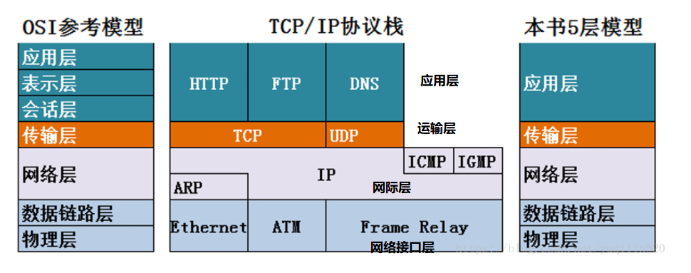

**每层使用下层的服务来提供服务**，对等层间的数据单位是协议数据单元 PDU，上下层间的数据单位是服务数据单元 SDU。

---

#### 应用层

**应用层协议定义了应用进程的通信规则，应用进程互相通信完成网络应用**。

应用层协议包括：

- **域名解析系统 DNS**

  DNS 是一个分布式数据库系统，存储了域名和 IP 地址的映射关系。

  主机向本地域名服务器的查询采用递归查询：如果本地域名服务器不知道被查询域名的 IP 地址，就会以 DNS 客户的身份向其他根域名服务器继续发出查询请求。

  本地域名服务器向根域名服务器查询采用迭代查询：根域名服务器会告知顶级域名服务器的地址，顶级域名服务器给出 IP 地址，或者告知下一步应该向哪个权限域名服务器进行查询。 

- **文件传送协议 FTP**

  FTP 通过TCP 保证可靠运输，使用两个端口，控制端口 21 和数据端口 20，分别进行控制连接和数据连接。

- **电子邮件协议**

  从用户代理把邮件传送到服务器，以及在服务器之间的传送使用 SMTP 协议。

  用户代理从服务器读取邮件时使用 POP3 或 IMAP 协议。

-----

#### 运输层

**运输层负责向主机应用进程间的通信提供数据传输服务**，由于一台主机可以同时运行多个进程，因此运输层具有复用和分用的功能，复用就是多个应用进程可以同时使用运输层发送数据，分用就是把运输层收到的数据交付给对应的应用进程。

运输层协议包括：

- 用户数据报协议 UDP，提供无连接的、尽最大努力交付的数据传输服务，不保证可靠性，不保证顺序，容易丢包，传输单位是用户数据报。

- 传输控制协议 TCP，提供面向连接的数据传输服务、保证可靠性，传输单位是报文。

----

#### 网络层

网络层任务：① 为分组交换网上的主机提供通信服务，在发送数据时把运输层数据报封装成分组传送。② 选择合适路由，使源主机的分组通过路由器找到目的主机。

网络层协议包括：

- **网际协议 IP**

  一般指 IPv4，与 IP 配套使用的还有 ARP、ICMP 和 IGMP。

  IP 数据报分为首部和数据两部分。首部前 20 字节是固定的，包含源地址、目的地址、总长度等，生存时间限制了 IP 数据报在网络中能经过的最大路由数，防止其兜圈子。

  要解决 IP 地址耗尽的问题，根本方法是采用具有更大地址空间的 IPv6（128 位）。

- **地址解析协议 ARP** 

  由于 IP 使用了 ARP，因此把 ARP 归到网络层，但 ARP 的作用是通过一个高速缓存，存储本地局域网的各主机和路由器的 IP 地址到硬件地址的映射表，以从网络层的 IP 解析出数据链路层的硬件地址，因此也可以把 ARP 划归在数据链路层。

  与 ARP 对应的是 RARP 逆地址解析协议，作用是通过硬件地址找到 IP 地址，被 DHCP 协议取代。

- **路由选择协议**

  内部网关协议：

  - RIP：分布式的距离向量协议，适用于小型网络，按固定时间间隔与相邻路由器交换路由表信息。

  - OSPF：分布式的链路状态协议，适用于大型网络，只在链路状态变化时才向本自治系统中的所有路由器发送相邻路由器的信息。

  外部网关协议：

  - BGP-4：针对不同自治系统之间的路由器，目标是寻找一条能够到达目的网络且不兜圈子的路由。

- **网际控制报文协议 ICMP**

  ICMP 报文包括差错报文和询问报文，ICMP 报文作为 IP 数据报的数据，加上首部后组成 IP 数据报发送出去。ICMP 允许主机或路由器报告差错情况，提供有关异常情况的信息。ICMP 的重要应用是分组探测 PING，测试主机间的连通性。

- **网际组管理协议 IGMP**

  IGMP 的作用是让连接在本地局域网上的多播路由器知道本局域网上是否有主机的某个进程参加或退出了某个多播组。

----

#### 链路层

**数据链路层将网络层的分组封装成帧，在两个相邻结点间的链路上传输，每一帧包括数据和必要的控制信息（同步信息、地址信息、差错信息）**。控制信息使接收端能够知道一个帧从哪个比特开始到哪个比特结束，从帧中提取出数据上交给网络层。控制信息还使接收端可以检测收到的帧有无差错，如果有差错就简单地丢弃，避免继续传送而浪费网络资源。

链路层协议包括：

- **点对点协议 PPP** 

  在通信质量较差的年代使用高级数据链路控制 HDLC 作为数据链路层协议，目前使用最广泛的协议是 PPP。PPP 的特点是简单、只检测差错而不纠正、不使用序号也不进行流量控制、同时支持多种网络层协议。

- **CSMA/CD 协议**

  以太网采用具有冲突检测的载波监听多点接入协议，特点是：发送前先监听、边发送边监听，一旦发现总线上出现了碰撞就立即停止发送，然后按退避算法等待一段随机时间后再次发送。

----

#### 物理层

物理层尽可能屏蔽传输媒体和通信手段的差异，使数据链路层只需考虑本层协议和服务。

物理层的数据单位是比特，发送方和接收方发送和接收 1 或 0，因此物理层需要考虑用多大的电压代表 1 或 0，以及接收方如何识别发送方所发送的比特。此外物理层还要确定传输媒体规范，例如接线器形状、电缆电压范围等。

----

### TCP⭐

#### 特点

**TCP 是面向连接的**，一个应用进程在向另一个进程发送数据前必须先建立连接，发送某些预备报文段。

**TCP 提供全双工服务**，允许通信双方的应用进程在任何时候发送数据。TCP 连接的两端都有发送缓存和接收缓存：发送时，应用程序把数据传送给 TCP 缓存后就可以做自己的事，TCP 在合适的时候发送；接收时，TCP 把收到的数据放入缓存，应用程序在合适的时候读取。

**TCP 连接是点对点的**，只能是单个发送方和单个接收方之间的连接。

**TCP 提供可靠的交付服务**，通过 TCP 传送的数据无差错、不丢失、不重复，按序到达。

**TCP 是面向字节流的**，流是指流入进程或从进程流出的字节序列。虽然应用程序和 TCP 的交互是每次一个数据块，但 TCP 把数据块仅看成一连串无结构的字节流。TCP 不保证接收方的数据块和发送方的数据块具有对应大小的关系，但接收方的字节流必须和发送方的字节流完全一样。应用程序必须有能力识别收到的字节流，把它还原成应用层数据。

---

#### UDP 和 TCP 的区别⭐

**UDP 无连接**，发送数据前不需要建立连接，减少了开销和时延。

**UDP 使用尽最大努力交付**，不保证可靠性，主机不需要维持复杂的连接状态。

**UDP 面向报文**，UDP 对应用层报文添加首部后就交付 IP 层。

**UDP 没有拥塞控制**，网络拥塞不会降低源主机的发送速率，这对某些实时应用很重要，如视频会议。

**UDP 支持一对一、一对多和多对多通信**。

----

#### TCP 报文结构

TCP 报文段分为首部和数据两部分。首部的前 20 个字节固定，后面有 4n 字节根据需要增加。

| 字段             | 大小 | 说明                                                         |
| ---------------- | ---- | ------------------------------------------------------------ |
| 源端口和目的端口 | 2B   | 分别写入源端口号和目的端口号，TCP 的分用功能是通过端口实现的。 |
| 序号             | 4B   | 本报文段所发数据第一个字节的序号，使用 mod 2^32^ 计算。      |
| 确认号           | 4B   | 期望收到对方下一个报文段第一个字节的序号，确认号为 N 代表到 N-1 为止都已收到。 |
| 数据偏移         | 4B   | 指出了报文的数据起始处到报文起始处的距离。                   |
| 标志             | 6b   | URG：紧急，URG=1 时表示存在紧急数据，不再排队等待发送，需要和紧急指针配合使用。 |
|                  |      | ACK：确认，ACK=1 时表示成功接收了报文段。                    |
|                  |      | SYN：同步，在建立连接时用来同步序号，SYN=1 表示一个连接请求或连接响应报文。 |
|                  |      | FIN：终止，用来释放连接，当 FIN=1 时表示发送方已发送完毕，并要求释放连接。 |
|                  |      | PSH：推送，PSH=1 时接收方不再等待整个缓存填满再交付数据，而是尽快交付数据。 |
|                  |      | RST：复位，当 RST=1 时表示 TCP 连接出现了严重错误，必须释放再重新建立连接。 |
| 接收窗口         | 2B   | 限制发送方的发送窗口，因为接收方的缓存有限。                 |
| 检验和           | 2B   | 检验包括首部和数据两部分，如果接收方检测到差错会丢弃 TCP 报文。 |

----

#### 自动重传请求 ARQ

ARQ 包括**停止等待协议、回退 N 步协议和选择重传协议**，后两种结合了窗口机制，属于连续 ARQ 协议。

**停止等待协议**

每发送完一个分组就停止发送，等待对方确认，在收到确认后再发送下一个分组。包括三种情况：

- **无差错**

  A 发送分组 M~1~，发送完后暂停并等待 B 的确认；B 收到 M~1~ 后向 A 发送确认；A 收到确认后再发送下一个分组 M~2~。

- **出现差错**

  B 收到 M~1~ 后检测到了差错，或者 M~1~ 在传输过程中丢失，这两种情况下 B 都不会发送确认信息，解决方法是：A 只要超过一段时间没有收到确认，就进行超时重传，每发送完一个分组就设置**超时计时器**，如果在计时器到期前收到确认就撤销计时。

  注意：① 发送完分组后必须暂时保留副本，收到确认再清除。② 分组和确认分组都必须进行编号。③ 超时时间应当比分组传输的往返时间稍长，过短会产生不必要的重传，过长会降低通信效率。

- **确认丢失和确认迟到** 

  B 发送的确认丢失，A 会超时重传，B 会丢弃重传分组并重新确认；B 发送的确认迟到，A 收到重复确认后将其丢弃。

  通常 A 最终总是可以收到对所有发出分组的确认，如果 A 不断重传分组但总收不到确认，就说明通信线路质量太差，不能通信。

停止等待协议的优点是简单，缺点是信道利用率低。为了提高传输效率，发送方可以连续发送多个分组，不必每发送完一个分组就停下来等待确认，使信道上一直有数据传送。但流水线传输可能会遇到差错，解决方法包括回退 N 步和选择重传。

----

**回退 N 步协议**

回退 N 步即 GBN 协议，允许发送方发送多个分组而不需要等待确认。GBN 中发送方已发送但还未确认的序号和允许发送但还未发送的序号可以被看作一个长度为 N 的窗口，随协议运行该窗口向前滑动，因此 GBN 也被称为滑动窗口协议。

GBN 采用**累积确认**的方式，对按序到达的最后一个分组发送确认，如果超时，发送方会重传所有已发送但还未确认的分组。例如发送了序号为 1~5 的五个分组，除了第三个全部收到了，那么确认序号就是 2，发送方将重传 3~5 的分组。

在 GBN 中，接收方丢弃所有失序分组，因为接收方必须按序交付数据。这种做法的优点是缓存简单，不需要缓存任何失序分组；缺点是对失序分组的重传可能出错而导致更多重传。

---

**选择重传协议**

GBN 中单个分组的差错就能引起大量分组重传，随着信道差错率的增加，流水线会被不必要重传的分组所充斥。

选择重传即 SR 协议，让发送方仅重传那些它怀疑接收出错的分组，避免不必要的重传。接收方将确认一个正确接收的分组而不管其是否按序，失序分组将被缓存直到收到所有丢失分组，此时将分组按序交付上层。

---

#### TCP 可靠原理

TCP 的可靠传输包含很多机制，例如使用**检验和**来检测传输中的比特错误、使用**定时器**超时重传、使用**序号**检测丢失分组和冗余副本、使用**确认号**告诉发送方确认的分组信息。

TCP 的发送方仅需维持已发送但未确认的最小序号，以及下一个要发送的序号，从这种角度看 TCP 像一个 GBN 协议。但 TCP 和 GBN 的区别是 TCP 会将正确接收但失序的报文缓存起来，当分组 n 丢失时，GBN 会重传 n 之后的所有分组，但 TCP 至多只会重传分组 n。TCP 允许接收方有选择地确认失序报文段，而不是累积确认最后一个正确接收的有序报文段，从这个角度看 TCP 又像 SR 协议。因此 TCP 的差错恢复机制是一种 GBN 和 SR 的结合体。

---

#### 滑动窗口

滑动窗口以字节为单位。发送端有一个发送窗口，窗口中的序号是允许发送的序号，窗口的后沿是已发送且确认的序号，窗口的前沿是不允许发送的序号。窗口的后沿可能不动（没有收到新的确认），也有可能前移（收到了新的确认），但不会后移（不可能撤销已经确认的数据）。窗口的前沿一般是向前的，可能不动（没有收到新的请求或对方的接收窗口变小），也可能收缩（TCP 强烈不建议这么做，因为发送端在收到通知前可能已经发送了很多数据，将产生错误）。

**发送缓存存放应用程序传给 TCP 准备发送的数据和已发送但还未确认的数据；接收缓存存放按序到达但尚未被应用程序读取的数据和未按序到达的数据。**

发送窗口根据接收窗口设置，但并不总是一样大，还要根据网络的拥塞情况调整。

接收方必须有累积确认功能，既可以在合适的时候确认，也可以在发送数据时捎带确认，但不能过分推迟，一般不超过 0.5 秒。

---

#### 流量控制

如果应用程序读取的速度较慢，而发送方发送得太快，就会使接收缓存溢出，TCP 通过流量控制解决该问题。

TCP 通过接收窗口实现流量控制，接收窗口告诉发送方自己可用的缓存空间，发送方的发送窗口不能超过接收方的接收窗口。

当接收窗口=0 时就不再允许发送方发送数据，但可能存在一种情况：在发送零窗口报文不久后，接收方的接收缓存又有了存储空间，因此发送报文说明新的接收窗口，但该报文在传输中丢失。发送方会一直等待接收方的非零窗口通知，而接收方也一直在等待发送方发送数据，形成死锁。为解决该问题，TCP 为每个连接设有**持续计时器**，只要 TCP 连接的一方收到对方的零窗口通知，就启动该计时器，到期后发送一个**零窗口探测报文**，避免死锁。

有一种问题叫**糊涂窗口综合症**，当接收方处理数据很慢时，应用进程间传送的有效数据很小， 极端情况下有效数据只有 1B 但传输开销却有 40B（IP 首部及TCP 首部各占 20B) ，导致通信效率极低。为解决该问题，可以等到接收方有足够空间容纳一个最长报文段，或接收缓存已有一半空间再发送；发送方也不要发送太小的报文，而是把数据积累成足够大的报文，或达到接收方缓存一半时才发送。

---

#### 拥塞控制

网络中对资源的需求超过可用量的情况就叫拥塞，当吞吐量明显小于理想吞吐量时就出现了轻度拥塞。拥塞控制就是减少注入网络的数据，减轻路由器和链路的负担，这是一个全局性问题，涉及网络中的所有路由器和主机，而流量控制是一个端到端的问题。

根据网络层是否为拥塞控制提供显式帮助，将拥塞控制分为：**端到端拥塞控制**和**网络辅助的拥塞控制**。TCP 使用端到端的拥塞控制，因为 IP 层不会向端系统提供显式的拥塞反馈。TCP 让发送方根据拥塞程度限制发送速率。如果发送方感知到没什么拥塞会增加发送速率，否则会降低发送速率。限制发送速率通过拥塞窗口实现，判断拥塞通过超时或连续接收到 3 个冗余 ACK 实现。

TCP 的拥塞控制算法包括了慢启动、拥塞避免和快恢复。慢启动和拥塞避免是 TCP 的强制部分，差异在于对收到的 ACK 做出反应时拥塞窗口增加的方式，慢启动比拥塞避免增加得更快。快恢复是推荐部分，对 TCP 发送方不是必须的。

**1. 慢启动**

拥塞窗口 cwnd 以一个 MSS 最大报文段开始，每当传输的报文段首次被确认就增加一个 MSS。因此每经过一个 RTT 往返时间，拥塞窗口就会翻倍，发送速率也会翻倍。

结束慢启动的情况：① 发生超时事件，发送方将 cwnd 设为 1，重新开始慢启动，并将慢启动阈值设置为 cwnd/2。② 当拥塞窗口达到慢启动阈值时就结束慢启动而进入拥塞避免模式。③ 如果检测到三个冗余的 ACK，TCP 就会执行快重传并进入快恢复状态。

**2. 拥塞避免**

一旦进入拥塞避免状态，cwnd 值大约是上次拥塞时的 1/2，距离拥塞并不遥远。因此 TCP 不会每经过一个 RTT 就将 cwnd 翻倍，而是较为保守地在每个 RTT 后将 cwnd 加 1。

发生超时事件时，拥塞避免和慢启动一样，将 cwnd 设为 1，并将慢启动阈值设置为 cwnd/2。

**3. 快恢复**

有时个别报文段丢失，但网络中并没有出现拥塞，如果使用慢启动会降低传输效率。这时应该使用快重传来让发送方尽早知道出现了个别分组的丢失，快重传要求接收端不要等待自己发送数据时再捎带确认，而是要立即发送确认。即使收到了乱序的报文段也要立即发出对已收到报文段的重复确认。当发送方连续收到三个冗余 ACK 后就知道出现了报文段丢失的情况，会立即重传并进入快恢复状态。

在快恢复中，会调整慢启动阈值为 cwnd/2，并进入拥塞避免状态。

---

#### 三次握手⭐

TCP 是全双工通信，任何一方都可以发起连接请求，假设 A 是客户端，B 是服务器。

初始 A 和 B 均处于 CLOSED 状态，B 会创建传输进程控制块 TCB 并进入 LISTEND 状态，监听端口是否收到连接请求。

当 A 要发送数据时，就向 B 发送连接请求报文，其中 SYN=1，ACK=0，SYN 不可以携带数据，但要消耗一个序号（假设 seq=x）。发送后 A 进入 SYN-SENT 同步已发送状态。

当 B 收到 A 的连接请求报文后，进入 SYN-RCVD 同步已接收状态，如果同意建立连接就会发送给 A 一个连接响应报文，其中 SYN=1，ACK=1，ack=x+1，seq=y。ack 的值为 A 发送的序号加 1，ACK 可以携带数据，如果不携带的话则不消耗序号。

当 A 收到 B 的确认后，还要对该确认再进行一次确认，报文的 ACK=1，ack=y+1，seq=x+1，发送后 A 进入 ESTABLISHED 状态，当 B 接收到该报文后也进入 ESTABLISHED 状态，客户端会稍早于服务器端建立连接。

ACK：确认标志位

SYN：同步标志位

ack：确认号

seq：序号

三次握手的原因：

- 从信息对等的角度看，**双方只有确定 4 类信息才能建立连接，即 A 和 B 分别确认自己和对方的发送和接收能力正常**。在第二次握手后，B 还不能确定自己的发送能力和 A 的接收能力，只有在第三次握手后才能确认。
- 报文的生存时间往往会超过 TCP 请求的超时时间，A 的某个超时连接请求可能会在双方释放连接后到达 B，B 会误以为是 A 创建了新的连接请求，然后发送确认报文创建连接。由于 A 的状态不是 SYN_SENT，将直接丢弃 B 的确认数据。如果是两次握手，连接建立，服务器资源被白白浪费；如果是三次握手，B 由于长时间没有收到确认，最终超时导致连接失败，不会出现脏连接。

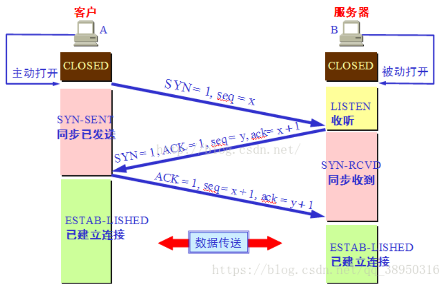

---

#### 四次挥手⭐

当 A 没有要发送的数据时就会向 B 发送终止连接报文，其中 FIN=1，seq=u，u 的值为之前 A 发送的最后一个序号加 1，发送后 A 进入 FIN-WAIT-1 状态。

B 收到后响应给 A 一个确认报文，ACK=1，ack=u+1，seq=v，v 的值为 B 之前发送的最后一个序号加 1。此时 A 进入 FIN-WAIT-2 状态，B 进入 CLOSE-WAIT 状态，但连接并未完全释放，B 会通知应用进程结束 A 到 B 方向的连接，此时 TCP 处于半关闭状态。

当 B 也准备释放连接时就向 A 发送连接终止报文，FIN=1，同时还要重发 ACK=1，ack=u+1，seq=w，seq 改变的原因是在半关闭状态 B 可能又发送了数据，之后 B 进入 LAST-ACK 状态。

A 收到连接终止报文后还要再进行一次确认，确认报文中 ACK=1，ack=w+1，seq=u+1，发送完后进入 TIME-WAIT 状态，等待 2MSL 后进入 CLOSED 状态。B 收到该确认后进入 CLOSED 状态，服务器端会稍早于客户端释放连接。

四次挥手的原因：TCP 是全双工通信，两个方向的连接需要单独断开。

等待 2MSL 的原因：

- **保证被动关闭方可以进入 CLOSED 状态**。MSL 是最大报文段寿命，等待 2MSL 可以保证 A 发送的最后一个确认报文被 B 接收，如果该报文丢失，B 会超时重传之前的 FIN+ACK 报文，而如果 A 在发送确认报文后立即释放连接就无法收到 B 可能超时重传的报文，也不会再次发送确认报文段，B 就无法正常进入 CLOSED 状态。

- 2MSL 时间后，本连接中的所有报文就都会从网络中消失，防止已失效连接的请求数据包与正常连接的请求数据包混淆而发生异常。

除此之外，TCP 还设有一个**保活计时器**，用于解决客户端故障问题，服务器每收到一次数据就重新设置保活计时器，如果 2 小时内没有收到数据就间隔 75 秒发送一次探测报文，连续 10 次没有响应后关闭连接。

**TIME-WAIT**

在高并发短连接的 TCP 服务器上，服务器处理完请求后立刻主动关闭连接，该场景下大量 socket 处于 TIME-WAIT 状态。TIME-WAIT 状态无法真正释放句柄资源，socket 使用的本地端口在默认情况下不能再被使用，会限制有效连接数量，成为性能瓶颈。

解决：调小 `tcp_fin_timeout` 的值、将 `tcp_tw_reuse` 设为 1 开启重用，将 `tcp_tw_recycle` 设为 1 开启快速回收。

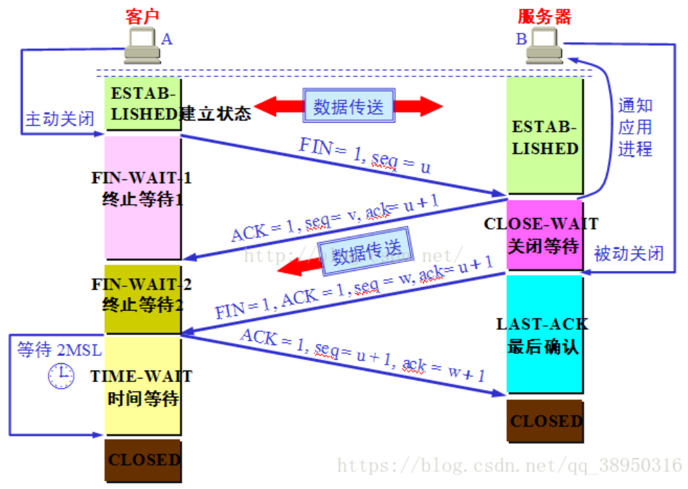

----

###  socket网络编程

####  简介

在网络编程中，网络上的两个程序通过一个双向的通信连接实现数据的交换，这个连接的一端称为一个socket。 Socket套接字是通信的基石，**是支持TCP/IP协议的网络通信的基本操作单元**。它是网络通信过程中端点的抽象表示，包含进行网络通信必须的五种信息：**连接使用的协议，本地主机的IP地址，本地进程的协议端口，远地主机的IP地址，远地进程的协议端口。** Socket本质是编程接口(API)，对TCP/IP的封装，TCP/IP也要提供可供程序员做网络开发所用的接口，这就是Socket编程接口；HTTP是轿车，提供了封装或者显示数据的具体形式；Socket是发动机，提供了网络通信的能力。


#### 原理

Socket实质上提供了进程通信的端点。进程通信之前，双方首先必须各自创建一个端点，否则是没有办法建立联系并相互通信的。正如打电话之前，双方必须各自拥有一台电话机一样。

套接字之间的连接过程可以分为三个步骤：服务器监听，客户端请求，连接确认。

>1、服务器监听：是服务器端套接字并不定位具体的客户端套接字，而是处于等待连接的状态，实时监控网络状态。
>
>2、客户端请求：是指由客户端的套接字提出连接请求，要连接的目标是服务器端的套接字。为此，客户端的套接字必须首先描述它要连接的服务器的套接字，指出服务器端套接字的地址和端口号，然后就向服务器端套接字提出连接请求。
>
>3、连接确认：是指当服务器端套接字监听到或者说接收到客户端套接字的连接请求，它就响应客户端套接字的请求，建立一个新的线程，把服务器端套接字的描述发给客户端，一旦客户端确认了此描述，连接就建立好了。而服务器端套接字继续处于监听状态，继续接收其他客户端套接字的连接请求。


------

### HTTP ⭐

#### 概况

**HTTP 超文本传输协议**，由客户程序和服务器程序实现，客户程序和服务器程序通过交换 HTTP 报文进行会话。HTTP 定义了这些报文的结构以及报文交换的方式，当用户请求一个 Web 页面时，浏览器向服务器发出对该页面中所包含对象的 HTTP 请求报文，服务器接收请求并返回包含这些对象的 HTTP 响应报文。

HTTP 使用 TCP 作为运输协议，HTTP 客户首先发起一个与服务器的 TCP 连接，一旦连接建立，浏览器和服务器进程就可以通过套接字访问 TCP。客户向它的套接字接口发送请求报文，服务器从它的套接字接口接收请求报文。

HTTP 是一种无状态的协议，服务器不存储任何关于该客户的状态信息。假如某个客户在短时间内连续两次请求同一个对象，服务器并不会因为刚刚为该客户做出了响应就不再响应，而是重新进行响应。

----

#### 非持续连接和持续连接

非持续连接必须为每个请求维护一个连接，对于每个连接，在客户和服务器中都要分配 TCP 缓冲区，给服务器造成很大负担。每次请求到响应大约需要花费两个 RTT 加上服务器传输文件的时间，RTT 指分组从客户到服务器再返回客户的时间。三次握手的前两部分占用一个 RTT，第三部分向服务器发送请求报文，服务器收到后做出响应，占用另一个 RTT。

HTTP1.1 使用持续连接，服务器响应后保持连接打开。在相同客户与服务器之间，后续的请求和响应报文能够通过相同的连接进行传送。

----

#### 报文格式

**请求报文**

请求报文包括**请求行、首部行和实体**。

- 请求行包括**方法、URL 和 HTTP 版本**。方法包括了 GET、POST、HEAD、PUT 和 DELETE 等。HEAD 类似于 GET，当服务器收到一个 HEAD 请求时，会用一个 HTTP 报文进行响应，但并不返回请求对象，通常使用 HEAD 进行调试；PUT 常用于上传对象到 Web 服务器；DELETE 用于删除 Web 服务器上的对象。 

- 首部行可以携带信息，例如 `Connection:close` 可以告诉服务器不要使用持续连接；`User-agent` 可以指明浏览器类型，服务器可以为不同类型的用户代理发送对象的不同版本。 

- 在首部行后有一个空行，后面跟着的是实体。使用 GET 时实体为空，而使用 POST 时才会使用实体。

**响应报文**

响应报文包括**状态行、首部行和实体**。

- 状态行包括协议版本、状态码和对应的状态信息。

- 首部行中，`Date` 是服务器发送响应报文的时间；`Server` 指明了服务器类型，类似于请求报文中的 `User-agent` 。
- 实体是报文的主要部分，即所请求的对象本身。

| 状态码 | 短语                       | 含义                                                         |
| ------ | -------------------------- | ------------------------------------------------------------ |
| 200    | OK                         | 成功响应                                                     |
| 301    | Moved Permanently          | 请求对象已被永久转移，新的 URL 定义在响应报文的首部行，客户端将自动获取。 |
| 302    | Found                      | 与301类似，但资源只是临时被移动，客户端继续使用原有 URL。    |
| 400    | Bad Request                | 通用的差错代码，请求不能被服务器理解。                       |
| 401    | Unauthorized               | 未认证，缺乏相关权限。                                       |
| 402    | Payment Required           | 保留，将来使用。                                             |
| 403    | Forbidden                  | 服务器理解客户端的请求，但是拒绝执行。                       |
| 404    | Not Found                  | 被请求的文档不在服务器上，有可能因为请求 URL 出错。          |
| 405    | Method Not Allowed         | 客户端中请求的方法被禁止，例如限制 POST 方式但使用了 GET 访问。 |
| 500    | Internal Server Error      | 服务器内部错误，无法完成请求。                               |
| 501    | Not Implemented            | 服务器不支持请求的功能，无法完成请求。                       |
| 502    | Bad Gateway                | 作为网关或代理工作的服务器尝试执行请求时，从远程服务器收到了一个无效响应。 |
| 503    | Service Unavailable        | 由于超载或系统维护，服务器暂时无法处理客户端的请求。         |
| 504    | Gateway Timeout            | 充当网关或代理的服务器，未及时从远端服务器获取请求。         |
| 505    | HTTP Version Not Supported | 服务器不支持请求报文使用的 HTTP 版本。                       |

----

#### GET 和 POST 的区别⭐

- GET 读取一个资源，可以将 GET 数据缓存在浏览器、代理或服务端。反复 GET 不应该对访问有副作用，没有副作用被称为幂等。 

  POST 不是幂等的，意味着不能随意多次执行，因此不能缓存，如果尝试重新执行 POST 请求，浏览器会弹出提示框询问是否重新提交表单。 

- GET 请求由 url 触发，想携带参数就只能在 url 后附加。 

  POST 请求来自表单提交，表单数据被浏览器编码到 HTTP 请求报文的请求体中。主要有两种编码格式，一种是 `application/..`，用来传输简单数据；另一种是 `multipart/form-data`格式，用来传输文件，对二进制数据传输效率高。

- 从攻击的角度说，无论 GET 还是 POST 都不安全，因为 HTTP 是明文协议。

- GET 长度受限于 url，而 url 的长度由浏览器和服务器决定。

  POST 没有大小限制，起限制作用的是服务器的处理能力。

---

#### cookie⭐

HTTP 的无状态性简化了服务器设计，提高了性能，使其可以同时处理大量 TCP 连接。但无状态也导致服务器不能识别用户，为解决该问题 HTTP 使用 cookie 客户端会话技术对用户进行追踪。

**工作流程**

① 当客户通过浏览器第一次访问站点时，该站点将产生一个唯一识别码，并以此作为索引，在后端数据库中产生一个表项。

② 服务器用一个包含 `Set-cookie` 首部的 HTTP 响应报文对浏览器进行响应，浏览器收到后将其添加到自己管理的 cookie 文件。

③ 在下次访问该站点时，请求报文的首部行会包括这个识别码，尽管服务器不知道客户是谁，但可以确定是同一个客户。

**cookie 和 session 的区别** 

① cookie 只能存储 ASCII 码，而 session 可以存储任何类型的数据。

② session 存储在服务器，而 cookie 存储在客户浏览器中，容易被恶意查看。。

③ session 的运行依赖 session id，而 session id 存在 cookie 中，叫做 JSESSIONID。如果浏览器禁用了 cookie ，同时 session 也会失效（可以通过其它方式实现，比如在 url 中传递 session_id）。

----

#### 输入一个 url 发生的事

判断 url 是否合法，如果不合法使用默认的搜索引擎进行搜索。如果输入的是一个域名，默认会加上一个 http 前缀。

先检查浏览器的 DNS 缓存，没有则检查本地 hosts 文件的缓存，如果仍然没有会向本地 DNS 服务器发送请求，最终本地 DNS 服务器得到域名和 IP 地址的映射关系，把结果返回给用户并进行缓存。

获取 IP 地址后，通过 TCP 三次握手建立连接，发送请求报文。

服务器收到请求报文后进行响应，主进程进行监听，创建子进程处理，先判断是否是重定向，如果是重定向则返回重定向地址。如果是静态资源则直接返回，否则通过 REST URL 在代码层面处理，最后返回响应报文。

浏览器收到 HTTP 响应报文后进行解析，首先查看响应报文的状态码，根据不同的状态码做不同处理。之后解析 HTML、CSS、JS 等文件，构建 DOM 树，渲染树，重绘。最后将像素发送 GPU 进行渲染，将渲染结果返回给用户并进行缓存。

通过 TCP 的四次挥手断开连接，如果是 HTTP1.1 则会将连接保持一小段时间。

----

#### HTTPS⭐

**HTTP 存在的问题**

**没有加密**，无法保证通信内容不被窃听。

**没有报文完整性验证**，无法确保通信内容在传输中不被改变。

**没有身份鉴别**，无法让通信双方确认对方身份。

**HTTPS 原理**

HTTP over SSL，**在 HTTP 传输上增加了 SSL 安全套接字层，通过机密性、数据完整性、身份鉴别为 HTTP 事务提供安全保证**。SSL 会对数据进行加密并把加密数据送往 TCP 套接字，在接收方，SSL 读取 TCP 套接字的数据并解密，把数据交给应用层。HTTPS 采用**混合加密机制**，使用非对称加密传输对称密钥保证传输安全，使用对称加密保证通信效率。

HTTPS 流程：

① 客户发送它支持的算法列表以及一个不重数。不重数就是在协议的生存期只使用一次的数，用于防止重放攻击，每个 TCP 会话使用不同的不重数，可以使加密密钥不同，重放记录无法通过完整性检查。

② 服务器从该列表中选择一种对称加密算法（例如 AES），一种公钥加密算法（例如 RSA）和一种报文鉴别码算法，然后把它的选择、证书，一个不重数返回给客户。

③ 客户通过 CA 提供的公钥验证证书，成功后提取服务器的公钥，生成一个前主密钥 PMS 并发送给服务器。

④ 客户和服务器独立地从 PMS 和不重数中计算出仅用于当前会话的主密钥 MS，然后通过 MS 生成密码和报文鉴别码密钥。此后客户和服务器间发送的所有报文均被加密和鉴别。

---

### 网络安全

#### 网络攻击

**被动攻击**指攻击者从网络上窃听他人的通信内容，只是分析协议数据单元 PDU 而不干扰信息流。

**主动攻击**包括：

- **篡改**

  攻击者篡改网络上传输的报文、中断报文的传送、或者把完全伪造的报文发给接收端。

- **恶意程序**

  ① 计算机病毒，修改其他程序来把自身的变种复制进去。② 计算机蠕虫，通过网络通信把自己从一个节点发往另一个节点，并自动启动。③ 特洛伊木马，它执行的功能并非声称的功能，而是恶意程序。④ 逻辑炸弹，当运行环境满足某种条件时就会执行某种功能。⑤ 后门入侵，利用系统漏洞通过网络入侵。

- **拒绝服务DoS**

  DoS 攻击使网络、主机不能由合法用户使用，电子邮件服务器、DNS 服务器和机构都可能成为攻击目标。

  DoS 包括：① 弱点攻击，向目标主机上运行的易受攻击的应用程序或操作系统发送精细制作的报文。② 带宽洪泛，攻击者向目标主机发送大量分组，使其接入链路变得阻塞导致分组无法到达服务器。③ 连接洪泛，在目标主机创建大量 TCP 连接，主机因这些伪造的连接而陷入阻塞。

- **ARP欺骗**

  攻击者向以太网交换机发送大量伪造的源 MAC 地址，以太网交换机把虚假的 MAC 地址填入到交换表中，导致交换机无法正常工作。

**对于被动攻击可以采用数据加密技术，对于主动攻击则需要将加密技术与鉴别技术相结合。**

安全的计算机网络特性：

- **机密性**

  仅有通信双方能理解传输内容，报文必须加密使截获者无法理解。

- **报文完整性**

  通信内容在传输过程中需要确保未被篡改。

- **端点鉴别**

  通信双方都能证实另一方的身份。

- **运行安全性**

  几乎所有机构都与互联网相连，需要通过访问控制确保安全性，防火墙位于机构和公共网络之间，控制通过网络的分组；入侵检测系统执行分组检查任务，检测可疑活动。

----

#### 密码技术⭐

密码技术使发送方可以伪装数据，入侵者不能从截获到的数据中获得有效信息。

**对称密钥密码体制**

使用相同的加密密钥和解密密钥，运算速度快，但安全性差。使用对称密钥时，在通信信道上可以进行**一对一的双向保密通信**，每一方既可以用该密钥加密明文，也可以解密密文。这种保密通信仅限于持有此密钥的双方。

**公开密钥密码体制**

使用公钥进行加密，私钥进行解密，公钥是任何人都可以得知的，而私钥是通信双方独有的。运算速度慢，但是安全性好。最常见的公钥加密算法是 RSA，它使用两个大素数 p 和 q 生成密钥，pq 的值越大破解难度越大，但耗时也越长。使用公开密钥时，在通信信道上是**多对一的单向保密通信**，可以同时有很多客户利用公钥对报文加密后发送给服务器，服务器利用其私钥可以对收到的密文一一解密，但如果是反方向则行不通，例如网购时很多客户都向同一网站发送各自的信用卡信息。

----

#### 数字签名⭐

**作用**

报文鉴别：接收者可以确认报文发送方的身份。

报文完整性：接收者可以确信报文内容没有被篡改过。

不可否认：发送者事后不能抵赖对报文的签名。

**实现原理**

用私钥对报文进行 D 运算得到密文，接收方会利用发送方的公钥进行 E 运算还原出明文。

- 报文鉴别：除了发送方外没有人持有其私钥，无法产生发送方才能产生的密文。

- 报文完整性：如果其他人篡改过密文，解密出的明文就会不可读。

- 不可否认：如果发送方抵赖发送过报文，接收方可以把初始报文和密文发送给公证的第三者，第三者通过公钥进行验证。

**公钥认证**

攻击者可能会发送使用自己私钥加密的密文和自己的公钥来伪造发送方的身份，该问题通过 CA 解决，发送方在发送数据时也会发送 CA 签署的证书，接收方会利用 CA 的公钥核实发送方证书的合法性并提取发送方的公钥。

CA 即认证中心，将公钥与特定的实体绑定， 职责是使识别和发行证书合法化。CA 认证一个实体的真实身份，生成一个将其身份和实体的公钥绑定起来的证书，证书包含了这个公钥和公钥所有者全局唯一的身份标识信息（例如一个人名或一个 IP）。

----

#### 报文鉴别

报文鉴别就是鉴别收到的报文确实是期望的发送方发送的，而不是别人伪造的。

数字签名可以实现报文鉴别，但缺点是对较长报文进行签名时需要长时间的运算。有一种相对简单的报文鉴别方式，即密码散列函数，要找到两个不同的报文，它们具有相同的密码散列函数输出，在计算上是不可行的。

**使用散列函数进行报文鉴别**

通信双方共享一个密钥 k ，发送方生成报文 m，用 k 级联 m 生成 m+k，并使用 SHA-1 或 MD5 这样的散列函数计算 m+k 的散列值 h，这个散列值就被称为报文鉴别码 MAC。发送方会利用 MAC 生成扩展报文并发送给接收方。接收方收到后，由于知道共享密钥 k，因此可以计算出 MAC，如果和 h 相等就可以得出一切正常的结论。

----

#### 端点鉴别

端点鉴别主要通过鉴别协议 ap 实现，鉴别协议通常在两个通信实体运行其他协议之前运行，仅当鉴别完成后各方才继续下面的工作。

**ap1.0**：发送方直接发送报文说明身份，攻击者可以任意伪造。

**ap2.0**：接收方验证 IP 数据报的源地址和发送方常用地址是否匹配来进行鉴别。存在 IP 欺骗的可能性，攻击者可以伪造源 IP 地址。

**ap3.0**：接收方会要求发送方提供口令进行验证，但依旧不安全，因为攻击者能通过嗅探获得口令并不断重放。

**ap4.0**：重放攻击主要是由于接收方并不知道此时发送方是否活跃，ap4.0 通过不重数防止重放攻击。接收方会向发送方发送一个不重数，发送方将其加密后发回给接收方，接收方通过验证这个数字来判断发送方是否活跃。

----

#### 安全协议

**网络层**

IPsec 是能够为两个网络实体提供通信安全的协议族，没有限定用户必须使用的加密算法，许多机构都使用 IPsec 保证 VPN 的安全性。

IPsec 有两个主要协议：鉴别首部 AH 和封装安全有效载荷 ESP。AH 提供源鉴别和数据完整性服务，而 ESP 除了这两种服务外还提供机密性服务，因此使用比 AH 广泛。使用 AH 或 ESP 的 IP 数据报称为 IP 安全数据报，IP 安全数据报有两种工作方式：① 运输方式，在整个运输层报文段的前后分别加上控制信息，再加上 IP 首部。② 隧道方式，在原始 IP 数据报的前后分别加上控制信息，这种方式使用较多。

**运输层**

运输层的安全协议主要是 SSL 和 TLS ，TLS 是 SSL3.0 的修改版本。SSL 主要作用在端系统的 HTTP 和运输层之间，在 TCP 上建立起一个安全通道，为 TCP 传输数据提供安全保障。

SSL 提供的安全服务包括：**服务器鉴别**，允许用户证实服务器的身份，支持 SSL 的客户端通过验证来自服务器的证书鉴别服务器的身份并取得服务器的公钥；**客户鉴别**，SSL 可选的安全服务，允许服务器验证用户的身份；**加密的 SSL 会话**，对客户和服务器发送的所有报文进行加密，检测报文是否被篡改。

----

#### 防火墙和入侵检测

在计算机网络中，当通信流量进出网络时要执行安全检查、记录、丢弃或转发，这些工作由防火墙和入侵检测系统完成。

**防火墙**

防火墙严格控制进出网络的分组，禁止任何不必要通信，从外部到内部和从内部到外部的所有流量都必须经过防火墙。 

防火墙分为三种：① 基于**分组过滤**，分组过滤器独立地检查每个数据报，然后基于特定规则决定该数据报应当通过还是丢弃，过滤因素包括 IP 地址、TCP 或 UDP 的端口等。②  基于**状态过滤**，利用一张连接表跟踪 TCP 连接，通过跟踪信息决定。③ **应用程序网关**，一个应用程序特定的服务器，所有数据都必须通过它。

**入侵检测系统 IDS**

防火墙不能阻止所有入侵，入侵检测系统作为第二道防线，对网络分组进行深度分析与检测从而发现异常行为。

- 基于特征的 IDS 

  维护一个攻击特征数据库，每个特征是一个与入侵活动关联的规则集，基于特征的 IDS 嗅探通过它的每个分组，将分组中的数据与数据库中的特征进行比较，如果匹配将产生一个警告，缺点是无法应对新型攻击。

- 基于异常的 IDS 

  观察正常运行的网络流量，学习正常流量的统计特性和规律，当检测到网络中流量的某种统计规律不符合正常情况时则认为可能发生了入侵行为，区分正常流量和统计异常流量非常困难 ，大多数 IDS 都是基于特征的。 

---

### 缓存⭐

#### 概念

当需要频繁访问用户信息等热数据时，为了加快响应速度往往会把数据缓存在内存中，这样再次访问数据时直接从内存中获取即可，降低了后端的负载。

- 处理写请求时先将数据写入数据库，然后写入缓存。
- 处理读请求时首先尝试从缓存获取，如果失败则从数据库查询并将结果缓存。

---

#### 缓存更新策略

缓存数据会和真实数据有一段时间的不一致，需要利用某种策略进行更新。低一致性业务建议配置最大内存并使用算法剔除，高一致性业务可以结合超时剔除和主动更新，即使主动更新出错也能保证数据过期后删除脏数据。

**算法剔除**

- **FIFO 先进先出**

  判断存储时间，离当前时间最远的数据优先淘汰。

  新数据插入队列尾部，数据在队列中顺序移动；淘汰队列头部的数据。

- **LRU 最近最少使用**

  判断最近使用时间，离当前时间最远的数据优先被淘汰。

  新数据插入到队列头部；每当缓存命中则将数据移到队列头部；当队列满的时候，将队列尾部的数据丢弃。

- **LFU 最不经常使用**

  在一段时间内，被使用次数最少的数据优先淘汰。LFU 的每个数据块都有一个引用计数，所有数据块按照引用计数排序，具有相同引用计数的数据块按时间排序。

  新数据插入到队列尾部；数据被访问后引用计数增加，队列重新排序；当需要淘汰数据时，将队列尾部数据删除。

剔除算法常用于缓存使用量超过预设最大值时对现有数据进行剔除，数据一致性最差。

---

**2 超时剔除**

**通过给缓存设置过期时间实现**，例如 Redis 的 expire 命令。如果业务可以容忍一段时间内缓存数据和真实数据不一致，可以为其设置过期时间，在数据过期后再从数据源获取数据，更新缓存并设置过期时间。数据一致性较差。

---

**3 主动更新**

**在真实数据更新后立即更新缓存**，可以利用消息系统实现。数据一致性强，但如果主动更新出错会导致脏数据，建议结合超时剔除使用。

---

#### 缓存穿透

**缓存穿透指查询不存在的数据，缓存层和存储层都不会命中**。过程：① 缓存层不命中。② 存储层不命中，不将空结果写回内存（出于容错考虑）。③ 返回空结果。

缓存穿透将导致不存在的数据每次请求都要到存储层查询，可能会使后端负载增大，由于很多后端存储不具备高并发性，甚至可能造成后端宕机。通常在程序中分别统计总调用数、缓存命中数、存储层命中数，如果发现大量存储层空命中，说明可能出现了缓存穿透。

产生原因：自身业务代码或数据出现问题； 一些恶意攻击、爬虫等造成大量空命中。

解决方法：

- 缓存空对象：如果一个查询返回结果为 null，仍然缓存 null 结果，但其过期时间很短，通常不超过 5 分钟。

- 布隆过滤器：将所有可能存在的数据映射到一个足够大的 Bitmap 中，在用户发起请求时首先经过布隆过滤器的拦截，一个一定不存在的数据会被拦截。

- >布隆过滤器的原理是，当一个元素被加入集合时，通过K个Hash函数将这个元素映射成一个位数组中的K个点，把它们置为1。检索时，我们只要看看这些点是不是都是1就（大约）知道集合中有没有它了：如果这些点有任何一个0，则被检元素一定不在；如果都是1，则被检元素很可能在。这就是布隆过滤器的基本思想。

---

#### 缓存击穿

对于热数据的访问量非常大，在其缓存失效的瞬间，大量请求直达存储层，导致服务崩溃。

解决：

- 加锁互斥：当一个线程访问后，缓存中数据会被重建，其他线程就可以从缓存中取值。
- 永不过期：为热点数据不设置过期时间。

---

#### 缓存雪崩

如果缓存层因为某些问题不能提供服务，所有请求都会到达存储层，对数据库造成巨大压力。

解决方法：

- 保证缓存层服务的高可用性：使用集群，即使个别节点宕机仍然可以提供服务。
- 依赖隔离组件为后端限流并降级：对重要资源进行隔离，让每种资源单独运行在自己的线程池中，即使个别资源出现问题，对其他服务没有影响，例如 Java 中的隔离工具 Hystrix。降级机制在高并发系统中使用普遍，例如在推荐服务中，如果个性化推荐服务不可用，可以降级补充热点数据，避免前端页面空白。
- 构建多级缓存：增加本地缓存，在存储层前多加一层屏障，降低请求直达存储层概率。

---

### CDN⭐

CDN 内容分发网络，指基于部署在各地的服务器，通过中心平台的负载均衡、内容分发，使用户就近获取所需内容，降低网络延迟。

关键技术：

- 内容发布：借助缓存、组播等技术，将内容发布到网络上距离用户最近的中心机房。
- 内容路由：通过内容路由器中的重定向机制，在多个中心机房的服务器上负载均衡用户的请求。
- 内容交换：根据内容可用性、服务器可用性及用户背景，在缓存服务器上利用应用层交换、流分裂等技术，平衡负载流量。
- 性能管理：通过监控系统，获取网络信息，测量内容发布的端到端性能（延时、包丢失、平均带宽等），保证网络处于最佳状态。

特点：

- 缓存加速：将用户经常访问的数据缓存在本地，提升响应速度。
- 镜像服务：消除不同运营商之间的网络差异，实现跨运营商的网络加速。
- 远程加速：利用负载均衡为用户选择高质量服务器，加快访问速度。
- 带宽优化：自动生产服务器的远程镜像缓存，分担流量，降低原站点负载。

---

## 操作系统 

### 进程

**进程是程序的一次执行过程，是系统进行资源分配和调度的一个独立单位，目的是为了更好地描述和控制程序的并发执行。**

| 结构           | 说明                                                         |
| -------------- | ------------------------------------------------------------ |
| 进程控制块 PCB | 进程存在的唯一标识，包括进程描述信息、控制信息、资源分配信息等。 |
| 程序段         | 能被进程调度到 CPU 执行的代码。                              |
| 数据段         | 进程对应的程序加工处理的原始数据。                           |

----

#### 进程特征

| 特征   | 说明                                                         |
| ------ | ------------------------------------------------------------ |
| 动态性 | 进程最基本的特征，进程是程序的一次执行，具有一定的生命周期。 |
| 并发性 | 多个进程可以同时存在于内存中，在一段时间内同时运行。         |
| 独立性 | 进程是一个能独立运行、独立接受调度的单位。                   |
| 异步性 | 进程按不可预知的速度推进。                                   |

---

#### 进程状态

| 状态   | 说明                                                         |
| ------ | :----------------------------------------------------------- |
| 创建态 | 进程正在被创建，尚未转到就绪态。                             |
| 就绪态 | 进程已处于准备运行的状态，获得了除处理机外的一切资源。       |
| 运行态 | 进程正在处理机上运行。                                       |
| 阻塞态 | 进程正在等待某一事件而暂停运行，如等待某资源可用或等待 IO 流完成。 |
| 结束态 | 进程正常结束或中断退出。                                     |

---

#### 进程控制

**进程的创建**

过程：

- 为新进程分配一个唯一的进程标识号，并申请一个空白的 PCB，若申请失败则创建失败。

- 为新进程的程序和数据分配内存空间，若资源不足会进入阻塞态。

- 初始化 PCB，主要包括标志信息、处理机状态信息、以及设置进程优先级等。

- 若进程就绪队列未满，就将新进程插入就绪队列，等待被调度运行。

---

**进程的终止**

进程终止包括：正常结束，表示进程已经完成并准备退出；异常结束，表示进程在运行时发生异常，程序无法继续运行，例如非法指令，IO 故障等；外界干预，指进程因为外界请求而终止，例如操作系统干预等。

过程：

- 根据被终止进程的标识符，检索 PCB，读出该进程的状态。
- 若被终止的进程处于执行状态，终止执行，将处理机资源分配给其他进程。
- 若进程还有子进程，将所有子进程终止。
- 将该进程的全部资源归还给父进程或操作系统，并将 PCB 从队列删除。

---

**进程的阻塞与唤醒**

正在执行的进程由于等待的事件未发生，由系统执行阻塞原语，由运行态变为阻塞态。

阻塞过程：

- 找到将要被阻塞进程的 PCB。
- 如果进程为运行态，保护现场并转为阻塞态，停止运行。
- 把 PCB 插入相应事件的等待队列，当被阻塞进程期待的事件发生时，由相关进程调用唤醒原语，将进程唤醒。

唤醒过程：

- 在该事件的等待队列中找到进程对应的 PCB。
- 将其从等待队列中移除，设置状态为就绪态。
- 将 PCB 插入就绪队列，等待调度程序调度。

---

**进程切换**

进程切换是指处理机从一个进程的运行转到另一个进程上运行。

进程切换过程：

- 保存处理机上下文，包括程序计数器和其他寄存器。
- 更新 PCB 信息，并把 PCB 移入相应的阻塞队列。
- 选择另一个进程执行并更新其 PCB。
- 更新内存管理的数据结构，恢复处理机上下文。

---

#### 进程通信⭐

**管道通信**

Linux 里的 `|` 就是一个管道，功能是将前一个命令的输出作为后一个命令的输入。

管道通信中存储空间是内核缓冲区，只允许一边写、另一边读，只要缓冲区有数据，进程就能读出。写进程会先将缓冲区写满才让读进程读，当缓冲区还有数据时，写进程不会往缓冲区写数据。因此管道是半双工通信，效率低，不适合进程间频繁交换数据。

**消息队列**

消息队列是保存在内核中的消息链表，消息的发送方和接收方要约定好消息体的数据类型，每个消息体都是固定大小的存储块，不像管道是无格式的字节流。如果进程从消息队列中读取了消息体，内核就会把这个消息体删除。消息队列的通信效率高于管道，进程发送消息时，把数据放在消息队列后就可以正常返回。

消息队列不适合较大数据的传输，因为内核中每个消息体都有最大长度限制。此外，消息队列通信存在数据拷贝开销，进程写数据到消息队列时，会发生从用户态拷贝数据到内核态的过程，读取数据时，会发生从内核态拷贝数据到用户态的过程。

**共享内存**

共享内存解决了消息队列中用户态与内核态间的数据拷贝问题，将虚拟地址空间映射到相同的物理内存，当某个进程写数据时，另一个进程马上就能看到，不需要拷贝，提高通信效率。

---

### 线程

线程是进程中的一个实体，是**操作系统独立调度和分配的基本单位**，由线程 ID、程序计数器、寄存器集合和堆栈组成。引入线程是为了减少程序并发执行的开销，进一步提高操作系统的并发性能。

#### 线程和进程的区别⭐

**调度：**进程是分配资源的基本单位，而线程是独立调度的基本单位。

**资源：**进程拥有系统资源，而线程只有一点运行必需的资源。如果线程也是分配资源的单位，切换就需要较大开销，引入没有意义。

**开销：**进程切换涉及当前 CPU 环境的保存和设置，但线程切换只需要保存和设置少量的寄存器容量。

**地址空间：**进程的地址空间互相独立，同一进程的线程共享进程资源，进程内的线程对其他进程不可见。

**通信：**进程通信需要同步和互斥手段的辅助，保证数据一致性。线程可以直接读写进程数据段（全局变量）来进行通信。

---

#### 线程实现

**内核级线程 1:1 实现**

内核通过操纵调度器对线程进行调度，并将线程的任务映射到处理器上。程序一般不会直接使用内核线程，而是使用内核线程的一种高级接口，轻量级进程，即通常意义上的线程。

优点：当一个线程被阻塞时，允许其他线程继续执行。

缺点：代价相对较高，需要在用户态和内核态来回切换。

---

**用户级线程 1:N 实现**

从广义上讲，一个线程只要不是内核线程，就可以认为是用户线程。狭义上的用户线程指的完全建立在用户空间的线程库上，系统内核不能感知到用户线程的存在及其是如何实现的。

优点：由于线程管理在用户空间进行，不需要切换到内核态，开销小，支持大规模并发。

缺点：一个线程在使用内核服务时被阻塞，整个进程都会被阻塞。

---

**混合方式 N:M 实现**

混合模式下既存在用户线程，也存在轻量级进程。用户线程完全建立在用户空间中，因此开销依然很小，可以支持大规模并发。轻量级进程作为用户线程和内核线程之间的桥梁，使用内核提供的线程调度功能及处理器映射，降低整个进程阻塞的风险。

----

### 死锁⭐

死锁就是指多个进程因为互相竞争资源而造成的一种互相等待的僵局，若无外力作用，这些进程都无法继续向前推进。

#### 死锁的原因

不可剥夺资源数量的不足，如打印机，对可剥夺资源的竞争不会造成死锁。

进程请求和释放资源的顺序不当，例如进程 P1 和 P2 分别占用资源 R1 和 R2，而此时 P1 和 P2 又分别申请资源 R2 和 R1。

信号量的使用不当，进程间彼此互相等待对方发来的消息，也会使进程无法推进。

#### 必要条件

互斥条件：进程对资源的占有具有排它性，如果进程请求的资源已被占用，请求就会被阻塞。

不可剥夺条件：进程获得的资源没有使用完成前，不能被其它进程强行获取，只能由占有它的进程主动释放。

请求和保持条件：进程已经保持了至少一个资源，但又提出了新的资源请求，而该资源已被其它进程占有，此时请求被阻塞，但进程也不会释放自己已经占有的资源。

循环等待条件：存在一个进程资源的循环等待链，链中每个进程已经占有的资源同时是其他进程请求的资源。

---

#### 死锁处理

**预防**

- 破坏互斥条件

  允许系统资源共享，但有的资源不可能同时访问，如打印机等临界资源。

- 破坏不可剥夺条件

  允许剥夺其他进程已占有的资源，但释放已获得的资源可能会造成前一段工作的失效。

- 破坏请求和保持条件

  采用预先资源分配法，在进程运行前一次性分配它需要的所有资源，缺点是有些资源可能仅在运行初期或快结束时才使用。

- 破坏循环等待条件

  采用顺序资源分配法， 给系统资源编号，规定每个进程必须按编号递增的顺序请求资源。

---

**避免**

同样属于事先预防，但并不是事先采取某种限制措施，而是动态地根据情况处理。

- 系统安全状态

  不安全状态可能会导致死锁，如果一次分配不会导致系统进入不安全状态，则将资源分配给进程，否则就让进程等待。

  安全状态是指系统能按照某种进程推进顺序为每个进程分配资源，直到满足每个进程对资源的需求。

- 银行家算法

  把操作系统视为银行家，资源视为资金，进程向操作系统申请资源相当于用户向银行家贷款。操作系统按照规则为进程分配资源，当进程首次申请资源时，要测试系统现存资源能否满足其最大需求量，可以则按申请量分配，否则推迟分配。

  当进程在执行中继续申请资源时，先测试该进程已占有的资源数与申请的资源数之和是否超过该进程对资源的最大需求量，如果超过则拒绝分配，否则再测试系统现存的资源能否满足该进程尚需的最大资源量，如果满足则按申请量分配，否则推迟分配。

---

**检测**

系统死锁可用资源分配图描述，圆圈表示进程，框表示资源。从进程到资源的有向边是请求边，从资源到进程的边是分配边。

简化资源分配图可以检测系统状态是否为死锁状态。在资源分配图中，找出既不阻塞也不孤立的进程，消去它的所有请求边和分配边，使之成为孤立的点。如果系统状态不可被完全简化，那么代表死锁。

---

**解除**

- 资源剥夺法

  挂起某些死锁进程，抢占其资源，分配给其它死锁进程。

- 撤销进程法

  强制撤销部分甚至全部死锁进程，可以按进程优先级和撤销代价进行。

- 进程回退法

  让一个或多个进程回退到足以避免死锁的地步，要求系统保持进程的历史信息，设置还原点。

---

## Java 基础

### 语言特性

#### 优点

① 平台无关，摆脱硬件束缚，"一次编写，到处运行"。

② 安全的内存管理和访问机制，避免大部分内存泄漏和指针越界。

③ 热点代码检测和运行时编译优化，程序随运行时长获得更高性能。

④ 完善的应用程序接口，支持第三方类库。

---

#### 平台无关⭐

**JVM：** 编译器生成与计算机体系结构无关的字节码，字节码文件不仅能在任何机器解释执行，还能动态转换成本地机器码，转换由 JVM 实现。JVM 是平台相关的，屏蔽了不同操作系统的差异。

**语言规范：** 基本数据类型大小有明确规定，如 int 永远 32 位，而 C/C++ 可能是 16 位、32 位，或编译器开发商指定的其他大小。数值类型有固定字节数，字符串用标准 Unicode 格式。

---

#### JDK 和 JRE

**JDK：** Java Development Kit，开发工具包。提供了编译运行 Java 程序的各种工具，包括编译器、JRE 及常用类库，是 JAVA 核心。

**JRE：** Java Runtime Environment，运行时环境，运行 Java 程序的必要环境，包括 JVM、核心类库、核心配置工具。

---

#### 值调用和引用调用

按值调用指方法接收调用者提供的值，按引用调用指方法接收调用者提供的变量地址。

Java 总是按值调用，方法得到的是参数的副本，传递对象时实际上传递的是对象引用的副本。

- 方法不能修改基本数据类型的参数，例如传递了一个 int 值 ，改变 int 值不会影响实参。

- 方法可以改变对象参数的状态，但不能让对象参数引用新的对象。例如传递了一个 int 数组，改变数组内容会影响实参，而改变其引用并不会让实参引用新的数组对象。

----

#### 浅拷贝和深拷贝

浅拷贝只复制当前对象的基本数据类型及引用变量，没有复制引用变量指向的实际对象。修改克隆对象可能影响原对象。

深拷贝完全拷贝基本数据类型和引用数据类型，修改克隆对象不会影响原对象。

---

#### 反射

在运行状态中，对于任意一个类都能知道它的所有属性和方法，对于任意一个对象都能调用它的任意方法和属性，这种动态获取信息及调用对象方法的功能称为反射，缺点是破坏了封装性及泛型约束。

反射调用对象的三种方法：

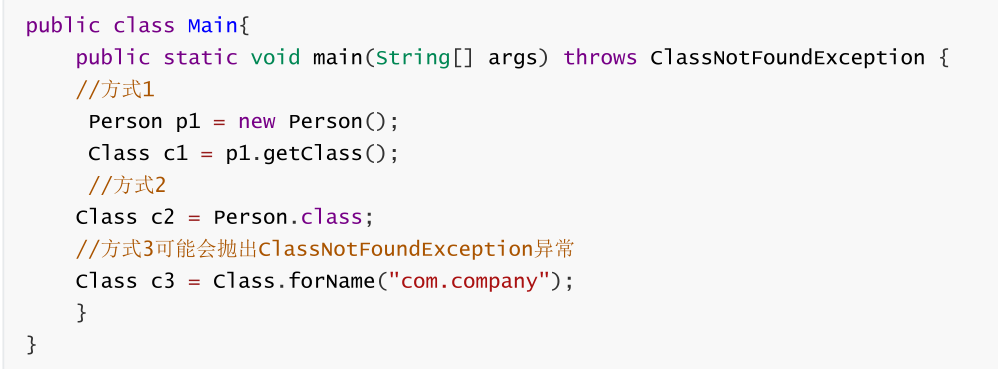

反射调用方法：

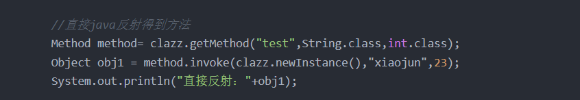

反射调用过程：


---

#### Class 类

在程序运行期间，Java 运行时系统为所有对象维护一个运行时类型标识，这个信息会跟踪每个对象所属的类，虚拟机利用运行时类型信息选择要执行的正确方法，保存这些信息的类就是 Class，这是一个泛型类。

获取 Class 对象：①  `类名.class` 。② 对象的 `getClass`方法。③ `Class.forName(类的全限定名)`。

---

#### 注解⭐

**注解是一种标记，使类或接口附加额外信息，帮助编译器和 JVM 完成一些特定功能**，例如 `@Override` 标识一个方法是重写方法。

**元注解是自定义注解**的注解，例如：

`@Target`：约束作用位置，值是 ElementType 枚举常量，包括 METHOD 方法、VARIABLE 变量、TYPE 类/接口、PARAMETER 方法参数、CONSTRUCTORS 构造方法和 LOACL_VARIABLE 局部变量等。

`@Rentention`：约束生命周期，值是 RetentionPolicy 枚举常量，包括 SOURCE 源码、CLASS 字节码和 RUNTIME 运行时。

`@Documented`：表明注解应该被 javadoc 记录。

---

#### 泛型

泛型本质是参数化类型，解决不确定对象具体类型的问题。

泛型的好处：① 类型安全，不存在 ClassCastException。② 提升可读性，编码阶段就显式知道泛型集合、泛型方法等处理的数据类型。

泛型用于编译阶段，编译后的字节码文件不包含泛型类型信息，因为虚拟机没有泛型类型对象，所有对象都属于普通类。例如定义 `List<Object>` 或 `List<String>`，在编译后都会变成 `List` 。

---

#### JDK8 新特性

**lambda 表达式：**允许把函数作为参数传递到方法，简化匿名内部类代码。

**函数式接口：**使用 `@FunctionalInterface` 标识，有且仅有一个抽象方法，可被隐式转换为 lambda 表达式。

**方法引用：**可以引用已有类或对象的方法和构造方法，进一步简化 lambda 表达式。

**接口：**接口可以定义 `default ` 修饰的默认方法，降低了接口升级的复杂性，还可以定义静态方法。

**注解：**引入重复注解机制，相同注解在同地方可以声明多次。注解作用范围也进行了扩展，可作用于局部变量、泛型、方法异常等。

**类型推测：**加强了类型推测机制，使代码更加简洁。

**Optional 类：**处理空指针异常，提高代码可读性。

**Stream 类：**引入函数式编程风格，提供了很多功能，使代码更加简洁。方法包括 `forEach` 遍历、`count` 统计个数、`filter` 按条件过滤、`limit` 取前 n 个元素、`skip` 跳过前 n 个元素、`map` 映射加工、`concat` 合并 stream 流等。

**日期：**增强了日期和时间 API，新的 java.time 包主要包含了处理日期、时间、日期/时间、时区、时刻和时钟等操作。

**JavaScript：**提供了一个新的 JavaScript 引擎，允许在 JVM上运行特定 JavaScript 应用。

---

#### 异常🌙


所有异常都是 Throwable 的子类，分为 Error 和 Exception。

Error 是 Java 运行时系统的内部错误和资源耗尽错误，例如 StackOverFlowError 和 OutOfMemoryError，这种异常程序无法处理。

Exception 分为受检异常和非受检异常，受检异常要显式处理，否则编译出错，非受检异常是运行时异常，继承 RuntimeException。

受检异常：① 无能为力型，如字段超长导致的 SQLException。② 力所能及型，如未授权异常 UnAuthorizedException，程序可跳转权限申请页面。常见受检异常还有 FileNotFoundException、ClassNotFoundException、IOException等。

非受检异常：① 可预测异常，例如 IndexOutOfBoundsException、NullPointerException、ClassCastException 等，这类异常应该提前处理。② 需捕捉异常，例如进行 RPC 调用时的远程服务超时，这类异常客户端必须显式处理。③ 可透出异常，指框架或系统产生的且会自行处理的异常，例如 Spring 的 NoSuchRequestHandingMethodException，Spring 会自动将异常自动映射到合适的状态码。

------

#####  throw -throws

- 位置区别：throw用在函数体内部，后面跟具体的异常对象，throws用在函数方法上，后面跟一个或者多个异常类
- 功能区别：throw表示一定抛出了某种特定的异常对象，执行到throw之后，会跳转调用者，并且调用者会接受到该异常；throws表示可能抛出异常，并不一定会发生异常，调用者只是知道该方法可能出现的问题，可以预先给出处理方法。

------

#####  try、catch、throw、throws、finally

try的意思是试试它所包含的代码段中是否会发生异常；

而catch当有异常时抓住它，并进行相应的处理，使程序不受异常的影响而继续执行下去；

throw是在程序中明确引发异常；throws的作用是如果一个方法可以引发异常，而它本身并不对该异常处理，那么它必须将这个异常抛给调用它的方法；finally是无论发不发生异常都要被执行的代码

---

### 数据类型 

#### 基本数据类型

| 数据类型 | 内存大小                               | 默认值   | 取值范围                    |
| -------- | -------------------------------------- | -------- | --------------------------- |
| byte     | 1 B                                    | (byte)0  | -128 ~ 127                  |
| short    | 2 B                                    | (short)0 | -2^15^ ~ 2^15^-1            |
| int      | 4 B                                    | 0        | -2^31^ ~ 2^31^-1            |
| long     | 8 B                                    | 0L       | -2^63^ ~ 2^63^-1            |
| float    | 4 B                                    | 0.0F     | ±3.4E+38（有效位数 6~7 位） |
| double   | 8 B                                    | 0.0D     | ±1.7E+308（有效位数 15 位） |
| char     | 英文 1B，中文 UTF-8 占 3B，GBK 占 2B。 | '\u0000' | '\u0000' ~ '\uFFFF'         |
| boolean  | 单个变量 4B / 数组 1B                  | false    | true、false                 |

JVM 没有 boolean 的字节码指令，单个 boolean 变量用 int 代替，`boolean f = false` 就是用 ICONST_0 即常数 0 赋值。boolean 数组会编码成 byte 数组。

自动装箱是将基本数据类型包装为一个包装类对象，例如向一个泛型为 Integer 的集合添加 int 元素；自动拆箱是将一个包装类对象转换为基本数据类型，例如将一个 Integer 对象赋值给一个 int 变量。比较两个包装类数值要用 `equals` 。

---

#### String⭐

String 类和其存储数据的 value 字节数组都是 final 修饰的。对 String 对象的任何修改实际都是创建新对象再引用，并没有修改原对象。

**字符串拼接方式**

① 直接用 `+` ，底层用 StringBuilder 实现。只适用小数量，如果在循环中使用 `+` 拼接，相当于不断创建新的 StringBuilder 对象再转换成 String 对象，效率极差。

② 使用 String 的 `concat` 方法，该方法使用 `Arrays.copyOf` 创建一个新的字符数组 buf 并将当前字符串 value 数组的值拷贝到 buf，之后调用 `getChars` 方法用 `System.arraycopy` 将拼接字符串的值也拷贝到 buf，最后用 buf 作为构造参数 new 一个新的 String 对象返回。效率稍高于直接使用 `+`。

③ 使用 StringBuilder 或 StringBuffer，两者的 `append` 方法都继承自 AbstractStringBuilder，该方法首先使用 `Arrays.copyOf`  确定新的字符数组容量，再调用 `getChars` 方法用 `System.arraycopy` 将新的值追加到数组。StringBuilder 是 JDK5 引入的，效率高但线程不安全，StringBuffer 使用 synchronized 保证线程安全。

####  String、StringBufer、StringBulider

1.可变性：String不可变、StringBuffer和StringBuilder是可变的；

2.线程安全性：String是线程安全的，StringBuffer对所有的公开方法都加了synchronized修饰，是线程安全的；StringBuilder是非线程安全的；

3.性能：StringBuilder>StringBuffer>String

---

### 面向对象

#### 面向对象

面向过程是过程化思维，代码松散，强调流程化，开发时软件维护困难，耦合严重；面向对象更适合解决大规模问题，强调高内聚、低耦合，先抽象模型定义共性行为，再解决问题。

**封装**是对象功能内聚的表现形式，在抽象基础上决定信息是否公开及公开等级。主要任务是对属性、数据、敏感行为实现隐藏，使对象关系变得简单，降低耦合。

**继承**用来扩展类，子类可继承父类的部分属性和行为，使模块具有复用性。

**多态**以封装和继承为基础，根据运行时对象实际类型使同一行为具有不同表现形式。多态指在编译层面无法确定最终调用的方法体，在运行期由 JVM 动态绑定，调用合适的重写方法。由于重载属于静态绑定，本质上重载结果是完全不同的方法，因此多态一般专指重写。

---

#### 重载和重写

**重载**指方法名称相同，但参数列表不同，是行为水平方向不同实现。对编译器来说，方法名称和参数列表组成了一个唯一键，称为方法签名，JVM 通过方法签名决定调用哪种重载方法。不管继承关系多复杂，重载在编译时可以确定调用哪个方法，因此属于静态绑定。重载顺序：① 精确匹配。② 基本数据类型自动转换成更大表示范围。③ 自动拆箱与装箱。④ 子类向上转型。⑤ 可变参数。

**重写**指子类实现接口或继承父类时，保持方法签名完全相同，实现不同方法体，是行为垂直方向不同实现。元空间有一个方法表保存方法信息，如果子类重写父类的方法，方法表中的方法引用会指向子类。重写方法访问权限不能变小，返回类型和抛出的异常类型不能变大。


方法的重写(Overriding)和重载(Overloading)是java多态性的不同表现，重写是父类与子类之间多态性的一种表现，重载可以理解成多态的具体表现形式。

- 方法重载是一个类中定义了多个方法名相同,而他们的参数的数量不同或数量相同而类型和次序不同,则称为方法的重载(Overloading)。
- 方法重写是在子类存在方法与父类的方法的名字相同,而且参数的个数与类型一样,返回值也一样的方法,就称为重写(Overriding)。
- 方法重载是一个类的多态性表现,而方法重写是子类与父类的一种多态性表现。

| 区别点   | 重载方法 | 重写方法                                       |
| :------- | :------- | :--------------------------------------------- |
| 参数列表 | 必须修改 | 一定不能修改                                   |
| 返回类型 | 可以修改 | 一定不能修改，可以小于父类得返回类型           |
| 异常     | 可以修改 | 可以减少或删除，一定不能抛出新的或者更广的异常 |
| 访问     | 可以修改 | 一定不能做更严格的限制（可以降低限制）         |

>1.重载：
>
>重载(overloading) 是在一个类里面，方法名字相同，而参数不同。返回类型可以相同也可以不同。每个重载的方法（或者构造函数）都必须有一个独一无二的参数类型列表。最常用的地方就是构造器的重载。
>
>**重载规则:**
>
>- 被重载的方法必须改变参数列表(参数个数或类型不一样)；
>- 被重载的方法可以改变返回类型；
>- 被重载的方法可以改变访问修饰符；
>- 被重载的方法可以声明新的或更广的检查异常；
>- 方法能够在同一个类中或者在一个子类中被重载。
>- 无法以返回值类型作为重载函数的区分标准。
>
>2.重写：
>
>重写是子类对父类的允许访问的方法的实现过程进行重新编写, 返回值和形参都不能改变。
>
>**重写规则:**
>
>- 参数列表与被重写方法的参数列表必须完全相同。
>- 返回类型与被重写方法的返回类型可以不相同，但是必须是父类返回值的派生类（java5 及更早版本返回类型要一样，java7 及更高版本可以不同）。
>- 访问权限不能比父类中被重写的方法的访问权限更低。例如：如果父类的一个方法被声明为 public，那么在子类中重写该方法就不能声明为 protected。
>- 父类的成员方法只能被它的子类重写。
>- 声明为 final 的方法不能被重写。
>- 声明为 static 的方法不能被重写，但是能够被再次声明。
>- 子类和父类在同一个包中，那么子类可以重写父类所有方法，除了声明为 private 和 final 的方法。
>- 子类和父类不在同一个包中，那么子类只能够重写父类的声明为 public 和 protected 的非 final 方法。
>- 重写的方法能够抛出任何非强制异常，无论被重写的方法是否抛出异常。但是，重写的方法不能抛出新的强制性异常，或者比被重写方法声明的更广泛的强制性异常，反之则可以。
>- 构造方法不能被重写。
>- 如果不能继承一个类，则不能重写该类的方法。

----

#### Object 类⭐

| 方法     | 说明                                                         |
| -------- | ------------------------------------------------------------ |
| equals   | 检测对象是否相等，默认使用 `==` 比较，可以重写该方法自定义规则。规范：自反性、对称性、传递性、一致性、对于任何非空引用 x，`x.equals(null)`  返回 false。 |
| hashCode | 每个对象都有默认散列码，值由对象存储地址得出。字符串散列码由内容导出，值可能相同。为了在集合中正确使用，一般需要同时重写 equals 和 hashCode，要求 equals 相同 hashCode 必须相同，hashCode 相同 equals 未必相同。 |
| toString | 默认打印表示对象值的一个字符串。                             |
| clone    | 默认声明为 protected，只能由本类对象调用，且是浅拷贝。一般重写 clone 方法需要实现 Cloneable 接口并声明为 public，如果没有实现 Cloneable 接口会抛出 CloneNotSupport 异常。 |
| finalize | GC 判断垃圾时，如果对象没有与 GC Roots 相连会被第一次标记，之后判断对象是否有必要执行 finalize 方法，有必要则由一条低调度优先级的 Finalizer 线程执行。虚拟机会触发该方法但不保证结束，防止方法执行缓慢或发生死循环。只要对象在 finalize 方法中重新与引用链相连，就会在第二次标记时移出回收集合。由于运行代价高且具有不确定性，在 JDK9 标记为过时方法。 |
| getClass | 返回对象所属类的 Class 对象。                                |
| wait     | 阻塞持有该对象锁的线程。                                     |
| notify   | 唤醒持有该对象锁的线程，notify 随机唤醒一个线程，notifyAll 唤醒全部线程。 |

---

#### 内部类

内部类可对同一包中其他类隐藏，内部类方法可以访问定义这个内部类的作用域中的数据，包括 private 数据。

内部类是一个编译器现象，与虚拟机无关。编译器会把内部类转换成常规的类文件，用 $ 分隔外部类名与内部类名，其中匿名内部类使用数字编号，虚拟机对此一无所知。

**静态内部类：** 属于外部类，只加载一次。作用域仅在包内，可通过 `外部类名.内部类名` 直接访问，只能访问外部类所有静态属性和方法。HashMap 的 Node 节点，ReentrantLock 中的 Sync 类都是静态内部类。

**成员内部类：** 属于外部类的每个对象，随对象一起加载。不可以定义静态成员和方法，可访问外部类的所有内容。

**局部内部类：** 定义在方法内，不能声明访问修饰符，只能定义实例成员变量和实例方法，作用范围仅在声明类的代码块中。

**匿名内部类：** 只用一次的没有名字的类，可以简化代码，创建的对象类型相当于 new 的类的子类类型。用于实现事件监听和其他回调。

---

#### 访问权限控制符

| 访问权限控制符 | 本类 | 包内 | 包外子类 | 任何地方 |
| -------------- | ---- | ---- | -------- | -------- |
| public         | √    | √    | √        | √        |
| protected      | √    | √    | √        | ×        |
| 无/default     | √    | √    | ×        | ×        |
| private        | √    | ×    | ×        | ×        |

public : 类，接口，方法，变量；

protected：内部类，方法，变量；

dafault：类，接口，方法，变量；

private：内部类，方法，变量；

---

#### 接口和抽象类

接口和抽象类对实体类进行更高层次的抽象，仅定义公共行为和特征。

| 语法维度 | 抽象类                 | 接口                                                         |
| -------- | ---------------------- | ------------------------------------------------------------ |
| 成员变量 | 无特殊要求             | 默认 public static final 常量                                |
| 构造方法 | 有构造方法，不能实例化 | 没有构造方法，不能实例化                                     |
| 方法     | 抽象类可以没有抽象方法 | 默认 public abstract，JDK8 支持默认/静态方法，JDK9 支持私有方法。 |
| 继承     | 单继承                 | 多继承                                                       |
|          |                        |                                                              |

抽象类是 is-a 关系，接口是 can-do 关系。与接口相比，抽象类通常是对同类事物相对具体的抽象。

抽象类是**模板式设计**，包含一组具体特征，例如汽车的底盘、控制电路等是抽象出来的共同特征，但内饰、显示屏、座椅可以根据不同级别配置存在不同实现。

接口是**契约式设计**，是开放的，定义了方法名、参数、返回值、抛出的异常类型，谁都可以实现它，但必须遵守约定。例如所有车辆都必须实现刹车这种强制规范。

接口是顶级类，抽象类在接口下面的第二层，对接口进行组合，然后实现部分接口。当纠结定义接口和抽象类时，推荐定义为接口，遵循接口隔离原则，按维度划分成多个接口，再利用抽象类去实现，方便扩展和重构。

####  Lambda表达式-匿名内部类

- 所需类型不同：
  - 匿名内部类：可以是接口、也可以是抽象类、还可以是具体类
  - lambda表达式：只能是接口
- 使用限制不同：
  - 如果接口中有且仅有一个抽象方法时，可以使用lambda表达式，也可以使用匿名内部类。
  - 如果接口中有多于一个抽象方法，只能使用匿名内部类，不可以使用lambda表达式
- 实现原理不一样：
  - 匿名内部类：编译之后会产生一个单独的.class字节码文件
  - lambda表达式：编译之后没有产生一个单独的.class字节码文件，对应的字节码文件会在运行的时候动态生成

----

### 集合 


| 函数名称        | 描述                                                         | 类型 |
| --------------- | ------------------------------------------------------------ | ---- |
| Collection      | 继承了iterable接口，collection接口提供了多种对集合的排序和遍历的方法； |      |
| LinkedList      | 该类实现了List接口，允许有null（空）元素。主要用于创建链表数据结构，非同步方法，插入效率高； |      |
| ArrayList       | 该类也是实现了List的接口，实现了可变大小的数组，随机访问和遍历元素时，提供更好的性能。非线程同步。ArrayList 增长当前长度的50%，插入删除效率低。 |      |
| Vector          | 可实现自动增长的对象数组，同步的线程安全，默认扩容两倍，也可在构造方法中设置，性能比ArrayList低。 |      |
| Stack           | 底层是vector，先进后出。                                     |      |
| Queue           | 列队，实现了一个先进先出（FIFO：First In First Out）的有序表，`List`可以在任意位置添加和删除元素，而`Queue`只有两个操作：<br />把元素添加到队列末尾； 从队列头部取出元素<br />Queue<String> queue = new LinkedList<>(); |      |
| Deque           | 接口`Deque`来实现一个双端队列，它的功能是：<br />既可以添加到队尾，也可以添加到队首； 既可以从队首获取，又可以从队尾获取,<br />Deque<String> d2 = new LinkedList<>(); |      |
| ArrayDeque      | `ArrayDeque`是`Deque`接口的一个实现，使用了可变数组，所以没有容量上的限制。是线程不安全的，效率高于`LinkedList`。不能有null |      |
| priorityQueue   | `PriorityQueue`实现了一个优先队列：从队首获取元素时，总是获取优先级最高的元素;<br />Queue<String> q = new PriorityQueue<>(); |      |
| HashSet         | 该类实现了Set接口，不允许出现重复元素，不保证集合中元素的顺序，允许包含值为null的元素，但最多只能一个 |      |
| LinkedHashSet   | 具有可预知迭代顺序的 `Set` 接口的哈希表和链接列表实现。      |      |
| TreeSet         | 该类实现了Set接口，对数据进行顺序存储；                      |      |
| HashMap         | HashMap 是一个散列表，它存储的内容是键值对(key-value)映射。该类实现了Map接口，根据键的HashCode值存储数据，具有很快的访问速度，最多允许一条记录的键为null，不支持线程同步。默认为16，每次扩2倍<br />可以用Collections.synchronizedMap(new HashMap<Long, User>()); |      |
| HashTable       | 和HashMap类似，但是线程安全的，支持多线程操作；键值都允许有null，默认11，每次变为原来的2n+1 |      |
| TreeMap         | 不允许出现重复的key，可以插入null键，可以插入null值，可以对元素进行排序，无序集合-插入和遍历的顺序不一致 |      |
| WeakHashMap     | 和hashmap相似，WeakHashMap的键是弱键，当某个键不再正常使用是，会从weakHashMap中移除 |      |
| IdentityHashMap | 比如对于要保存的key，k1和k2，当且仅当k1== k2的时候，IdentityHashMap才会相等，而对于HashMap来说，相等的条件则是：对比两个key的hashCode等 |      |
| LinkedHashMap   | HashMap和双向链表合二为一即是LinkedHashMap，通过额外维护一个双向链表保证了迭代顺序，可以是插入顺序也可以是访问顺序； |      |

#### ArrayList⭐

ArrayList 是容量可变列表，使用数组实现，扩容时会创建更大的数组，把原有数组复制到新数组。支持对元素的随机访问，但插入与删除速度慢。ArrayList 实现了 RandomAcess 接口，如果类实现了该接口，使用索引遍历比迭代器更快。

elementData 是 ArrayList 的数据域，被 transient 修饰，序列化时调用 `writeObject` 写入流，反序列化时调用 `readObject` 重新赋值到新对象的 elementData。原因是 elementData 容量通常大于实际存储元素的数量，所以只需发送真正有值的元素。

size 是当前实际大小，小于等于 elementData 的大小。

modCount 记录了 ArrayList 结构性变化的次数，继承自 AbstractList。expectedModCount 是迭代器初始化时记录的 modCount 值，每次访问新元素时都会检查 modCount 是否等于 expectedModCount，不等将抛出异常。这种机制叫 fail-fast，所有集合类都有。

----

#### LinkedList⭐

LinkedList 本质是双向链表，与 ArrayList 相比增删速度更快，但随机访问慢。除继承 AbstractList 外还实现了 Deque 接口，该接口具有队列和栈的性质。成员变量被 transient 修饰，原理和 ArrayList 类似。

包含三个重要的成员：size、first 和 last。size 是双向链表中节点的个数，first 和 last 分别指向首尾节点。

优点：可以将零散的内存单元通过附加引用的方式关联起来，形成按链路顺序查找的线性结构，内存利用率高。

---

#### Set 

Set 元素不重复且无序，常用实现有 HashSet、LinkedHashSet 和 TreeSet。

HashSet 通过 HashMap 实现，HashMap 的 Key 即 HashSet 存储的元素，所有 Key 都使用相同的 Value ，一个 Object 类型常量。使用 Key 保证元素唯一性，但不保证有序性。HashSet 判断元素是否相同时，对于包装类型直接按值比较，对于引用类型先比较 hashCode，不同则代表不是同一个对象，相同则比较 equals，都相同才是同一个对象。

LinkedHashSet 继承自 HashSet，通过 LinkedHashMap 实现，使用双向链表维护元素插入顺序。

TreeSet 通过 TreeMap 实现的，添加元素到集合时按照比较规则将其插入合适的位置，保证插入后的集合仍然有序。

---

#### TreeMap⭐

TreeMap 基于红黑树实现，增删改查的平均和最差时间复杂度均为 O(log~n~) ，最大特点是 Key 有序。Key 必须实现 Comparable 接口或 Comparator 接口，所以 Key 不允许为 null。

TreeMap 依靠 Comparable 或 Comparator 排序，如果实现了 Comparator 就会优先使用 `compare` 方法，否则使用 Comparable 的 `compareTo` 方法，两者都不满足会抛出异常。

TreeMap 通过 `put` 和 `deleteEntry` 实现增加和删除树节点。插入新节点的规则有三个：① 需要调整的新节点总是红色的。② 如果插入新节点的父节点是黑色的，不需要调整。③ 如果插入新节点的父节点是红色的，由于红黑树不能出现相邻红色，进入循环判断，通过重新着色或左右旋转来调整。

---

#### HashMap ⭐

JDK8 前底层使用数组加链表，JDK8 改为数组加链表/红黑树，节点从 Entry 变为 Node。主要成员变量包括 table 数组、元素数量 size、加载因子 loadFactor。

table 数组记录 HashMap 的数据，每个下标对应一条链表，所有哈希冲突的数据都会被存放到同一条链表，Node/Entry 节点包含四个成员变量：key、value、next 和 hash。

数据以键值对的形式存在，键对应的 hash 值用来计算数组下标，如果两个元素 key 的 hash 值一样，就会发生哈希冲突，被放到同一个链表上，为使查询效率尽可能高，键的 hash 值要尽可能分散。

默认初始化容量为 16，扩容容量必须是 2 的幂次方、最大容量为 1<< 30 、默认加载因子为 0.75。

------

####  ArrayList-LinkedList

- ArrayList的底层是数组，LinkedList的底层是双向链表
- ArrayList支持随机快速访问读取，LinkedList不支持
- ArrayList插入元素时，可以快速找到插入位置，但是插入过程需要重移动数组，LinkedList比较慢的找到插入位置，但是可以很快的插入元素
- ArrayList占用空间主要体现在，会预留一段空间，LinkedList则体现在每个元素消耗的空间比ArrayList多；

------

####  hashMap-hashSet

1. hashset底层基于hashmap实现；
2. hashMap存储键值对
3. hashSet仅存储对象

------

#### hashMap-hashTable

1. hashTable是同步的，线程安全的效率高，hashMap是非同步的，线程不安全的，效率比hashTable低
2. hashTable键和值都不能有null，hashMap中，键可以有一个null，值中可以有多个null
3. hashTable的初始容量是11，当容量不够的时候，每次变成原来两倍加一；hashMap的初始值容量为16，每次扩容变成原有的两倍；
4. HashTable继承自Dirctionary，HashMap继承自AbstractMap

------

####  currentHashMap-hashTable

1. 从底层结构上，concurrentHashMap，采用分段数组+链表/红黑二叉树，hashTable采用数组+链表
2. 线程安全实现上，1.7，对每一个分段数组进行上上锁，1.8而是直接用Node数组+链表+红黑树的数据结构来实现，并发控制使用synchronized和CAS来操作；hashTable是直接对整个数组上锁，效率低；

---

**JDK8 之前**

**hash：计算元素 key 的散列值**

① 处理 String 类型时，调用 `stringHash32` 方法获取 hash 值。

② 处理其他类型数据时，提供一个随机值 hashSeed 作为计算初始量，执行异或和无符号右移使 hash 值更加离散。

---

**indexFor：计算元素下标**

将 hash 值和数组长度-1 进行与操作，保证结果不超过 table 范围。

---

**get：获取元素的 value 值**

key 为 null，调用 `getForNullKey` 方法：

- size=0 表示链表为空，返回 null。
- size!=0 说明存在链表，遍历 table[0] 链表，如果找到了 key=null 的节点则返回其 value，否则返回 null。

key 不为 null，调用 `getEntry` 方法：

- size=0 表示链表为空，返回 null 值。
- size!=0，首先计算 key 的 hash 值，然后遍历该链表的所有节点，如果节点的 key 和 hash 值都和要查找的元素相同则返回其 Entry 节点。 如果找到了对应的 Entry 节点，调用 `getValue` 方法获取其 value 并返回，否则返回 null。

---

**put：添加元素**

key 为 null，直接存入 table[0]。

key 不为 null，计算 key 的 hash 值，调用 `indexFor` 计算元素下标 i，遍历 table[i] 链表：

- key 已存在，更新 value 然后返回旧 value。
- key 不存在，将 modCount 加 1，调用 `addEntry` 方法增加一个节点并返回 null。

---

**resize：扩容数组**

当前容量达到了最大容量，将阈值设置为 Integer 最大值，之后扩容不再触发。

当前容量没达到最大容量，计算新的容量，将阈值设为 `newCapacity x loadFactor` 和 `最大容量 + 1` 的较小值。创建一个容量为 newCapacity 的 Entry 数组，调用 `transfer` 方法将旧数组的元素转移到新数组。

---

**transfer：转移元素**

遍历旧数组的所有元素，调用 `rehash` 方法判断是否需要哈希重构，如果需要就重新计算元素 key 的 hash 值。

调用 `indexFor` 方法计算元素存放的下标 i，利用头插法将旧数组的元素转移到新数组。

---

**JDK8**

**hash：计算元素 key 的散列值**

如果 key 为 null 返回 0，否则就将 key 的 `hashCode` 方法返回值高低16位异或，让尽可能多的位参与运算，让结果的 0 和 1 分布更加均匀，降低哈希冲突概率。

---

**put：添加元素**

调用 `putVal` 方法添加元素：

- 如果 table 为空或不存在元素就进行扩容，否则计算元素下标位置，不存在就调用 `newNode` 创建一个节点。
- 如果存在元素且是链表类型，如果首节点和待插入元素相同，直接更新节点 value。
- 如果首节点是 TreeNode 类型，调用 `putTreeVal` 方法增加一个树节点，每一次都比较插入节点和当前节点的大小，待插入节点小就往左子树查找，否则往右子树查找，找到空位后执行两个方法：`balanceInsert` 方法，插入节点并调整平衡、`moveRootToFront` 方法，由于调整平衡后根节点可能变化，需要重置根节点。
- 如果都不满足，遍历链表，根据 hash 和 key 判断是否重复，决定更新 value 还是新增节点。如果遍历到了链表末尾则添加节点，如果达到建树阈值 7，还需要调用 `treeifyBin` 把链表重构为红黑树。
- 存放元素后将 modCount 加 1，如果 `++size > threshold` ，调用 `resize` 扩容。

---

**get ：获取元素的 value 值**

调用 `getNode` 方法获取 Node 节点：

- 如果数组不为空且存在元素，先比较第一个节点和要查找元素，如果相同则直接返回。

- 如果第二个节点是 TreeNode 类型则调用 `getTreeNode` 方法进行查找。
- 都不满足，遍历链表根据 hash 和 key 查找，如果没有找到就返回 null。

- 如果节点不是 null 就返回其 value，否则返回 null。 

---

**resize：扩容数组**

重新规划长度和阈值，如果长度发生了变化，部分数据节点也要重新排列。

**重新规划长度**

① 如果当前容量 `oldCap > 0` 且达到最大容量，将阈值设为 Integer 最大值，终止扩容。

② 如果未达到最大容量，当 `oldCap << 1` 不超过最大容量就扩大为 2 倍。

③ 如果都不满足且当前扩容阈值 `oldThr > 0`，使用当前扩容阈值作为新容量。

④ 否则将新容量置为默认初始容量 16，新扩容阈值置为 12。

**重新排列数据节点**

① 如果节点为 null 不进行处理。

② 如果节点不为 null 且没有 next 节点，通过节点的 hash 值和 `新容量-1` 进行与运算计算下标存入新的 table 数组。

③ 如果节点为 TreeNode 类型，调用 `split` 方法处理，如果节点数 hc 达到 6 会调用 `untreeify` 方法转回链表。

④ 如果是链表节点，需要将链表拆分为 hash 值超出旧容量的链表和未超出容量的链表。对于`hash & oldCap == 0` 的部分不需要做处理，否则需要放到新的下标位置上，新下标 = 旧下标 + 旧容量。

---

**线程不安全**

JDK7 存在死循环和数据丢失问题。

**数据丢失：**

- **并发赋值被覆盖：** 在 `createEntry` 方法中，新添加的元素放在头部，使元素可以被更快访问，但如果两个线程同时执行到此处，会导致数据覆盖。

- **新表被覆盖：** 如果多线程同时 `resize` ，每个线程都会 new 一个数组，这是线程内的局部对象，线程间不可见。迁移完成后`resize` 的线程会赋值给 table 线程共享变量，可能会覆盖其他线程的操作，在新表中插入的对象都会被丢弃。

**死循环：** 扩容时 `resize` 调用 `transfer` 使用头插法迁移元素，虽然 newTable 是局部变量，但原先 table 中的 Entry 链表是共享的，问题根源是 Entry 的 next 指针并发修改，某线程还没有将 table 设为 newTable 时用完了 CPU 时间片。

JDK8 在 `resize` 方法中完成扩容，并改用尾插法，不会产生死循环，但并发下仍可能丢失数据。可用 ConcurrentHashMap 或 `Collections.synchronizedMap` 包装同步集合。

---

### IO 流 

#### BIO

BIO 是**同步阻塞式 IO**，JDK1.4 前的 IO 模型。服务器实现模式为一个连接请求对应一个线程，服务器需要为每一个客户端请求创建一个线程，如果这个连接不做任何事会造成不必要开销。可以通过线程池改善，称为伪异步 IO。适用连接数目少且服务器资源多的场景。

---

#### NIO

NIO 是 JDK1.4 引入的**同步非阻塞 IO**。服务器实现模式为多个连接请求对应一个线程，客户端连接请求会注册到一个**多路复用器 Selector** ，Selector 轮询到连接有 IO 请求时才启动一个线程处理。适用连接数目多且连接时间短的场景。

同步是指线程还是要不断接收客户端连接并处理数据，非阻塞是指如果一个管道没有数据，不需要等待，可以轮询下一个管道。

核心组件：

- Selector： 多路复用器，轮询检查多个 Channel 的状态，判断注册事件是否发生，即判断 Channel 是否处于可读或可写状态。使用前需要将 Channel 注册到 Selector，注册后会得到一个 SelectionKey，通过 SelectionKey 获取 Channel 和 Selector 相关信息。

- Channel： 双向通道，替换了 BIO 中的 Stream 流，不能直接访问数据，要通过 Buffer 来读写数据，也可以和其他 Channel 交互。

- Buffer： 缓冲区，是一块可读写数据的内存。Buffer 三个重要属性：position 下次读写数据的位置，limit 本次读写的极限位置，capacity 最大容量。

  - `flip` 将写转为读，底层实现原理把 position 置 0，并把 limit 设为当前的 position 值。
  - `clear` 将读转为写模式（用于读完全部数据的情况，把 position 置 0，limit 设为 capacity）。
  - `compact` 将读转为写模式（用于存在未读数据的情况，让 position 指向未读数据的下一个）。
  - 通道方向和 Buffer 方向相反，读数据相当于向 Buffer 写，写数据相当于从 Buffer 读。

  使用步骤：向 Buffer 写数据，调用 flip 方法转为读模式，从 Buffer 中读数据，调用 clear 或 compact 方法清空缓冲区。

---

#### AIO

AIO 是 JDK7 引入的**异步非阻塞 IO**。服务器实现模式为一个有效请求对应一个线程，客户端的 IO 请求都是由操作系统先完成 IO 操作后再通知服务器应用来直接使用准备好的数据。适用连接数目多且连接时间长的场景。

异步是指服务端线程接收到客户端管道后就交给底层处理IO通信，自己可以做其他事情，非阻塞是指客户端有数据才会处理，处理好再通知服务器。

实现方式包括通过 Future 的 `get` 方法进行阻塞式调用以及实现 CompletionHandler 接口，重写请求成功的回调方法 `completed` 和请求失败回调方法 `failed`。

---

####  java五种io模型

阻塞io（BIO）：

非阻塞io：

io多路复用（NIO）：

信号驱动IO：

异步IO（AIO）：

------

#### java.io 

主要分为字符流和字节流，字符流一般用于文本文件，字节流一般用于图像或其他文件。

字符流包括了字符输入流 Reader 和字符输出流 Writer，字节流包括了字节输入流 InputStream 和字节输出流 OutputStream。字符流和字节流都有对应的缓冲流，字节流也可以包装为字符流，缓冲流带有一个 8KB 的缓冲数组，可以提高流的读写效率。除了缓冲流外还有过滤流 FilterReader、字符数组流 CharArrayReader、字节数组流 ByteArrayInputStream、文件流 FileInputStream 等。

---

#### 序列化

-  序列化：将对象转化为字节序列
-  反序列化：将字节序列转化为对象
-  序列化的意义：将java对象转化成为字节序列，方便通过网络传输或者存储在磁盘上，在需要的时候可以通过反序列化恢复；
-  实现方式：1.实现Serializable接口，2.实现Externalizable接口；
-  序列化注意事项：
   - 对象的类名、实例变量会被序列化，方法、类变量、transient实列变量都不会被序列化；
   - 可以同通过transient修饰，使得变量不被序列化；
   - 序列化对象的引用类型成员变量，也必须是可以序列化的，否则会报错；
   - 反序列化时必须有序列化对象的class文件；

Java 对象在 JVM 退出时会全部销毁，如果需要将对象持久化就要通过序列化实现，将内存中的对象保存在二进制流中，需要时再将二进制流反序列化为对象。对象序列化保存的是对象的状态，因此属于类属性的静态变量不会被序列化。

常见的序列化有三种：

- **Java 原生序列化**

  实现 `Serializabale` 标记接口，兼容性最好，但不支持跨语言，性能一般。

  序列化和反序列化必须保持序列化 ID 的一致，一般使用 `private static final long serialVersionUID` 定义序列化 ID，如果不设置编译器会根据类的内部实现自动生成该值。

- **Hessian 序列化**

  支持动态类型、跨语言，对象序列化的二进制流可以被其它语言反序列化。特性：① 自描述序列化类型，不依赖外部描述文件。② 语言无关，支持脚本语言。③ 协议简单，比 Java 原生序列化高效。

- **JSON 序列化**

  JSON 序列化就是将数据对象转换为 JSON 字符串，在序列化过程中抛弃了类型信息，反序列化时只有提供类型信息才能准确进行。相比前两种方式可读性更好，方便调试。

序列化通常使用网络传输对象，容易遭受攻击，Jackson 和 fastjson 都出现过反序列化漏洞，因此不需要进行序列化的敏感属性应加上 transient 关键字。transient 的作用是把变量生命周期仅限于内存，不会写到磁盘，变量会被设为对应数据类型的零值。

---


## JVM 


### 内存区域划分 ⭐

#### 程序计数器

程序计数器是一块较小的内存空间，可以看作当前线程执行字节码的行号指示器，是唯一没有内存溢出的区域。字节码解释器工作时通过改变计数器的值选取下一条执行指令。分支、循环、跳转、线程恢复等功能都需要依赖计数器。

如果线程正在执行 Java 方法，计数器记录正在执行的虚拟机字节码指令地址。如果是本地方法，计数器值为 Undefined。

---

#### Java 虚拟机栈

Java 虚拟机栈描述 Java 方法的内存模型。当有新线程创建时会分配一个栈空间，栈中元素用于支持虚拟机进行方法调用，每个方法在执行时都会创建一个栈帧存储方法的局部变量表、操作栈和方法出口等信息。每个方法从调用到执行完成，就是栈帧从入栈到出栈的过程。

线程请求的栈深度大于虚拟机允许的深度抛出 StackOverflowError；如果 JVM 栈允许动态扩展，栈扩展无法申请足够内存抛出 OutOfMemoryError（HotSpot 不可动态扩展）。

----

#### 本地方法栈

本地方法栈与虚拟机栈作用相似，不同的是虚拟机栈为 Java 方法服务，本地方法栈为本地方法服务。虚拟机规范对本地方法栈中方法的语言与数据结构无强制规定，例如 HotSpot 将虚拟机栈和本地方法栈合二为一。

如果线程请求的栈深度大于虚拟机所允许的深度，将抛出 StackOverflowError，例如一个递归方法不断调用自己。该异常有明确错误堆栈可供分析，容易定位问题。

如果 JVM 栈可以动态扩展，当扩展无法申请到足够内存时会抛出 OutOfMemoryError。HotSpot 不支持虚拟机栈扩展，所以除非在创建线程申请内存时就因无法获得足够内存而出现 OOM，否则在线程运行时是不会因为扩展而导致溢出的。

---

#### 堆

堆是虚拟机管理的内存中最大的一块，被所有线程共享，在虚拟机启动时创建。堆用来存放对象实例，Java 里几乎所有对象都在堆分配内存。堆可以处于物理上不连续的内存空间，但对于数组这样的大对象，多数虚拟机出于简单高效的考虑会要求连续的内存空间。

堆既可以被实现成固定大小，也可以是可扩展的，通过 `-Xms` 和 `-Xmx` 设置堆的最小和最大容量，主流 JVM 都按照可扩展实现。

堆用于存储对象实例，只要不断创建对象并保证 GC Roots 可达避免垃圾回收，当总容量触及最大堆容量后就会产生 OOM，例如在 while 死循环中一直 new 创建实例。

处理方法：通过内存映像分析工具对 Dump 出的堆转储快照分析，确认导致 OOM 的对象是否必要，分清是内存泄漏还是内存溢出。

- 如果是内存泄漏，通过工具查看泄漏对象到 GC Roots 的引用链，找到泄露对象是通过怎样的引用路径、与哪些 GC Roots 关联才导致无法回收，一般可以准确定位到产生内存泄漏代码的具体位置。 
- 如果不是内存泄漏，即内存中对象都必须存活，应当检查 JVM 堆参数与内存相比是否还有调整空间。再从代码检查是否存在某些对象生命周期过长、存储结构设计不合理等情况，尽量减少程序运行期的内存消耗。

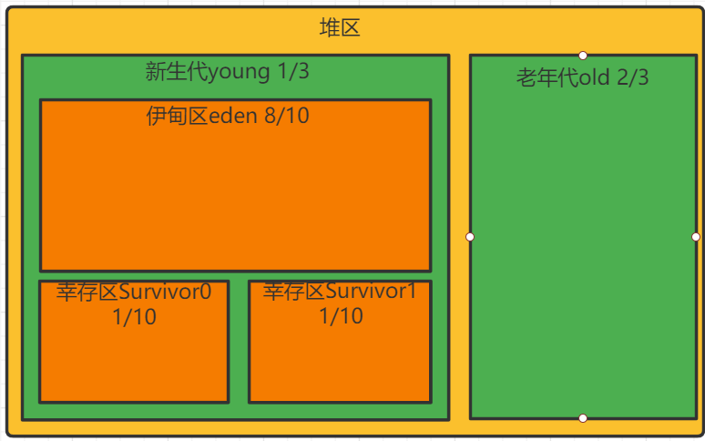

---

#### 方法区

方法区用于存储被虚拟机加载的**类型信息、常量、静态变量、即时编译器编译后的代码缓存等数据**。

JDK8 前使用永久代实现方法区，容易内存溢出，因为永久代有 `-XX:MaxPermSize ` 上限，即使不设置也有默认大小。JDK7 把放在永久代的字符串常量池、静态变量等移出，JDK8 时永久代完全废弃，改用在本地内存中实现的元空间代替，把 JDK7 中永久代剩余内容（主要是类型信息）全部移到元空间。

虚拟机规范对方法区的约束宽松，除和堆一样不需要连续内存、可选择固定大小、可扩展外，还可以不实现垃圾回收。垃圾回收在方法区出现较少，主要针对常量池和类型卸载。

方法区主要存放类型信息，只要不断在运行时产生大量类，方法区就会溢出。例如使用反射或 CGLib 在运行时生成大量的类。

JDK8 使用元空间取代永久代，HotSpot 提供了一些参数作为元空间防御措施，例如 `-XX:MetaspaceSize` 指定元空间初始大小，达到该值会触发 GC 进行类型卸载，同时收集器会对该值进行调整，如果释放大量空间就适当降低该值，如果释放很少空间就适当提高。

---

#### 运行时常量池

运行时常量池是方法区的一部分，Class 文件中除了有类的版本、字段、方法、接口等描述信息外，还有一项信息是常量池表，用于存放编译器生成的各种字面量与符号引用，这部分内容在类加载后存放到运行时常量池。一般除了保存 Class 文件中描述的符号引用外，还会把符号引用翻译的直接引用也存储在运行时常量池。

运行时常量池相对于 Class 文件常量池的一个重要特征是动态性，Java 不要求常量只有编译期才能产生，例如 String 的 `intern` 方法。

`intern` 方法是一个本地方法，作用是如果字符串常量池中已包含一个等于此 String 对象的字符串，则返回池中这个字符串的 String 对象的引用，否则将此 String 对象包含的字符串添加到常量池并返回此 String 对象的引用。

在 JDK6 及之前常量池分配在永久代，因此可以通过 `-XX:PermSize` 和 `-XX:MaxPermSize` 限制永久代大小，间接限制常量池。在 while 死循环中调用 `intern` 方法导致运行时常量池溢出。在 JDK7 后不会出现该问题，因为存放在永久代的字符串常量池已经被移至堆中。

---

#### 内存溢出和内存泄漏

内存溢出 OutOfMemory，指程序在申请内存时，没有足够的内存空间供其使用。

内存泄露 Memory Leak，指程序在申请内存后，无法释放已申请的内存空间，内存泄漏最终将导致内存溢出。

---

### 创建对象 

#### 创建对象的过程⭐

① 当 JVM 遇到字节码 new 指令时，首先检查能否在常量池中定位到一个类的符号引用，并检查该类是否已被加载。

② 在类加载检查通过后虚拟机将为新生对象分配内存。

③ 内存分配完成后虚拟机将成员变量设为零值，保证对象的实例字段可以不赋初值就使用。

④ 设置对象头，包括哈希码、GC 信息、锁信息、对象所属类的类元信息等。

⑤ 执行 init 方法，初始化成员变量，执行实例化代码块，调用类的构造方法，并把堆内对象的首地址赋值给引用变量。


---

#### 分配内存

分配内存相当于把一块确定大小的内存块从 Java 堆划分出来。

**指针碰撞：** 假设 Java 堆内存规整，利用一个指针将内存分为两部分，分配内存就是把指针向空闲方向挪动一段与对象大小相等的距离。

**空间列表：** 如果 Java 堆内存不规整，虚拟机维护一个列表记录可用内存，分配时从列表中找到一块足够的空间划分给对象并更新列表。

选择哪种分配方式由堆是否规整决定，堆是否规整由垃圾收集器是否有空间压缩能力决定。使用 Serial、ParNew 等收集器时，系统采用指针碰撞；使用 CMS 时，采用空间列表。

修改指针位置是线程不安全的，存在正给对象分配内存，指针还没来得及修改，其它对象又使用指针分配内存的情况。解决方法：① CAS 加失败重试。② 把内存分配按线程划分在不同空间，叫做本地线程分配缓冲 TLAB，哪个线程要分配内存就在对应的 TLAB 分配。

----

#### 内存布局

**对象头**

占 12B，包括对象标记和类型指针。对象标记存储对象自身的运行时数据，如哈希码、GC 分代年龄、锁标志、偏向线程 ID 等，这部分占 8B，称为 Mark Word。Mark Word 被设计为动态数据结构，以便在极小的空间存储更多数据，根据对象状态复用存储空间。类型指针是对象指向它的类型元数据的指针，占 4B，JVM 通过该指针来确定对象是哪个类的实例。

**实例数据**

对象真正存储的有效信息，即本类对象的实例成员变量和所有可见的父类成员变量。存储顺序会受到虚拟机分配策略参数和字段在源码中定义顺序的影响。

**对齐填充**

仅起占位符作用。虚拟机的内存管理系统要求任何对象的大小必须是 8B 的倍数，如果没有对齐需要对齐填充补全。

---

### 垃圾回收 

#### 判断垃圾

**引用计数**

在对象中添加一个引用计数器，如果被引用计数器加 1，引用失效时计数器减 1，如果计数器为 0 则被标记为垃圾。简单高效，但在 Java 中很少使用，因为存在对象循环引用的问题，导致计数器无法清零。

**可达性分析**

通过一系列称为 GC Roots 的根对象作为起始节点集，从这些节点开始根据引用关系向下搜索，搜索过程走过的路径称为引用链，如果某个对象到 GC Roots 没有任何引用链相连则会被标记为垃圾。可作为 GC Roots 的对象包括：**虚拟机栈中的引用对象，本地方法栈中的引用对象，静态属性的引用对象，常量的引用对象。**

JDK1.2 后对引用进行了扩充，按强度分为四种。

**强引用：** 最常见的引用，例如使用 new 创建对象。只要对象有强引用指向且 GC Roots 可达，即使濒临内存耗尽也不会回收。

**软引用：** 弱于强引用，描述非必需对象。系统发生内存溢出前，会把软引用关联的对象加入回收范围。

**弱引用：** 弱于软引用，描述非必需对象。弱引用关联的对象只能生存到下次 GC 前，GC 时无论内存是否足够都会回收。

**虚引用：** 最弱的引用，无法通过引用获取对象。唯一目的是在对象被回收时收到一个系统通知，必须与引用队列配合。

---

#### GC 算法

**标记清除**

分为标记和清除阶段，首先从每个 GC Roots 出发依次标记有引用关系的对象，最后清除没有标记的对象。如果堆包含大量对象且大部分需要回收，必须进行大量标记清除，效率低。

缺点：存在内存空间碎片化问题，分配大对象时容易触发 Full GC。

**标记复制**

为解决内存碎片，将可用内存按容量划分为大小相等的两块，每次只使用其中一块，主要用于新生代。

缺点：对象存活率高时要进行较多复制操作，效率低。如果不想浪费空间就需要有额外空间分配担保，老年代一般不使用此算法。

HotSpot 把新生代划分为一块较大的 Eden 和两块较小的 Survivor，每次分配内存只使用 Eden 和其中一块 Survivor。垃圾收集时将 Eden 和 Survivor 中仍然存活的对象一次性复制到另一块 Survivor 上，然后直接清理掉 Eden 和已用过的那块 Survivor。HotSpot 默认Eden 和 Survivor 的大小比例是 8:1，每次新生代中可用空间为整个新生代的 90%。

**标记整理**

老年代使用标记整理算法，标记过程与标记清除算法一样，但不直接清理可回收对象，而是让所有存活对象都向内存空间一端移动，然后清理掉边界以外的内存。

标记清除与标记整理的区别：前者是一种非移动式算法，后者是移动式的。如果移动存活对象，尤其是在老年代这种每次回收都有大量对象存活的区域，开销很大，而且移动必须暂停用户线程；如果不移动会导致空间碎片问题。

**分代收集算法**

当前虚拟机的垃圾收集都采用分代收集算法，这种算法没有什么新的思想，**只是根据对象存活周期的不同将内存分为几块。一般将 java 堆分为新生代和老年代，这样我们就可以根据各个年代的特点选择合适的垃圾收集算法**。比如在新生代中，每次收集都会有大量对象死去，所以可以选择”标记-复制“算法，只需要付出少量对象的复制成本就可以完成每次垃圾收集。而老年代的对象存活几率是比较高的，而且没有额外的空间对它进行分配担保，所以我们必须选择“标记-清除”或“标记-整理”算法进行垃圾收集。

---

#### 垃圾收集器

**Serial**

最基础的收集器，使用复制算法、单线程工作，进行垃圾收集时必须暂停其他线程。

Serial 是客户端模式的默认新生代收集器，对于处理器核心较少的环境，由于没有线程开销，可获得最高的单线程收集效率。

---

**ParNew**

Serial 的多线程版本，ParNew 是虚拟机在服务端模式的默认新生代收集器，一个重要原因是除了 Serial 外只有它能与 CMS 配合。从 JDK9 开始，ParNew 加 CMS 不再是官方推荐的解决方案，官方希望它被 G1 取代。

---

**Parallel Scavenge**

基于复制算法、多线程工作的新生代收集器。

它的目标是高吞吐量，吞吐量就是处理器用于运行用户代码的时间与处理器消耗总时间的比值。

---

**Serial Old**

Serial 的老年代版本，使用整理算法。

Serial Old 是客户端模式的默认老年代收集器，用于服务端有两种用途：① JDK5 前与 Parallel Scavenge 搭配。② 作为 CMS 失败预案。

---

**Parellel Old**

Parallel Scavenge 的老年代版本，支持多线程，基于整理算法。JDK6 提供，注重吞吐量可考虑 Parallel Scavenge 加 Parallel Old 组合。

---

**CMS**

以获取最短回收停顿时间为目标，基于清除算法，过程分为四个步骤：

- 初始标记：标记 GC Roots 能直接关联的对象，速度很快。

- 并发标记：从 GC Roots 的直接关联对象开始遍历整个对象图，耗时较长但不需要停顿用户线程。

- 重新标记：修正并发标记期间因用户程序运作而导致标记产生变动的记录。

- 并发清除：清理标记阶段判断的已死亡对象，不需要移动存活对象，该阶段也可与用户线程并发。

缺点：① 对处理器资源敏感，并发阶段虽然不会导致用户线程暂停，但会降低吞吐量。② 无法处理浮动垃圾，有可能出现并发失败而导致 Full GC。③ 基于清除算法，会产生空间碎片。

---

**G1**

开创了面向局部收集的设计思路和基于 Region 的内存布局，主要面向服务端，最初设计目标是替换 CMS。

G1 可面向堆任何部分来组成回收集进行回收，衡量标准不再是分代，而是哪块内存中垃圾的价值最大。价值即回收所获空间大小以及回收所需时间的经验值，G1 在后台维护一个优先级列表，每次根据用户设定允许的收集停顿时间优先处理回收价值最大的 Region。

G1 运作过程：

- 初始标记：标记 GC Roots 能直接关联到的对象，让下一阶段用户线程并发运行时能正确地在可用 Region 中分配新对象。需要 STW 但耗时很短，在 Minor GC 时同步完成。
- 并发标记：从 GC Roots 开始对堆中对象进行可达性分析，递归扫描整个堆的对象图。耗时长但可与用户线程并发，扫描完成后要重新处理 SATB 记录的在并发时有变动的对象。
- 最终标记：对用户线程做短暂暂停，处理并发阶段结束后仍遗留下来的少量 SATB 记录。
- 筛选回收：对各 Region 的回收价值排序，根据用户期望停顿时间制定回收计划。必须暂停用户线程，由多条收集线程并行完成。

---

#### ZGC

JDK11 中加入的具有实验性质的低延迟垃圾收集器，目标是尽可能在不影响吞吐量的前提下，实现在任意堆内存大小都可以把停顿时间限制在 10ms 以内的低延迟。

基于 Region 内存布局，不设分代，使用了读屏障、染色指针和内存多重映射等技术实现可并发的标记整理。ZGC 的 Region 具有动态性，是动态创建和销毁的，并且容量大小也是动态变化的。

---

#### 内存分配与回收策略

**对象优先在 Eden 区分配**

大多数情况下对象在新生代 Eden 区分配，当 Eden 没有足够空间时将发起一次 Minor GC。

**大对象直接进入老年代**

大对象指需要大量连续内存空间的对象，例如很长的字符串或大数组，容易导致内存还有不少空间就提前触发 GC 以获得足够连续空间。

HotSpot 提供了 `-XX:PretenureSizeThreshold` 参数，大于该值的对象直接在老年代分配，避免在 Eden 和 Survivor 间来回复制。

**长期存活对象进入老年代**

虚拟机给每个对象定义了一个对象年龄计数器，存储在对象头。如果经历过第一次 Minor GC 仍然存活且能被 Survivor 容纳，该对象就会被移动到 Survivor 中并将年龄设置为 1。对象在 Survivor 中每熬过一次 Minor GC 年龄就加 1 ，当增加到一定程度（默认15）就会被晋升到老年代。对象晋升老年代的阈值可通过 `-XX:MaxTenuringThreshold` 设置。

**动态对象年龄判定**

为了适应不同内存状况，虚拟机不要求对象年龄达到阈值才能晋升老年代，如果在 Survivor 中相同年龄所有对象大小的总和大于 Survivor 的一半，年龄不小于该年龄的对象就可以直接进入老年代。

**空间分配担保**

MinorGC 前虚拟机必须检查老年代最大可用连续空间是否大于新生代对象总空间，如果满足则说明这次 Minor GC 确定安全。

如果不满足，虚拟机会查看 `-XX:HandlePromotionFailure` 参数是否允许担保失败，如果允许会继续检查老年代最大可用连续空间是否大于历次晋升老年代对象的平均大小，如果满足将冒险尝试一次 Minor GC，否则改成一次 FullGC。

冒险是因为新生代使用复制算法，只用一个 Survivor，大量对象在 Minor GC 后仍然存活时需要老年代接收 Survivor 无法容纳的对象。

---

#### 故障处理工具

**jps：虚拟机进程状况工具**

列出正在运行的虚拟机进程，使用 Windows 的任务管理器或 UNIX 的 ps 命令也可以查询，但如果同时启动多个进程，必须依赖 jps。

**jstat：虚拟机统计信息监视工具**

监视虚拟机各种运行状态信息，显示本地或远程虚拟机进程中的类加载、内存、垃圾收集、即时编译器等运行时数据。

**jinfo：Java 配置信息工具**

查看虚拟机各项参数，使用 `jps -v` 可查看虚拟机启动时显式指定的参数，但如果想知道未显式指定的参数只能使用 `jinfo -flag`。

**jmap：Java 内存映像工具**

用于生成堆转储快照，还可以查询 finalize 执行队列、Java 堆和方法区的详细信息，如空间使用率，当前使用的是哪种收集器等。

**jhat：虚拟机堆转储快照分析工具**

JDK 提供 jhat 与 jmap 搭配使用分析堆转储快照。jhat 内置微型的 HTTP/Web 服务器，堆转储快照的分析结果后可以在浏览器查看。

**jstack：Java 堆栈跟踪工具**

用于生成虚拟机当前时刻的线程快照，定位线程出现长时间停顿的原因，如线程间死锁、死循环、请求外部资源导致的长时间挂起等。

---

### 类加载机制 ⭐

#### Java 程序运行过程

首先通过 Javac 编译器将 `.java` 文件转为 JVM 可加载的 `.class` 字节码文件。编译过程分为： ① 词法解析，通过空格分割出单词、操作符、控制符等信息，形成 token 信息流，传递给语法解析器。② 语法解析，把 token 信息流按照 Java 语法规则组装成语法树。③ 语义分析，检查关键字使用是否合理、类型是否匹配、作用域是否正确等。④ 字节码生成，将前面各个步骤的信息转换为字节码。

之后通过即时编译器 JIT 把字节码文件编译成本地机器码。Java 程序最初都是通过解释器进行解释执行的，当虚拟机发现某个方法或代码块的运行特别频繁，就会认定其为热点代码，热点代码的检测主要有采样和计数器两种方式，为了提高热点代码的执行效率，虚拟机会把它们编译成本地机器码。

----

#### 类加载

**Class 文件中的信息需要加载到虚拟机后才能使用。JVM 把描述类的数据从 Class 文件加载到内存，并对数据进行校验、解析和初始化，最终形成可以被虚拟机直接使用的 Java 类型，这个过程称为虚拟机的类加载机制。**

Java 类型的加载、连接和初始化都是在运行期间完成的，这增加了性能开销，但提供高扩展性，Java 动态扩展的特性就是依赖运行期动态加载和连接实现的。

类型从被加载到卸出，**整个生命周期经历加载、验证、准备、解析、初始化、使用和卸载七个阶段，其中验证、准备和解析三部分称为连接。加载、验证、准备、初始化的顺序是确定的**，解析则不一定：可能在初始化后再开始，这是为了支持 Java 的动态绑定。


----

#### 类初始化的情况

① 遇到 `new`、`getstatic`、`putstatic` 字节码指令时，还未初始化。例如 new 实例化对象、设置静态字段、调用静态方法。

② 对类反射调用时，还未初始化。

③ 初始化类时，父类还未初始化。（接口初始化时不要求父接口初始化，只有在真正使用父接口时才会初始化，如引用接口常量）

④ 虚拟机启动时，会先初始化包含 main 方法的主类。

⑤ 接口定义了默认方法，如果接口的实现类初始化，接口要在其之前初始化。

其余所有引用类型的方式都不会触发初始化，称为被动引用。被动引用举例：① 子类使用父类的静态字段时，只有父类被初始化。② 通过数组定义使用类。③ 常量在编译期会存入调用类的常量池，不会初始化定义常量的类。

----

#### 类加载的过程⭐

[引用](https://www.cnblogs.com/zhaodongge/p/10590457.html)

**加载**

通过一个类的全限定类名获取对应的二进制字节流，将流所代表的静态存储结构转化为方法区的运行时数据区，然后在内存中生成对应该类的 Class 实例，作为方法区中这个类的数据访问入口。

**验证**

确保 Class 文件的字节流符合约束。如果虚拟机不检查输入的字节流，可能因为载入有错误或恶意企图的字节流而导致系统受攻击。验证主要包含：文件格式验证、元数据验证、字节码验证、符号引用验证。

验证通过后对程序运行期没有任何影响。如果代码已被反复使用和验证过，在生产环境就可以考虑关闭大部分验证缩短类加载时间。

**准备**

为类静态变量分配内存并设置零值，该阶段进行的内存分配仅包括类变量，不包括实例变量。如果变量被 final 修饰，编译时 Javac 会为变量生成 ConstantValue 属性，准备阶段虚拟机会将变量值设为代码值。

**解析**

将常量池内的符号引用替换为直接引用。

符号引用以一组符号描述引用目标，可以是任何形式的字面量，只要使用时能无歧义地定位目标即可，引用目标不一定已经加载到虚拟机内存；直接引用是可以直接指向目标的指针、相对偏移量或能间接定位到目标的句柄，引用目标必须已在虚拟机的内存中存在。

**初始化**

直到该阶段 JVM 才开始执行类中编写的代码。准备阶段时变量赋过零值，初始化阶段会根据程序员的编码去初始化类变量和其他资源。初始化阶段就是执行类构造方法中的 `<client>` 方法，该方法是 Javac 自动生成的。

---

#### 类加载器

**启动类加载器Bootstrap ClassLoader**

在 JVM 启动时创建，负责加载最核心的类，例如 Object、System 等。无法被程序直接引用，如果需要把加载委派给启动类加载器，直接使用 null 代替即可，因为启动类加载器通常由操作系统实现，并不存在于 JVM 体系。

**平台类加载器**

从 JDK9 开始从扩展类加载器更换为平台类加载器，负载加载一些扩展的系统类，比如 XML、加密、压缩相关的功能类等。

**应用类加载器**

也称系统类加载器，负责加载用户类路径上的类库，可以直接在代码中使用。如果没有自定义类加载器，一般情况下应用类加载器就是默认的类加载器。自定义类加载器通过继承 ClassLoader 并重写 `findClass` 方法实现。

---

#### 双亲委派模型

双亲委派模型要求除了顶层的启动类加载器外，其余类加载器都应该有自己的父加载器。

一个类加载器收到了类加载请求，不会自己去尝试加载，而将该请求委派给父加载器，每层的类加载器都是如此，因此所有加载请求最终都应该传送到启动类加载器，只有当父加载器反馈无法完成请求时，子加载器才会尝试。

类跟随它的加载器一起具备了有优先级的层次关系，确保某个类在各个类加载器环境中都是同一个，保证程序的稳定性。


---

#### 判断两个类是否相等

任意一个类都必须由类加载器和这个类本身共同确立其在虚拟机中的唯一性。两个类只有由同一类加载器加载才有比较意义，否则即使两个类来源于同一个 Class 文件，被同一个 JVM 加载，只要类加载器不同，这两个类就必定不相等。

---

## 并发 

### JMM 

#### JMM⭐


>**当程序在运行过程中，会将运算需要的数据从主存复制一份到CPU的高速缓存当中，那么CPU进行计算时就可以直接从它的高速缓存读取数据和向其中写入数据，当运算结束之后，再将高速缓存中的数据刷新到主存当中。**
>
>**Java内存模型的主要目标是定义程序中各个变量的访问规则，即在JVM中将变量存储到内存和从内存中取出变量这样的底层细节。**

Java 线程的通信由 JMM 控制，**JMM 定义了变量的访问规则，变量包括实例字段、静态字段，**但不包括局部变量、方法参数这些线程私有的值。JMM 基本原则：只要不改变程序执行结果，编译器和处理器怎么优化都行，例如某个锁只会单线程访问就消除锁，某个 volatile 变量只会单线程访问就当作普通变量。

JMM 规定所有变量都存储在主内存，每条线程有自己的工作内存，工作内存中保存变量的主内存副本，线程对变量的所有操作都必须在工作内存进行，不能直接读写主内存。

关于主内存与工作内存的交互，即变量如何从主内存拷贝到工作内存、从工作内存同步回主内存，JMM 定义了 8 种原子操作：

| 操作   | 作用范围 | 作用                         |
| ------ | -------- | ---------------------------- |
| lock   | 主内存   | 把变量标识为锁定状态         |
| unlock | 主内存   | 释放锁定状态的变量           |
| read   | 主内存   | 把变量值从主内存读到工作内存 |
| load   | 工作内存 | 把 read 值加载到工作内存     |
| use    | 工作内存 | 把 load 值传给执行引擎       |
| assign | 工作内存 | 把 use 值赋给工作内存变量    |
| store  | 工作内存 | 把 assign 值传到主内存       |
| write  | 主内存   | 把 store 值写回主内存变量    |

---

#### happens-before

先行发生原则，指两项操作间的偏序关系。JMM 存在一些天然的 happens-before 关系，如果两个操作的关系不在此列且无法从中推导，虚拟机就可以对其重排序：

- 一个线程内写在前面的操作先行发生于后面的。
- unlock 先行发生于后面对同一个锁的 lock。
- 对 volatile 变量的写先行发生于后面的读。
- 线程的 `start` 方法先行发生于线程的每个动作。
- 线程中所有操作先行发生于对线程的终止检测。
- 对象的初始化先行发生于 `finalize` 方法。
- 如果 A 先行发生于 B，B 先行发生于 C，那么 A 先行发生于 C 。

as-if-serial 保证单线程程序的执行结果不变，happens-before 保证正确同步的多线程程序的执行结果不变。这两种语义的目的都是为了在不改变程序执行结果的前提下尽可能提高程序并行度。

---

#### 重排序

为了提高性能，编译器和处理器通常会对指令进行重排序，重排序指从源代码到指令序列的重排序，分为三种：① 编译器重排序，编译器在不改变单线程程序语义的前提下可以重排语句的执行顺序。② 处理器重排序，如果不存在数据依赖性，处理器可以改变语句对应机器指令的执行顺序。③ 内存系统的重排序。

---

#### 原子性、可见性、有序性

**原子性**

原子性指操作要么全部成功，要么全部失败。基本数据类型的访问都具备原子性，例外就是 long 和 double，虚拟机将没有被 volatile 修饰的 64 位数据操作划分为两次 32 位操作。

**可见性**

可见性指当一个线程修改了共享变量时，其他线程能够立即得知修改。

volatile：保证新值能立即同步到主内存以及每次使用前立即从主内存刷新。

synchronized：对一个变量执行 unlock 前必须先把此变量同步回主内存，即先执行 store 和 write。

final：final 字段在构造方法中一旦初始化完成，并且构造方法没有把 this 引用传递出去，其他线程就能看到 final 字段的值。

**有序性**

volatile 和 synchronized 保证有序性，volatile 本身就包含禁止指令重排序的语义，而 synchronized 保证一个变量在同一时刻只允许一条线程对其进行 lock 操作。

---

#### volatile⭐

volatile 变量特性：

- **保证变量对所有线程可见**

  当一条线程修改了变量值，新值对于其他线程来说立即可见。但 Java 运算并非原子操作，导致 volatile 变量运算在并发下仍不安全。

- **禁止指令重排序优化**

  使用 volatile 变量进行写操作，汇编指令带有 lock 前缀，相当于一个内存屏障，后面的指令不能重排到屏障之前。

  lock 引发两件事：① 将当前处理器缓存行的数据写回系统内存。②使其他处理器的缓存无效。相当于对缓存变量做了一次 store 和 write 操作，让 volatile 变量的修改对其他处理器立即可见。

**静态变量 i++ 的不安全问题**

自增语句由 4 条字节码指令构成的，依次为 `getstatic`、`iconst_1`、`iadd`、`putstatic`，当 `getstatic` 把 i 取到操作栈顶时，volatile 保证了 i 值在此刻正确，但在执行 `iconst_1`、`iadd` 时，其他线程可能已经改变了 i 值，操作栈顶的值就变成了脏数据，所以 `putstatic` 后就可能把较小的值同步回了主内存。 

**适用场景**

运算结果不依赖变量的当前值；一写多读，只有单一的线程修改变量值。

**内存语义**

写 volatile 变量时，把该线程工作内存中的值刷新到主内存；读 volatile 变量时，把该线程工作内存值置为无效，从主内存读取。

在旧的内存模型中，不允许 volatile 变量间重排序，但允许 volatile 变量与普通变量重排序，可能导致内存不可见问题。JSR-133 严格限制编译器和处理器对 volatile 变量与普通变量的重排序，确保 volatile 的写-读和锁的释放-获取具有相同的内存语义。

---

#### final⭐

final 类不能被继承，所有成员方法都会被隐式地指定为 final 方法，final 方法不能被重写。

final 变量表示常量，只能被赋值一次，赋值后值不再改变。

- 修饰基本数据类型时，该值在初始化后不能改变。
- 修饰引用类型时，引用指向的对象在初始化后不能改变，但该对象的内容可以发生变化。

**内存语义**

- 编译器会在 final 域的写后，构造方法的 return 前插入一个 Store Store 屏障，确保对象引用为任意线程可见前其 final 域已初始化。 
- 编译器在读 final 域操作的前面插入一个 Load Load 屏障，确保在读一个对象的 final 域前一定会先读包含这个 final 域的对象引用。

---

####  JVM和JMM之间的区别

[引用](https://blog.csdn.net/zhaomengszu/article/details/80270696)

jmm中的主内存、工作内存与jvm中的Java堆、栈、方法区等并不是同一个层次的内存划分，这两者基本上是没有关系的，如果两者一定要勉强对应起来，那从变量、主内存、工作内存的定义来看，主内存主要对应于Java堆中的对象实例数据部分，而工作内存则对应于虚拟机栈中的部分区域。从更低层次上说，主内存就直接对应于物理硬件的内存，而为了获取更好的运行速度，虚拟机（甚至是硬件系统本身的优化措施）可能会让工作内存优先存储于寄存器和高速缓存中，因为程序运行时主要访问读写的是工作内存。

---

### [锁](https://mp.weixin.qq.com/s?__biz=MjM5NjQ5MTI5OA==&mid=2651749434&idx=3&sn=5ffa63ad47fe166f2f1a9f604ed10091&chksm=bd12a5778a652c61509d9e718ab086ff27ad8768586ea9b38c3dcf9e017a8e49bcae3df9bcc8&scene=38#wechat_redirect)

#### synchronized⭐

[连接](https://blog.csdn.net/zfy163520/article/details/89138218)

每个 Java 对象都有一个关联的 monitor，JVM 会根据 monitor 的状态进行加解锁的判断，monitor 在被释放前不能被其他线程获取。

同步块使用 `monitorenter` 和 `monitorexit` 字节码指令获取和释放 monitor。这两个指令都需要一个引用类型的参数指明锁对象，对于普通方法，锁是当前实例对象；对于静态方法，锁是当前类的 Class 对象；对于方法块，锁是 synchronized 括号里的对象。

执行 `monitorenter` 指令时，首先尝试获取对象锁。如果这个对象没有被锁定，或当前线程已经持有锁，就把锁的计数器加 1，执行 `monitorexit` 指令时会将锁计数器减 1。一旦计数器为 0 锁随即就被释放。

假设有两个线程 A、B 竞争锁，当 A 竞争到锁时会将 monitor 中的 owner 设置为 A，把 B 阻塞并放到等待资源的 ContentionList 队列。ContentionList 中的部分线程会进入 EntryList，EntryList 中的线程会被指定为 OnDeck 竞争候选者，如果获得了锁资源将进入 Owner 状态，释放锁后进入 !Owner 状态。

synchronized 修饰的同步块是可重入的，并且持有锁的线程释放锁前会阻塞其他线程。持有锁是一个重量级的操作，Java 线程是映射到操作系统的内核线程上的，如果要阻塞或唤醒一条线程，需要用户态到核心态的转换。

**不公平性**

所有收到锁请求的线程首先自旋，如果通过自旋也没有获取锁将被放入 ContentionList，该做法对于已经进入队列的线程不公平。

为了防止 ContentionList 队列尾部的元素被大量线程 CAS 访问影响性能，Owner 线程会在释放锁时将队列的部分线程移动到 EntryList 并指定某个线程为 OnDeck 线程。

**synchronized底层实现**

Java对象头和monitor是实现synchronized的基础，下面将会说说关于Java对象头和monitor。

>同步代码块：从上面的字节码中可以看出，同步语句块的实现是使用monitorenter和monitorexit指令的，monitorenter指向同步代码块的开始位置，它首先去获取PrintStream这个类，然后传入“Hello”这个参数，然后再调用PrintStream中的println()方法去打印，monitorexit指明同步代码块的结束位置，当执行到monitorenter时，当前线程将试图获取对象锁所对应的monitor的持有权。
>
>同步方法：从上面代码的syncTask()方法字节码中看，这里面并没monitorenter和monitorexit，且字节码较短，其实这里方法的同步是隐式的，是无需通过字节码指令控制，在上面可以看到一个“ACC_SYNCHRONIZED”这样的一个访问标志，用来区分一个方法是否是同步方法。当方法调用时，调用指令将会检查ACC_SYNCHRONIZED是否被设置，如果被设置，当前线程将会持有monitor，然后再执行方法，最后不管方法是否正常完成都会释放monitor。

**对象头**
hotspot虚拟机中，对象在内存的布局分布分为3个部分：对象头，实例数据，和对齐填充。

对象头的结构如下：


**Monitor锁**
每个Java对象天生就自带了一把看不见的锁，它可以视为是一种同步工具或者是一种同步机制，monitor还是线程私有的数据结构，每一个线程都有一个可用monitor 列表，同时还有一个全局的可用列表，如上面所说每一个被锁住的对象都会持有一个monitor。monitor结构如下：

**Owner：**初始时为NULL表示当前没有任何线程拥有该monitor record，当线程成功拥有该锁后保存线程唯一标识，当锁被释放时又设置为NULL；
**EntryQ:**  关联一个系统互斥锁（semaphore），阻塞所有试图锁住monitor record失败的线程。
**RcThis:**  表示blocked或waiting在该monitor record上的所有线程的个数。
**Nest**:   用来实现重入锁的计数。
**HashCode: ** 保存从对象头拷贝过来的HashCode值（可能还包含GC age）。
**Candidate:**  用来避免不必要的阻塞或等待线程唤醒，因为每一次只有一个线程能够成功拥有锁，如果每次前一个释放锁的线程唤醒所有正在阻塞或等待的线程，会引起不必要的上下文切换（从阻塞到就绪然后因为竞争锁失败又被阻塞）从而导致性能严重下降。Candidate只有两种可能的值0表示没有需要唤醒的线程1表示要唤醒一个继任线程来竞争锁。

---

#### 锁优化策略⭐

JDK 6 对 synchronized 做了很多优化，引入了**自适应自旋、锁消除、锁粗化、偏向锁和轻量级锁**等提高锁的效率，锁一共有 4 个状态，级别从低到高依次是：无锁、偏向锁、轻量级锁和重量级锁，状态会随竞争升级，但不能降级。

---

**自适应自旋**

>许多情况下共享数据的锁定状态持续时间较短，切换线程不值得，通过让请求锁的**线程执行忙循环，等待锁的释放，不让出cpu**；
>
>缺点：若锁被其他线程长时间占用，会带来许多性能上的开销。
>
>自适应自旋：
>
>- 自旋的次数不再固定
>- 由前一次在同一锁上的自旋时间及锁拥有者的状态来决定

许多锁定时间很短，为了这段时间去挂起和恢复线程并不划算。如果机器有多个处理器核心，可以让后面请求锁的线程稍等一会，但不放弃处理器的执行时间，看看锁是否很快会被释放，这就是自旋锁。

自旋锁在 JDK1.4 引入，默认关闭，在 JDK6 默认开启。如果自旋超过限定次数仍然没有成功，**就应挂起线程，自旋默认限定次数是 10**。

JDK6 对自旋锁进行了优化，自旋时间不再固定，而是由前一次的自旋时间及锁拥有者的状态决定。

如果在同一个锁上，自旋刚刚成功获得过锁且持有锁的线程正在运行，虚拟机会认为这次自旋也很可能成功，允许自旋持续更久。如果自旋很少成功，以后获取锁时将可能直接省略掉自旋，避免浪费处理器资源。

----

**锁消除**

>锁消除是对锁更彻底的优化，JIT编译时，对运行上下文进行扫描，去除不可能存在竞争的锁

锁消除指即时编译器对检测到不可能存在共享数据竞争的锁进行消除。如果堆上的所有数据都只被一个线程访问，就当作栈上的数据对待，认为它们是线程私有的而无须同步。

---

**锁粗化**

>在加同步锁的时候，尽可能将同步块的作用范围先知道尽量小的范围，及只在共享数据的实际工作范围中进行同步，这样是为了需要同步的数量尽可能的变小，在存在锁同步竞争中，使得等待锁的时间减小。大部分时候是正确的，但是如果存在一系列频繁的操作，对同一个对象反复的加锁、解锁， 甚至加锁时是在循环体中操作的，这样即使没有线程竞争，频繁的进行互斥锁操作，也是导致不必要的性能开销。

```java
    public static String copyString(String target){
        int i = 0;
        StringBuffer sb = new StringBuffer();
        while (i<100){
            sb.append(target);
        }
        return sb.toString();
    }
```

原则上需要将同步块的作用范围限制得尽量小，只在共享数据的实际作用域进行同步，使等待锁的线程尽快拿到锁。

但如果一系列的连续操作都对同一个对象反复加锁和解锁，即使没有线程竞争也会导致不必要的性能消耗。因此如果虚拟机探测到有一串零碎的操作都对同一个对象加锁，会把同步范围扩展到整个操作序列的外部。

---

**synchronized锁的状态**

synchronized锁有四种状态分别为：无锁、偏向锁、轻量级锁、重量级锁

锁的膨胀方向：无锁——>偏向锁——>轻量级锁——>重量级锁

----

**偏向锁**

偏向锁是为了在没有竞争的情况下减少锁开销，锁会偏向于第一个获得它的线程，如果在执行过程中锁一直没有被其他线程获取，则持有偏向锁的线程将不需要同步。

当锁对象第一次被线程获取时，虚拟机会将对象头中的偏向模式设为 1，同时使用 CAS 把获取到锁的线程 ID 记录在对象的 Mark Word 中。如果 CAS 成功，持有偏向锁的线程以后每次进入锁相关的同步块都不再进行任何同步操作。

一旦有其他线程尝试获取锁，偏向模式立即结束，根据锁对象是否处于锁定状态决定是否撤销偏向，后续同步按照轻量级锁的步骤执行。

---

**轻量级锁**

轻量级锁是为了在没有竞争的前提下减少重量级锁的性能消耗。

在代码即将进入同步块时，如果同步对象没有被锁定，虚拟机将在当前线程的栈帧中建立一个锁记录空间，存储锁对象目前 Mark Word 的拷贝。然后使用 CAS 尝试把对象的 Mark Word 更新为指向锁记录的指针，如果更新成功代表该线程拥有了锁，锁标志位将转变为 00，表示轻量级锁状态。

如果更新失败就意味着存在线程竞争。虚拟机检查对象的 Mark Word 是否指向当前线程的栈帧，如果是则说明当前线程已经拥有了锁，直接进入同步块继续执行，否则说明锁已被其他线程抢占。如果出现两条以上线程竞争锁，轻量级锁将膨胀为重量级锁，锁标志状态变为 10，此时Mark Word 存储的就是指向重量级锁的指针，后面等待锁的线程将阻塞。

解锁同样通过 CAS 进行，如果对象 Mark Word 仍然指向线程的锁记录，就用 CAS 把对象当前的 Mark Word 和线程复制的 Mark Word 替换回来。假如替换成功同步过程就完成了，否则说明有其他线程尝试过获取该锁，就要在释放锁的同时唤醒被挂起的线程。

---

**偏向锁、轻量级锁和重量级锁的区别**

偏向锁的优点是加解锁不需要额外消耗，和执行非同步方法比仅存在纳秒级差距，适用只有一个线程访问同步代码块的场景。

轻量级锁的优点是程序响应速度快，缺点是如果线程始终得不到锁会自旋消耗 CPU，适用追求响应时间、同步代码块执行快的场景。

重量级锁的优点是线程竞争不使用自旋不消耗CPU，缺点是线程会阻塞，响应时间慢，适应追求吞吐量、同步代码块执行慢的场景。

-------

####  锁的种类

**可重入锁**

指在同一个线程在外层方法获取锁的时候,进入内层方法会自动获取锁，为了避免死锁的发生,JDK中基本都是可重入锁；

**不可重入锁**

指在同一个线程在外层方法获取锁的时候,进入内层方法会不会自动获取锁

-----

| 锁名称 | 特性                                                         | 例子                        |
| ------ | ------------------------------------------------------------ | --------------------------- |
| 独占锁 | 会导致其它所有需要锁的线程挂起，等待持有锁的线程释放锁，是悲观锁的一种 | synchronized、ReentrantLock |
| 共享锁 | 就是查询的时候，如果没有修改，可以支持多线程查询             | 通过AQS实现                 |
| 排它锁 | 就是修改的时候，锁定共享锁，停止查询，同时，锁定排它锁，只允许一个线程进行修改，修改完成后，再解开共锁； | 通过AQS实现                 |
| 乐观锁 | 假设数据一般情况下不会造成冲突，在数据提交更新的时候才会正式对数据冲突检测，如果冲突，则返回给用户异常信息，让用户决定如何去做，适用于读多写少的场景。 | CAS、版本号控制方式         |
| 悲观锁 | 每次查询数据的时候认为数据已经被修改，进行冲突检测。共享锁、排他锁。 |                             |

---

#### Lock

Lock 是 juc 包的顶层接口，摆脱了语言特性束缚，在类库层面实现同步，利用了 volatile 的可见性。

重入锁 ReentrantLock 是 Lock 最常见的实现，与 synchronized 一样可重入，不过它增加了一些功能：

- **等待可中断： **持有锁的线程长期不释放锁时，正在等待的线程可以选择放弃等待而处理其他事情。
- **公平锁：** synchronized 是非公平的，ReentrantLock 默认是非公平的，可以通过构造方法指定公平锁。
- **锁绑定多个条件：** 一个 ReentrantLock 可以同时绑定多个 Condition。synchronized 中锁对象的 `wait` 跟 `notify` 只可以实现一个隐含条件，而 ReentrantLock 可以调用 `newCondition` 创建多个条件。

一般优先考虑 synchronized：① synchronized 是语法层面的同步，足够简单。② Lock 必须手动在 finally 释放锁，而synchronized 可以由 JVM 来确保即使出现异常也能正常释放锁。③ 尽管 JDK5 时 ReentrantLock 的性能优于 synchronized，但 JDK6 锁优化后二者的性能基本持平。 JVM 更可能针对synchronized 优化，因为 JVM 可以在线程和对象的元数据中记录锁的相关信息。

------

**ReentrantLock 的可重入实现**

以非公平锁为例，通过 `nonfairTryAcquire` 方法获取锁，如果是持有锁的线程再次请求则增加同步状态值并返回 true。

释放同步状态时将减少同步状态值。如果锁被获取了 n 次，那么前 n-1 次 `tryRelease` 方法必须都返回 fasle，只有同步状态完全释放才能返回 true，并将锁占有线程设置为null。

公平锁使用 `tryAcquire` 方法，该方法与非公平锁的区别是：判断条件中多了对同步队列中当前节点是否有前驱节点的判断，如果该方法返回 true 表示有线程比当前线程更早请求锁，因此需要等待前驱线程。

------

####  Lock和Synchronized

- Lock是一个接口，而synchronized是Java中的关键字，synchronized是内置的语言实现；
- synchronized在发生异常时，会自动释放线程占有的锁，因此不会导致死锁现象发生；而Lock在发生异常时，如果没有主动通过unLock()去释放锁，则很可能造成死锁现象，因此使用Lock时需要在finally块中释放锁；
- Lock可以让等待锁的线程响应中断，而synchronized却不行，使用synchronized时，等待的线程会一直等待下去，不能够响应中断；
- 通过Lock可以知道有没有成功获取锁，而synchronized却无法办到。
- Lock可以提高多个线程进行读操作的效率。

　　在性能上来说，如果竞争资源不激烈，两者的性能是差不多的，而当竞争资源非常激烈时（即有大量线程同时竞争），此时Lock的性能要远远优于synchronized。所以说，在具体使用时要根据适当情况选择。

---

#### 读写锁

读写锁在同一时刻允许多个读线程访问，在写线程访问时，所有的读写线程均阻塞。

读写锁依赖 AQS 实现，在一个 int 变量上维护读线程和写线程的状态，将变量切分成了两个部分，高 16 位表示读，低 16 位表示写。

写锁是可重入排他锁，如果当前线程已经获得了写锁则增加写状态，如果当前线程在获取写锁时，读锁已经被获取或者该线程不是已经获得写锁的线程则等待。写锁的释放与 ReentrantLock 的释放类似，每次释放减少写状态，当写状态为 0 时表示写锁已被释放。

读锁是可重入共享锁，能够被多个线程同时获取。如果当前线程已经获取了读锁，则增加读状态。如果当前线程在获取读锁时，写锁已被其他线程获取则进入等待。读锁每次释放会减少读状态，减少的值是 `1<<16`，读锁的释放是线程安全的。

**锁降级**指把持住当前写锁再获取读锁，随后释放先前拥有的写锁。

锁降级中读锁的获取是必要的，这是为了保证数据可见性，如果当前线程不获取读锁而直接释放写锁，假设另一个线程 A 获取写锁修改数据，当前线程无法感知线程 A 的数据更新。

---

#### AQS

AQS **抽象队列同步器**是用来构建锁或其他同步组件的基础框架，使用一个 volatile int 变量作为共享同步状态，如果线程获取状态失败，则进入同步队列等待；如果成功就执行临界区代码，释放状态时会通知同步队列中的等待线程。

同步器的主要使用方式是继承，子类通过继承同步器并实现它的抽象方法来管理同步状态，对同步状态进行更改需要使用同步器提供的 3个方法 `getState`、`setState` 和 `compareAndSetState` ，它们保证状态改变是安全的。

每当有新线程请求同步状态时都会进入一个等待队列，等待队列通过双向链表实现，线程被封装在链表的 Node 节点中，Node 的等待状态包括：CANCELLED（线程已取消）、SIGNAL（线程需要唤醒）、CONDITION （线程正在等待）、PROPAGATE（后继节点会传播唤醒操作，只作用于共享模式）。

---

**两种模式**

**独占模式**下锁只会被一个线程占用，其他线程必须等持有锁的线程释放锁后才能获取锁。

获取同步状态时，调用 `acquire` 方法的 `tryAcquire` 方法安全地获取同步状态，获取失败的线程会被构造同步节点并通过 `addWaiter` 方法加入到同步队列的尾部，在队列中自旋。之后调用 `acquireQueued` 方法使得节点以死循环的方式获取同步状态，如果获取不到则阻塞，被阻塞线程的唤醒依靠前驱节点的出队或中断。后继节点的线程被唤醒后需要检查自己的前驱节点是否是头节点，目的是维护同步队列的 FIFO 原则，节点之间在循环检查的过程中基本不通信，而是简单判断自己的前驱是否为头节点。

释放同步状态时，同步器调用 `tryRelease` 方法释放同步状态，然后调用 `unparkSuccessor` 方法唤醒头节点的后继节点，使后继节点重新尝试获取同步状态。

**共享模式**下多个线程可以获取同一个锁。

获取同步状态时，调用 `acquireShared` 方法的 `tryAcquireShared` 方法，返回值为 int 类型，值不小于 0 表示能获取同步状态。

释放同步状态时，调用 `releaseShared` 方法，释放后会唤醒后续处于等待状态的节点。它和独占式的区别在于 `tryReleaseShared` 方法必须确保同步状态安全释放，通过循环 CAS 保证。

---

### 线程 

#### 生命周期⭐

NEW：新建状态，线程被创建且未启动，还未调用 `start`  方法。

RUNNABLE：Java 将操作系统中的就绪和运行两种状态统称为 RUNNABLE，此时线程有可能在等待时间片，也有可能在执行。

BLOCKED：阻塞状态，可能由于锁被其他线程占用、调用了  `join` 方法、执行了 `wait `方法等。

WAITING：等待状态，该状态线程不会被分配 CPU 时间片，需要其他线程通知或中断。可能由于调用了无参的 `wait` 和 `join` 方法。

TIME_WAITING：限期等待状态，可以在指定时间内自行返回。导可能由于调用了`sleep` 或带参的 `wait` 和 `join` 方法。

TERMINATED：终止状态，表示当前线程已执行完毕或异常退出。


---

#### 线程的创建方式⭐

① 继承 Thread 类并重写 `run` 方法。实现简单，但不符合里氏替换原则，不可以继承其他类。

② 实现 Runnable 接口并重写 `run` 方法。避免了单继承局限性，实现解耦。

③实现 Callable 接口并重写 `call` 方法。可以获取线程执行结果的返回值，并且可以抛出异常。

---

#### 线程方法

`sleep` 方法导致当前线程进入休眠状态，与 `wait` 不同的是该方法不会释放锁资源，进入的是 TIME-WAITING 状态。

`yiled` 方法使当前线程让出 CPU 时间片给优先级相同或更高的线程，回到 RUNNABLE 状态，与其他线程重新竞争 CPU 时间片。

`join` 方法用于等待其他线程运行终止，如果当前线程调用了另一个线程的 `join` 方法，则当前线程进入阻塞状态，当另一个线程结束时当前线程才能从阻塞状态转为就绪态，等待获取CPU时间片。底层使用 `wait`，也会释放锁。

---

#### 守护线程

守护线程是一种支持型线程，可以通过 `setDaemon(true)` 将线程设置为守护线程，但必须在线程启动前设置。

守护线程用于完成支持性工作，但在 JVM 退出时守护线程中的 finally 块不一定执行，因为 JVM 中没有非守护线程时需要立即退出，因此不能靠在守护线程使用 finally 确保关闭资源。

---

#### 线程通信的方式⭐

Java 采用共享内存模型，线程间的通信总是隐式进行，整个通信过程对程序员完全透明。

**volatile** 告知程序任何对变量的读需要从主内存中获取，写必须同步刷新回主内存，保证所有线程对变量访问的可见性。

**synchronized** 确保多个线程在同一时刻只能有一个处于方法或同步块中，保证线程对变量访问的原子性、可见性和有序性。

**等待通知机制**指一个线程 A 调用了对象的 `wait` 方法进入等待状态，另一线程 B 调用了对象的 `notify/notifyAll` 方法，线程 A 收到通知后结束阻塞并执行后序操作。对象上的 `wait` 和 `notify/notifyAll` 完成等待方和通知方的交互。

如果一个线程执行了某个线程的 `join` 方法，这个线程就会阻塞等待执行了 `join` 方法的线程终止，这里涉及等待/通知机制。`join` 底层通过 `wait` 实现，线程终止时会调用自身的 `notifyAll` 方法，通知所有等待在该线程对象上的线程。

**管道 IO 流**用于线程间数据传输，媒介为内存。PipedOutputStream 和 PipedWriter 是输出流，相当于生产者，PipedInputStream 和 PipedReader 是输入流，相当于消费者。管道流使用一个默认大小为 1KB 的循环缓冲数组。输入流从缓冲数组读数据，输出流往缓冲数组中写数据。当数组已满时，输出流所在线程阻塞；当数组首次为空时，输入流所在线程阻塞。

**ThreadLocal** 是线程共享变量，但它可以为每个线程创建单独的副本，副本值是线程私有的，互相之间不影响。

---

#### 线程池好处

**降低资源消耗，复用已创建的线程，降低开销、控制最大并发数。**

隔离线程环境，可以配置独立线程池，将较慢的线程与较快的隔离开，避免相互影响。

实现任务线程队列缓冲策略和拒绝机制。

实现某些与时间相关的功能，如定时执行、周期执行等。

---

#### 线程池处理任务的流程

① 核心线程池未满，创建一个新的线程执行任务，此时 workCount < corePoolSize。

② 如果核心线程池已满，工作队列未满，将线程存储在工作队列，此时 workCount >= corePoolSize。

③ 如果工作队列已满，线程数小于最大线程数就创建一个新线程处理任务，此时 workCount < maximumPoolSize，这一步也需要获取全局锁。

④ 如果超过大小线程数，按照拒绝策略来处理任务，此时 workCount > maximumPoolSize。

线程池会将线程封装成工作线程 Worker，Worker 在执行完任务后会循环获取工作队列中的任务来执行。

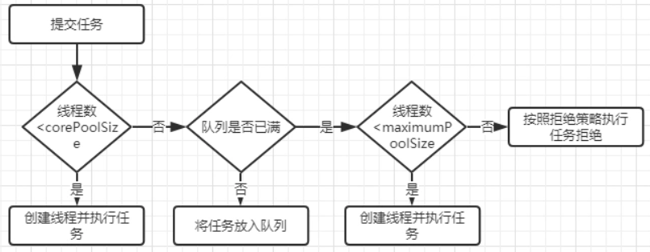

---

#### 创建线程池

可以通过 Executors 的静态工厂方法创建线程池：

① `newFixedThreadPool`，固定大小的线程池，核心线程数也是最大线程数，不存在空闲线程，keepAliveTime = 0。使用的工作队列是无界阻塞队列 LinkedBlockingQueue，适用于负载较重的服务器。

② `newSingleThreadExecutor`，使用单线程，相当于单线程串行执行所有任务，适用于需要保证顺序执行任务的场景。

③ `newCachedThreadPool`，最大线程数是 Integer 最大值，使用的工作队列是没有容量的 SynchronousQueue，如果主线程提交任务的速度高于线程处理的速度，线程池会不断创建新线程，极端情况下会耗尽 CPU 和内存资源。适用于执行很多短期异步任务的小程序或负载较轻的服务器。

④ `newScheduledThreadPool`：最大线程数是Integer 最大值，存在 OOM 风险。支持定期及周期性任务执行，适用需要多个后台执行任务，同时限制线程数量的场景。相比 Timer 更安全，功能更强，与 `newCachedThreadPool` 的区别是不回收工作线程。

---

#### 线程池的参数

① corePoolSize：常驻核心线程数，设置过大会浪费资源，过小会导致线程的频繁创建与销毁。

② maximumPoolSize：线程池能够容纳同时执行的线程最大数，必须大于 0。

③ keepAliveTime：线程空闲时间，线程空闲时间达到该值后会被销毁，直到线程数等于 corePoolSize 为止，避免浪费内存资源。

④ unit：keepAliveTime 的时间单位。

⑤ workQueue：工作队列，当线程请求数大于等于 corePoolSize 时线程会进入队列。

⑥ threadFactory：线程工厂，用来生产一组相同任务的线程。可以给线程命名，有利于分析错误。

⑦ handler：拒绝策略，默认使用 AbortPolicy 丢弃任务并抛出异常，CallerRunsPolicy 重新尝试提交任务，DiscardOldestPolicy 抛弃队列里等待最久的任务并把当前任务加入队列，DiscardPolicy 丢弃任务但不抛出异常。

---

#### 关闭线程池

可以调用 `shutdown` 或 `shutdownNow` 方法关闭线程池，原理是遍历线程池中的工作线程，逐个调用 `interrupt` 方法中断线程。

区别是 `shutdownNow` 首先将线程池的状态设为 STOP，然后尝试停止正在执行或暂停任务的线程，并返回等待执行任务的列表。而 `shutdown` 只是将线程池的状态设为 SHUTDOWN，然后中断没有正在执行任务的线程。

通常调用 `shutdown` 来关闭线程池，如果任务不一定要执行完可调用 `shutdownNow`。

---

#### 线程池的选择策略

- 任务性质：CPU 密集型、IO 密集型和混合型。

  性质不同的任务用不同规模的线程池处理，CPU 密集型任务应配置尽可能少的线程；IO 密集型任务应配置尽可能多的线程；混合型任务，如果可以拆分，将其拆分为一个 CPU 密集型任务和一个 IO 密集型任务，只要两个任务执行时间相差不大，那么分解后的吞吐量将高于串行执行的吞吐量，如果相差太大则没必要分解。

- 任务优先级/执行时间。

  使用优先级队列让优先级高或执行时间短的任务先执行。

- 任务依赖性：是否依赖其他资源，如数据库连接。

  依赖数据库连接池的任务，由于线程提交 SQL 后需要等待数据库返回的结果，等待的时间越长 CPU 空闲的时间就越长，因此线程数应该尽可能地设置大一些，提高 CPU 的利用率。

----

####  线程池的参数与状态

[参考](https://www.cnblogs.com/wf-zhang/p/12120472.html)

----

#### 阻塞队列

阻塞队列支持阻塞插入和移除，当队列满时，阻塞生产线程直到队列不满。当队列为空时，消费线程会被阻塞直到队列非空。阻塞生产者主要通过 LockSupport 的 `park` 方法实现，不同操作系统中实现方式不同，在 Linux 下使用的是系统方法 `pthread_cond_wait` 实现。

**Java 中的阻塞队列**

ArrayBlockingQueue，由数组组成的有界阻塞队列，默认情况下不保证线程公平。

LinkedBlockingQueue，由链表组成的有界阻塞队列，队列的默认和最大长度为 Integer 最大值。

PriorityBlockingQueue，支持优先级的无界阻塞队列，默认情况下元素按升序排序。可自定义 `compareTo` 方法指定排序规则，或者初始化时指定 Comparator 排序，不能保证同优先级元素的顺序。

DelayQueue，支持延时获取元素的无界阻塞队列，使用优先级队列实现。创建元素时可以指定多久才能从队列中获取当前元素，只有延迟期满时才能从队列中获取元素，适用于缓存和定时调度。

SynchronousQueue，不存储元素的阻塞队列，每一个 put 必须等待一个 take。默认使用非公平策略，适用于传递性场景，吞吐量高。

LinkedBlockingDeque，链表组成的双向阻塞队列，可从队列的两端插入和移出元素，多线程同时入队时减少了竞争。

---

#### ThreadLocal 

ThreadLoacl 是线程共享变量，主要用于线程内跨类、方法传递数据。ThreadLoacl 有一个静态内部类 ThreadLocalMap，其 Key 是 ThreadLocal 对象，值是 Entry 对象，Entry 中只有一个 Object 类的 vaule 值。ThreadLocal 是线程共享的，但 ThreadLocalMap 是每个线程私有的。ThreadLocal 主要有 set、get 和 remove 三个方法。

**set 方法**

首先获取当前线程，然后再获取当前线程对应的 ThreadLocalMap 类型的对象 map。如果 map 存在就直接设置值，key 是当前的 ThreadLocal 对象，value 是传入的参数。

如果 map 不存在就通过 `createMap` 方法为当前线程创建一个 ThreadLocalMap 对象再设置值。

**get 方法**

首先获取当前线程，然后再获取当前线程对应的 ThreadLocalMap 类型的对象 map。如果 map 存在就以当前 ThreadLocal 对象作为 key 获取 Entry 类型的对象 e，如果 e 存在就返回它的 value 属性。

如果 e 不存在或 map 不存在，就调用 `setInitialValue` 方法为当前线程创建一个 ThreadLocalMap 对象然后返回默认的初始值 null。

**remove 方法**

首先通过当前线程获取其对应的 ThreadLocalMap 类型的对象 m，如果 m 不为空，就解除 ThreadLocal 这个 key 及其对应的 value 值的联系。

**存在的问题**

线程复用会产生脏数据，由于线程池会重用 Thread 对象，因此与 Thread 绑定的 ThreadLocal 也会被重用。如果没有调用 remove 清理与线程相关的 ThreadLocal 信息，那么假如下一个线程没有调用 set 设置初始值就可能 get 到重用的线程信息。

ThreadLocal 还存在内存泄漏的问题，由于 ThreadLocal 是弱引用，但 Entry 的 value 是强引用，因此当 ThreadLocal 被垃圾回收后，value 依旧不会被释放。因此需要及时调用 remove 方法进行清理操作。

---

### JUC

#### CAS

CAS 表示比较并交换，需要三个操作数，内存位置 V、旧的预期值 A 和准备设置的新值 B。CAS 执行时，当且仅当 V=A 时，处理器才会用 B 更新 V 的值。不管是否更新都会返回 V 的旧值，处理过程是原子操作，期间不会被其他线程打断。

JDK5 开始使用 CAS 操作，该操作由 Unsafe 类里的 `compareAndSwapInt` 等几个方法提供。HotSpot 在内部对这些方法做了特殊处理，即时编译的结果是一条平台相关的处理器 CAS 指令。Unsafe 类不是给用户程序调用的类，因此 JDK9 前只有 Java 类库可以使用 CAS，譬如  AtomicInteger 类中 `compareAndSet` 等方法都使用了 Unsafe 类的 CAS 操作实现。

CAS 存在一个漏洞：如果初次读取和准备赋值时都满足 V=A，依旧不能说明值没有被其他线程更改过，因为存在 V 先改为 B 又改回 A 的情况，这个漏洞称为 ABA 问题。juc 包提供了一个 AtomicStampedReference 类，通过控制变量值的版本来解决 ABA 问题。

>- CAS是一个**原子操作**，它**比较**一个内存位置的值并且**只有相等时修改**这个内存位置的值为新的值，保证了新的值总是基于最新的信息计算的，如果有其他线程在这期间修改了这个值则CAS失败。CAS返回是否成功或者内存位置原来的值用于判断是否CAS成功。
>- JVM中的CAS操作是利用了CPU处理器提供的**CMPXCHG指令(compare X change)**实现的
>
>缺点：
>
>- 循环时间长开销大。
>- ABA问题。
>- 只能保证一个共享变量的原子操作。

---

#### 原子类

JDK5 提供了 atomic 包，包中的原子操作类提供了简单高效、线程安全地更新变量的方式。到 JDK8 该包共有17个类，依据作用分为四种：原子更新基本类型、原子更新数组、原子更新引用、原子更新字段，atomic 包里的类基本都使用 Unsafe 实现，Unsafe 只提供三种 CAS 方法：`compareAndSwapInt`、`compareAndSwapLong` 和 `compareAndSwapObject`，例如原子更新 Boolean 是先转成整形再使用 `compareAndSwapInt` 。

- AtomicInteger 原子更新整形、 AtomicLong 原子更新长整型、AtomicBoolean 原子更新布尔类型。

  AtomicInteger 的 `getAndIncrement` 调用 Unsafe 类的 `getAndAddInt` 方法以原子方式将当前的值加 1，该方法调用 `compareAndSwapInt` 更新值。

- AtomicIntegerArray 原子更新整形数组、 AtomicLongArray 原子更新长整型数组、 AtomicReferenceArray 原子更新引用数组。
- AtomicReference 原子更新引用、AtomicMarkableReference 原子更新带有标记的引用，AtomicStampedReference 原子更新带有版本号的引用，关联一个整数值作为版本号，解决 ABA 问题。
- AtomicIntegerFieldUpdater 原子更新整形字段、 AtomicLongFieldUpdater 原子更新长整形字段、AtomicReferenceFieldUpdater 原子更新引用类型字段。

---

#### CountDownLatch 

CountDownLatch 是基于执行时间的同步类，允许一个或多个线程等待其他线程完成操作，构造方法接收一个 int 参数作为计数器。每次调用 `countDown` 方法时计数器减 1，`await` 方法会阻塞当前线程直到计数器变为 0。

---

#### CyclicBarrier

循环屏障是基于同步到达某个点的信号量触发机制，作用是让一组线程到达一个屏障时被阻塞，直到最后一个线程到达屏障才会解除。构造方法中的参数表示拦截线程数量，每个线程调用 `await` 方法表示自己已到达屏障，然后被阻塞。支持在构造方法中传入一个 Runnable 任务，当线程到达屏障时会优先执行该任务。适用于多线程计算数据，最后合并计算结果的应用场景。

CountDownLacth 的计数器只能用一次，而 CyclicBarrier 的计数器可用 `reset` 方法重置，所以 CyclicBarrier 能处理更为复杂的业务。

---

#### Semaphore

信号量用来控制同时访问特定资源的线程数量，通过协调各个线程以保证合理使用公共资源。信号量可以用于流量控制，特别是公共资源有限的应用场景，比如数据库连接。

Semaphore 的构造方法参数接收一个 int 值，表示可用的许可数量即最大并发数。使用 `acquire` 方法获得一个许可证，使用 `release` 方法归还许可，还可以用 `tryAcquire` 尝试获得许可。

---

#### Exchanger

交换者是用于线程间协作的工具类，用于进行线程间的数据交换。它提供一个同步点，在这个同步点两个线程可以交换彼此的数据。

两个线程通过 `exchange` 方法交换数据，第一个线程执行 `exchange` 方法后会阻塞等待第二个线程执行该方法，当两个线程都到达同步点时这两个线程就可以交换数据，将本线程生产出的数据传递给对方，可用于校对工作等场景。

---

#### ConcurrentHashMap⭐

ConcurrentHashMap 用于解决 HashMap 的线程安全和 HashTable 的低效问题，HashTable 效率低是因为所有线程都必须竞争同一把锁，假如容器有多把锁，每把锁只锁部分数据，那么多线程访问不同数据段时就不会存在竞争，ConcurrentHashMap 使用锁分段，将数据分成 Segment 数据段，给每个数据段配一把锁，当一个线程占用锁访问某段数据时，其他数据段也能被其他线程访问。

`get` 实现简单高效，先经过一次再散列得到一个 hash 值，再用这个 hash 值定位到 Segment，最后通过散列算法定位到元素。`get` 的高效在于不用加锁，除非读到空值才会加锁重读。`get` 方法中将共享变量定义为 volatile，由于只需要读所以不用加锁。

`put` 必须加锁，首先定位到 Segment，然后进行插入操作，第一步判断是否需要对 Segment 里的 HashEntry 数组进行扩容，第二步定位添加元素的位置，然后将其放入数组。

`size` 方法用于统计数量，必须统计每个 Segment 的大小然后求和，在统计结果累加的过程中，之前累加过的 count 变化几率很小，因此先尝试两次不加锁统计结果，如果统计过程中容器大小发生了变化，再加锁统计。判断容器是否发生变化根据 modCount 确定。

**JDK8**

主要改造：① 取消分段锁机制，降低冲突概率。② 同一个哈希槽上的元素个数超过阈值后，链表改为红黑树结构。③ 使用优化方式统计元素数量，在涉及元素总数的更新和计算时都避免了锁，使用 CAS 代替。

`get` 同样不需要同步，`put` 时如果没有出现哈希冲突，就使用 CAS 添加元素，否则使用 synchronized 添加元素。

当某个槽内的元素个数达到 7 且 table 容量不小于 64 时，链表转为红黑树。

当某个槽内的元素减少到 6 时，由红黑树重新转为链表。在转化过程中，使用同步块锁住当前槽的首元素，防止其他线程对当前槽进行增删改操作，转化完成后利用 CAS 替换原有链表。由于 TreeNode 节点也存储了 next 引用，因此红黑树转为链表很简单，只需从 first 元素开始遍历所有节点，并把节点从 TreeNode 转为 Node 类型即可，当构造好新链表后同样用 CAS 替换红黑树。

---

#### CopyOnWriteArrayList

可以使用 CopyOnWriteArrayList 代替 ArrayList，它实现了读写分离。写操作复制一个新的集合，在新集合内添加或删除元素，修改完成后再将原集合的引用指向新集合。这样做的好处是可以高并发地进行读写操作而不需要加锁，因为当前集合不会添加任何元素。使用时注意尽量设置容量初始值，使用批量添加或删除，避免多次扩容，防止只增加一个元素却复制整个集合。

适合读多写少的场景，单个添加时效率极低。CopyOnWriteArrayList 是 fail-safe 的，并发包的集合都是这种机制，fail-safe 在安全的副本上遍历，集合修改与副本遍历没有任何关系，缺点是无法读取最新数据。这也是 CAP 理论中 C（一致性） 和 A（可用性） 的矛盾。

---

## 框架 

### Spring IoC⭐

#### IoC 

IoC 控制反转，把对象创建、依赖反转给容器实现，需要创建一个容器和一种描述让容器知道对象间的依赖关系，Spring 通过 IoC 容器管理对象及其依赖关系。IoC 的主要实现方式是 DI，对象不是从容器中查找依赖的类，而是容器实例化对象时主动为它注入依赖的类。

>IoC（Inverse of Control:控制反转）是一种**设计思想**，就是 **将原本在程序中手动创建对象的控制权，交由Spring框架来管理。** IoC 在其他语言中也有应用，并非 Spring 特有。 **IoC 容器是 Spring 用来实现 IoC 的载体， IoC 容器实际上就是个Map（key，value）,Map 中存放的是各种对象。**
>
>将对象之间的相互依赖关系交给 IoC 容器来管理，并由 IoC 容器完成对象的注入。这样可以很大程度上简化应用的开发，把应用从复杂的依赖关系中解放出来。 **IoC 容器就像是一个工厂一样，当我们需要创建一个对象的时候，只需要配置好配置文件/注解即可，完全不用考虑对象是如何被创建出来的。** 在实际项目中一个 Service 类可能有几百甚至上千个类作为它的底层，假如我们需要实例化这个 Service，你可能要每次都要搞清这个 Service 所有底层类的构造函数，这可能会把人逼疯。如果利用 IoC 的话，你只需要配置好，然后在需要的地方引用就行了，这大大增加了项目的可维护性且降低了开发难度。
>
>Spring 时代我们一般通过 XML 文件来配置 Bean，后来开发人员觉得 XML 文件来配置不太好，于是 SpringBoot 注解配置就慢慢开始流行起来。
>
>------
>
>　　理解好它的关键在于我们需要回答如下四个问题：
>
>1. **谁控制谁**：在传统的开发模式下，我们都是采用直接 new 一个对象的方式来创建对象，也就是说你依赖的对象直接由你自己控制，但是有了 IOC 容器后，则直接由 IoC 容器来控制。所以“谁控制谁”，当然是 IoC 容器控制对象。
>2. **控制什么**：控制对象。
>3. **为何是反转**：没有 IoC 的时候我们都是在自己对象中主动去创建被依赖的对象，这是正转。但是有了 IoC 后，所依赖的对象直接由 IoC 容器创建后注入到被注入的对象中，依赖的对象由原来的主动获取变成被动接受，所以是反转。
>4. **哪些方面反转了**：所依赖对象的获取被反转了。

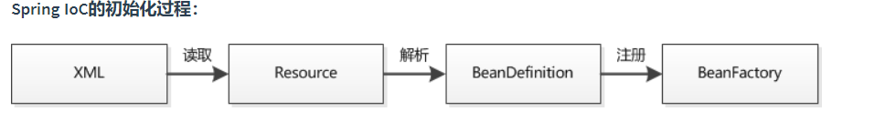

**基于 XML 的 IoC 初始化**

当创建 ClassPathXmlApplicationContext 时，调用父类 AbstractApplicationContext 的 `refresh` 方法启动整个 IoC 容器对 Bean 定义的载入过程，在创建 IoC 容器前如果已有容器存在，需要销毁，保证使用的是新创建的容器。

容器创建后通过 `loadBeanDefinitions` 方法加载 Bean 配置资源，首先解析配置文件路径，读取配置文件内容，然后通过 XML 解析器将配置信息转换成文档对象，之后按照 Bean 的定义规则解析文档对象。

IoC 容器中注册的 Bean 信息存放在一个 HashMap 中，key 是字符串，值是 BeanDefinition。当配置信息中的 Bean 被解析且被注册到 IoC 容器后，初始化就算完成了。

>　该**`org.springframework.context.ApplicationContext`**接口代表Spring IoC容器，并负责**实例化，配置和组装Bean**。容器通过读取配置元数据来获取有关要实例化，配置和组装哪些对象的指令。配置元数据以 **XML** ，**Java批注** 或 **Java代码** 表示。它使您能够表达组成应用程序的对象以及这些对象之间的丰富相互依赖关系。

---

#### DI

**实现**

- **构造方法注入**  

  IoC 容器会检查对象的构造方法，取得它的依赖对象列表，当对象实例化完成时依赖的属性也会成功注入，可以直接使用。缺点是当依赖对象较多时，可能需要多个构造方法。

- **setter 方法注入**

  只需要为依赖对象的属性添加 setter 方法，在描述性上要比构造方法注入强，缺点是无法在对象构造完成后就进入就绪状态。IoC 容器会先实例化 Bean 对象，然后通过反射调用 setter 方法注入属性。

- **注解注入**

  `@Autowired`：自动按类型注入，如果有多个匹配则按照指定 Bean 的 id 查找，需要搭配 `@Qualifier`。

  `@Resource` ：按照 Bean 的 id 注入，如果找不到则会按类型注入。

  `@Value` ：用于注入基本数据类型和 String。
  
- **接口注入**

---

#### Bean

**生命周期**

在 IoC **容器的初始化时会对 Bean 定义完成资源定位，加载读取配置并解析，最后将解析的 Bean 信息放在一个 HashMap 集合中。当 IoC 容器初始化后，会创建 Bean 实例并完成依赖注入，注入对象依赖的各种属性值，在初始化时可以指定自定义的初始化方法。经过一系列初始化操作后 Bean 达到可用状态，当使用完成后会调用 destroy 方法进行销毁，此时也可以指定自定义的销毁方法**，最终 Bean 被销毁且从容器中移除。

通过配置 bean 标签或注解中的 init-Method 和 destory-Method 属性指定自定义初始化和销毁方法。 

---

**作用域**

通过 scope 属性指定作用域。

| 范围             | 作用域         | 备注                                             |
| ---------------- | -------------- | ------------------------------------------------ |
| 所有 Spring 应用 | singleton      | 默认作用域，每个容器中只有一个唯一的 Bean 实例。 |
|                  | prototype      | 每次 Bean 请求都会创建一个新的实例。             |
| Spring Web 应用  | request        | 为每个请求创建一个新的实例。                     |
|                  | session        | 为每个会话创建一个新的实例。                     |
|                  | global session | 为全局 session 创建一个新的实例。                |

----

**创建**

- **XML**  

  默认无参构造方法，只需指明 bean 标签中的 id 和 class 属性，如果没有无参构造方法会报错。

  静态工厂方法，通过 bean 标签的 class 属性指明工厂，factory-method 属性指明方法。

  实例工厂方法，通过 bean 标签的 factory-bean 属性指明工厂，factory-method 属性指明方法。

- **注解** 

  `@Component` 把当前类对象存入 Spring 容器，相当于在 xml 中配置一个 bean 标签。value 属性指定 bean 的 id，默认使用当前类首字母小写的类名。

  `@Controller`，` @Service`，` @Repository` 都是 `@Component`  的衍生注解，作用及属性都一模一样，只是提供了更明确的语义，`@Controller` 用于表现层，`@Service`用于业务层，`@Repository`用于持久层。

  如果想注入第三方类又没有源码，就没法使用 `@Component`，需要用 `@Bean`。被 `@Bean` 注解的方法返回值是一个对象，这个对象由 Spring 的 IoC 容器管理，name 属性用于给对象指定一个名称。

---

**BeanFactory、FactoryBean 和 ApplicationContext 的区别**

BeanFactory 是一个 Bean 工厂，使用简单工厂模式，是 Spring IoC 容器顶级接口，作用是管理 Bean，包括实例化、定位、配置对象及维护对象间的依赖。BeanFactory 属于延迟加载，适合多例模式。

FactoryBean 是一个工厂 Bean，使用工厂方法模式，作用是生产其他 Bean 实例，可以通过实现该接口来自定义实例 Bean 的逻辑。如果一个 Bean 实现了这个接口，那么它就是创建对象的工厂 Bean，而不是 Bean 实例本身。

ApplicationConext 是 BeanFactory 的子接口，扩展了 BeanFactory 的功能，提供了支持国际化文本消息，统一的资源文件读取方式等功能。Bean 的依赖注入在容器初始化时就已经完成，属于立即加载，适合单例模式。

---

#### 注解配置文件

`@Configuration` 指定当前类是一个 Spring 配置类，创建容器时会从该类上加载注解，`value` 属性指定配置类的字节码。

`@ComponentScan` 开启组件扫描，`basePackages` 属性指定要扫描的包。

`@PropertySource` 用于加载 `properties` 文件中的配置。

`@Import` 导入其他配置类，有 `@Import` 的是父配置类，引入的是子配置类，value 属性指定其他配置类的字节码。

---

###  Spring 事务

#### 什么是事务:
事务逻辑上的一组操作,组成这组操作的各个逻辑单元,要么一起成功,要么一起失败.

####  Spring事务的4种性质

**原子性 （atomicity）**:强调事务的不可分割.
**一致性 （consistency）**:事务的执行的前后数据的完整性保持一致.
**隔离性 （isolation）**:一个事务执行的过程中,不应该受到其他事务的干扰
**持久性（durability）** :事务一旦结束,数据就持久到数据库

####  不考虑隔离性引起的安全问题

**脏读** :一个事务读到了另一个事务的未提交的数据
**不可重复读** :一个事务读到了另一个事务已经提交的 update 的数据导致多次查询结果不一致.
**虚幻读** :一个事务读到了另一个事务已经提交的 insert 的数据导致多次查询结果不一致.

####  Spring事务5种隔离级别

DEFAULT 这是一个PlatfromTransactionManager默认的隔离级别，使用数据库默认的事务隔离级别.
**未提交读**（read uncommited） :脏读，不可重复读，虚读都有可能发生
**已提交读** （read commited）:避免脏读。但是不可重复读和虚读有可能发生
**可重复读** （repeatable read） :避免脏读和不可重复读.但是虚读有可能发生.
**串行化的** （serializable） :避免以上所有读问题.
**Mysql 默认:可重复读**
**Oracle 默认:读已提交**


**read uncommited**：是最低的事务隔离级别，它允许另外一个事务可以看到这个事务未提交的数据。
**read commited**：保证一个事物提交后才能被另外一个事务读取。另外一个事务不能读取该事物未提交的数据。
**repeatable read**：这种事务隔离级别可以防止脏读，不可重复读。但是可能会出现幻象读。它除了保证一个事务不能被另外一个事务读取未提交的数据之外还避免了以下情况产生（不可重复读）。
**serializable**：这是花费最高代价但最可靠的事务隔离级别。事务被处理为顺序执行。除了防止脏读，不可重复读之外，还避免了幻象读（避免三种）。

####  Spring事务7种传播行为

*** 保证同一个事务中**
**propagion_required:** 支持当前事务，如果不存在 就新建一个(默认)
**propagion_supports:** 支持当前事务，如果不存在，就不使用事务
**propagion_mandatory:** 支持当前事务，如果不存在，抛出异常
*** 保证没有在同一个事务中**
**propagion_requires_new:**  如果有事务存在，挂起当前事务，创建一个新的事务
**propagion_not_supported:** 以非事务方式运行，如果有事务存在，挂起当前事务
**propagion_never:** 以非事务方式运行，如果有事务存在，抛出异常
**propagion**_**nested:** 如果当前事务存在，则嵌套事务执行

####  @Transactional

**`@Transactional` 的常用配置参数总结（只列出了 5 个我平时比较常用的）：**

| 属性名      | 说明                                                         |
| ----------- | ------------------------------------------------------------ |
| propagation | 事务的传播行为，默认值为 REQUIRED，可选的值在上面介绍过      |
| isolation   | 事务的隔离级别，默认值采用 DEFAULT，可选的值在上面介绍过     |
| timeout     | 事务的超时时间，默认值为-1（不会超时）。如果超过该时间限制但事务还没有完成，则自动回滚事务。 |
| readOnly    | 指定事务是否为只读事务，默认值为 false。                     |
| rollbackFor | 用于指定能够触发事务回滚的异常类型，并且可以指定多个异常类型。 |

------

### Spring AOP ⭐

#### AOP 

AOP 面向切面编程，将代码中重复的部分抽取出来，使用动态代理技术，在不修改源码的基础上对方法进行增强。

如果目标对象实现了接口，默认采用 JDK 动态代理，也可以强制使用 CGLib；如果目标对象没有实现接口，采用 CGLib 的方式。

常用场景包括权限认证、自动缓存、错误处理、日志、调试和事务等。

>AOP(Aspect-Oriented Programming:面向切面编程)能够将那些与业务无关，**却为业务模块所共同调用的逻辑或责任（例如事务处理、日志管理、权限控制等）封装起来**，便于**减少系统的重复代码**，**降低模块间的耦合度**，并**有利于未来的可拓展性和可维护性**。

---

#### 相关注解

`@Aspect`：声明被注解的类是一个切面 Bean。

`@Before`：前置通知，指在某个连接点之前执行的通知。

`@After`：后置通知，指某个连接点退出时执行的通知（不论正常返回还是异常退出）。

`@AfterReturning`：返回后通知，指某连接点正常完成之后执行的通知，返回值使用 returning 属性接收。

`@AfterThrowing`：异常通知，指方法异常退出时执行的通知，和 `@AfterReturning` 只会有一个执行，异常使用 throwing 属性接收。

---

#### 相关术语

`Aspect`：切面，一个关注点的模块化，这个关注点可能会横切多个对象。

`Joinpoint`：连接点，程序执行过程中的某一行为，即业务层中的所有方法。

`Advice`：通知，指切面对于某个连接点所产生的动作，包括前置通知、后置通知、返回后通知、异常通知和环绕通知。

`Pointcut`：切入点，指被拦截的连接点，切入点一定是连接点，但连接点不一定是切入点。

`Proxy`：代理，Spring AOP 中有 JDK 动态代理和 CGLib 代理，目标对象实现了接口时采用 JDK 动态代理，反之采用 CGLib 代理。

`Target`：代理的目标对象，指一个或多个切面所通知的对象。

`Weaving` ：织入，指把增强应用到目标对象来创建代理对象的过程。

---

### Spring MVC ⭐


#### 处理流程

Web 容器启动时初始化 IoC 容器，加载 Bean 的定义信息并初始化所有单例 Bean，遍历容器中的 Bean，获取每个 Controller 中的所有方法访问的 URL，将 URL 和对应的 Controller 保存到一个 Map 集合中。

所有的请求会转发给 DispatcherServlet 处理，DispatcherServlet 会请求 HandlerMapping 找出容器中被 `@Controler` 修饰的 Bean 以及被 `@RequestMapping` 修饰的方法和类，生成 Handler 和 HandlerInterceptor 并以一个 HandlerExcutionChain 链的形式返回。

DispatcherServlet 使用 Handler 找到对应的 HandlerApapter，通过 HandlerApapter 调用 Handler 的方法，将请求参数绑定到方法的形参上，执行方法处理请求并得到逻辑视图 ModelAndView。

使用 ViewResolver 解析 ModelAndView 得到物理视图 View，进行视图渲染，将数据填充到视图中并返回给客户端。

---

#### 组件

`DispatcherServlet`：前端控制器，整个流程控制的核心，负责接收请求并转发给对应的处理组件。

`Handler`：处理器，完成具体业务逻辑。

`HandlerMapping`：处理器映射器，完成 URL 到 Controller 映射。

`HandlerInterceptor`：处理器拦截器，如果需要完成拦截处理可以实现该接口。

`HandlerExecutionChain`：处理器执行链，包括 Handler 和 HandlerInterceptor。

`HandlerAdapter`：处理器适配器，DispatcherServlet 通过 HandlerAdapter 来执行不同的 Handler。

`ModelAndView`：逻辑视图，装载模型数据信息。

`ViewResolver`：视图解析器，将逻辑视图解析为物理视图。

---

#### 相关注解

`@RequtestMapping`：将 URL 请求和方法映射起来，在类和方法定义上都可以添加。`value ` 属性指定 URL 请求的地址。`method` 属性限制请求类型，如果没有使用指定方法请求 URL，会报 405 错误。`params` 属性限制必须提供的参数。

`@RequestParam`：如果 Controller 方法的形参和 URL 参数名不一致可以使用该注解绑定。`value` 属性表示 HTTP 请求中的参数名，`required` 属性设置参数是否必要，默认false。`defaultValue` 属性指定没有给参数赋值时的默认值。

`@PathVariable`：Spring MVC 支持 RESTful 风格 URL，通过 `@PathVariable` 完成参数绑定。

---

### Spring Data JPA 

#### ORM

Object-Relational Mapping ，表示对象关系映射，映射的不只是对象的值还有对象之间的关系，通**过 ORM 就可以把对象映射到关系型数据库中**。操作实体类就相当于操作数据库表，可以不再重点关注 SQL 语句。

---

#### JPA 的使用

只需要持久层接口继承 JpaRepository 即可，泛型参数列表中第一个参数是实体类类型，第二个参数是主键类型。

运行时通过 `JdkDynamicAopProxy` 的 `invoke` 方法创建了一个动态代理对象 `SimpleJpaRepository`，`SimpleJpaRepository` 中封装了 JPA 的操作，通过 hibernate 完成数据库操作。

---

#### 实体类相关注解

` @Entity `：表明当前类是一个实体类。

`@Table` ：关联实体类和数据库表。

`@Column` ：关联实体类属性和数据库表中字段。

`@Id` ：声明当前属性为数据库表主键对应的属性。

`@GeneratedValue`： 配置主键生成策略。

`@OneToMany` ：配置一对多关系，mappedBy 属性值为主表实体类在从表实体类中对应的属性名。

`@ManyToOne` ：配置多对一关系，targetEntity 属性值为主表对应实体类的字节码。

`@JoinColumn`：配置外键关系，name 属性值为外键名称，referencedColumnName 属性值为主表主键名称。

---

#### 对象导航查询

通过 get 方法查询一个对象的同时，通过此对象可以查询它的关联对象。

对象导航查询一到多默认使用延迟加载， 关联对象是多个对象，使用立即加载可能浪费资源；对象导航查询多到一默认使用立即加载。

实体类注解的 fetch 属性表示加载方式，LAZY 是延迟加载，EAGER 是立即加载。

---

### Mybatis⭐

#### XML 标签

`select`、`insert`、`update`、`delete` 标签分别对应查询、添加、更新、删除操作。

>还有很多其他的标签resultMap、parameterMap、sql、include、selectKey，加上动态 sql 的 9 个标签，`trim|where|set|foreach|if|choose|when|otherwise|bind`等，其中为 sql 片段标签，通过``标签引入 sql 片段，``为不支持自增的主键生成策略标签。
>
>

`parameterType`  属性表示参数的数据类型，包括基本数据类型和对应的包装类型、String 和 Java Bean 类型，当有多个参数时可以使用 `#{argn}` 的形式表示第 n 个参数。除了基本数据类型都要以全限定类名的形式指定参数类型。

`resultType`  表示返回的结果类型，包括基本数据类型和对应的包装类型、String 和 Java Bean 类型。还可以使用把返回结果封装为复杂类型的 `resultMap` 。

---

#### 一级缓存

一级缓存是 SqlSession 级别，默认开启。

SqlSession 对象中有一个 HashMap 缓存数据，不同 SqlSession 间缓存数据互不影响。同一个 SqlSession 中执行两次相同的 SQL 语句时，第一次执行完毕会将结果保存在缓存中，第二次查询直接从缓存中获取。

如果 SqlSession 执行了 **DML 操作（insert、update、delete）**，Mybatis 必须将缓存清空保证数据有效性。 

---

#### 二级缓存

二级缓存是Mapper 级别，默认关闭。

相比于一级缓存，缓存范围更大，多个 SqlSession 可以共用二级缓存，作用域是 Mapper 的同一个 namespace，不同 SqlSession 两次执行相同的 namespace 下的 SQL 语句，参数也相等，则第一次执行成功后会将数据保存在二级缓存中。

需要在全局配置文件中配置 `<setting name="cacheEnabled" value="true"/>` ，并在对应的映射文件中配置 `<cache/>` 标签。

---

#### `#{}` 和 `${}` 的区别

使用 `${}`  相当于使用字符串拼接，存在 SQL 注入的风险。是 Properties 文件中的变量占位符，它可以用于标签属性值和 sql 内部，属于静态文本替换

使用 `#{}` 相当于使用占位符，可以防止 SQL 注入，不支持使用占位符的地方就只能使用 `${}` ，典型情况就是动态参数。是 sql 的参数占位符，MyBatis 会将 sql 中的`#{}`替换为?号

------

###  常用orm框架区别

| 名称          | 类型       | 自定义sql                       | 提供自动方法               |
| ------------- | ---------- | ------------------------------- | -------------------------- |
| SpringDataJPA | 全自动框架 | 可以通过@Query                  | 自定义了增删改查等         |
| Hibernate     | 全自动框架 | 通过编写HQL实现，create.session | 自定义了增删改查等         |
| Mybatis       | 半自动框架 | 通过XML配置文件编写SQL语句      | 通过Mybatis-puls/generator |


------

### SpringBoot⭐

#### 优点

简化开发：它的作用就是快速搭建 Spring 框架。

简化配置：比如要创建一个 web 项目，在使用 Spring 的时候，需要在 pom 文件中添加多个依赖，而在 SpringBoot 中只需要添加一个 starter-web 依赖即可。

简化部署：使用 Spring 时需要部署 tomcat，然后把项目打成 war 包。而 SpringBoot 内嵌了 tomcat，只需要将项目打成 jar 包即可。

---

#### 注解

`@SpringBootApplication`：自动给程序进行必要配置，这个配置等同于：`@Configuration` ，`@EnableAutoConfiguration` 和 `@ComponentScan` 三个配置。

`@EnableAutoConfiguration`：允许 SpringBoot 自动配置注解，开启后 SpringBoot 就能根据当前类路径下的包或者类来配置 Bean。

`@SpringBootConfiguration`：相当于 `@Configuration`，只是语义不同。

---

####  BeanFactory和FactoryBean的区别

BeanFactory是个Factory，也就是IOC容器或对象工厂，FactoryBean是个Bean。在Spring中，所有的Bean都是由BeanFactory(也就是IOC容器)来进行管理的。但对FactoryBean而言，这个Bean不是简单的Bean，而是一个能生产或者修饰对象生成的工厂Bean,它的实现与设计模式中的工厂模式和修饰器模式类似

---

####  Spring-三级缓存和循环依赖

[参考](https://segmentfault.com/a/1190000023712597)


---

### SpringCloud⭐

#### 微服务的优点

各个服务的开发、测试、部署都相互独立，用户服务可以拆分为独立服务，如果用户量很大，可以很容易对其实现负载。

当新需求出现时，使用微服务不再需要考虑各方面的问题，例如兼容性、影响度等。

使用微服务拆分项目后，各个服务之间消除了很多限制，只需要保证对外提供的接口正常可用，而不限制语言和框架等选择。

---

#### 服务治理 Eureka

服务治理由三部分组成：服务提供者、服务消费者、注册中心。

服务注册：在分布式系统架构中，每个微服务在启动时，将自己的信息存储在注册中心。

服务发现：服务消费者从注册中心获取服务提供者的网络信息，通过该信息调用服务。

Spring Cloud 的服务治理使用 Eureka 实现，Eureka 是 Netflix 开源的基于 REST 的服务治理解决方案，Spring Cloud 集成了 Eureka，提供服务注册和服务发现的功能，可以和基于 Spring Boot 搭建的微服务应用轻松完成整合。

---

#### 服务网关 Zuul

Spring Cloud 集成了 Zuul 组件，实现服务网关。

Zuul 是 Netflix 提供的一个开源的 API 网关服务器，是客户端和网站后端所有请求的中间层，对外开放一个 API，将所有请求导入统一的入口，屏蔽了服务端的具体实现逻辑，可以实现方向代理功能，在网关内部实现动态路由、身份认证、IP过滤、数据监控等。

---

#### 负载均衡 Ribbon

Ribbon 是 Netflix 发布的均衡负载器，Spring Cloud 集成了 Ribbon，提供用于对 HTTP 请求进行控制的负载均衡客户端。

在注册中心对 Ribbon 进行注册之后，Ribbon 就可以基于某种负载均衡算法（轮循、随机、加权轮询、加权随机等）自动帮助服务消费者调用接口，开发者也可以根据具体需求自定义 Ribbon 负载均衡算法。实际开发中 Spring Clooud Ribbon 需要结合 Spring Cloud Eureka 使用，Eureka 提供所有可以调用的服务提供者列表，Ribbon 基于特定的负载均衡算法从这些服务提供者中选择要调用的实例。

---

#### 声明式接口调用 Feign

Feign 是 Netflix 提供的，一个声明式、模板化的 Web Service 客户端，简化了开发者编写 Web 客户端的操作，开发者可以通过简单的接口和注解来调用 HTTP API。

相比于 Ribbon + RestTemplate 的方式，Feign 可以大大简化代码开发，支持多种注解，包括 Feign 注解、Spring MVC 注解等。

RestTemplate 是 Spring 框架提供的基于 REST 的服务组件，底层是对 HTTP 请求及响应进行了封装，提供了很多访问 REST 服务的方法，简化代码开发。

---

#### 服务配置 Config

Spring Cloud Config 通过服务端可以为多个客户端提供配置服务，既可以将配置文件存储在本地，也可以将配置文件存储在远程的 Git 仓库，创建 Config Server，通过它管理所有的配置文件。

---

#### 服务跟踪 Zipkin

Spring Cloud Zipkin 是一个可以采集并跟踪分布式系统中请求数据的组件，让开发者更直观地监控到请求在各个微服务耗费的时间，Zipkin 包括两部分 Zipkin Server 和 Zipkin Client。

---

#### 服务熔断 Hystrix

熔断器的作用：在不改变各个微服务调用关系的前提下，针对错误情况进行预先处理。

设计原则：服务隔离、服务降级、熔断机制、提供实时监控和报警功能、提供实时配置修改功能。

Hystrix 数据监控需要结合 `Spring Boot Actuator` 使用，Actuator 提供了对服务的数据监控、数据统计，可以通过 `hystirx-stream` 节点获取监控的请求数据，同时提供了可视化监控界面。

---

## 数据结构和算法 

### 数据结构 

####  树

[树介绍](https://www.cnblogs.com/jiangxin/p/11810772.html)

####  三种遍历

- 前序遍历：先遍历自己--》左子节点--》右子节点
- 中序遍历：先遍历左子节点--》自己--》右子节点
- 后续遍历：左子节点--》右子节点--》自己

#### AVL 树⭐

AVL 树是平衡二叉查找树，增加和删除节点后通过旋转重新达到平衡，旋转包括左旋和右旋。左旋是以某节点为中心，将它沉入当前左子节点的位置，而让当前的右子节点作为新树的根节点，称为逆时针旋转，右旋同理。

---

#### 红黑树⭐

每个节点上有一个颜色属性，是红色或黑色。红黑树通过重新着色和左右旋转，高效地实现了平衡调整。

红黑树本质上是二叉查找树，额外引入了 5 个约束条件：① 节点只能是红色或黑色。② 根节点必须是黑色。③ 所有 NIL 节点都是黑色的。④ 一条路径上不能出现相邻的红色节点。⑤ 在任何递归子树中，根节点到叶子节点的所有路径上包含相同数目的黑色节点。这五个条件保证了红黑树增删查的最坏时间复杂度均为 O(log~n~)。红黑树的任何旋转在 3 次之内均可完成。

红黑树的平衡性不如 AVL 树，它维持的只是一种大致的平衡，不严格保证左右子树的高度差不超过 1。节点数相同的情况下，红黑树的高度可能更高，平均查找次数会高于 AVL 树。

在插入时，红黑树和 AVL 树都能在至多两次旋转内恢复平衡，在删除时由于红黑树只追求大致平衡，因此至多三次旋转可以恢复平衡，而 AVL 树最多需要 O(log~n~) 次。面对频繁地插入与删除红黑树更加合适。

---

#### B 树⭐

B 树 又叫多路平衡搜索树，一颗 m 叉的 B 树：

- 树中每个节点最多包含 m 个子节点。
- 除根节点与叶子节点外，每个节点至少有 `ceil(m/2)` 个子节点。
- 所有的叶子节点都在同一层。
- 每个非叶子节点由 n 个 key 与 n+1 个指针组成，其中 `ceil(m/2)-1` <= n <= `m-1`。

B 树和二叉树相比，查询效率更高，因为 B 树的层级结构比二叉树小（深度小，需要遍历的次数少）。

---

#### B+ 树⭐

B 树中每个节点同时存储 key 和 data，而 B+ 树中只有叶子节点才存储 data，非叶子节点只存储 key。InnoDB 对 B+ 树进行了优化，在每个叶子节点上增加了一个指向相邻叶子节点的链表指针，形成了带有顺序指针的 B+ 树，提高区间访问的性能。

B+ 树的优点：

- 由于 B+ 树在非叶子节点上不含数据信息，因此在内存中能够存放更多的 key，数据存放得更紧密，利用率更高。
- B+ 树的叶子节点都是相连的，对整棵树的遍历只需要对叶子节点进行一次线性遍历，而 B 树则需要每层递归遍历，相邻元素可能在内存中不相邻，缓存命中率没有 B+ 树好。
- B 树的优点是，由于每个节点都包含 key 和 value，经常访问的元素可能离根节点更近，访问也更迅速。

---

#### 图⭐

图表示多对多关系，根据边的属性分为有向图和无向图。

存储结构：

- 邻接矩阵：一个一维数组存储图的顶点信息，一个二维数组存储图的边/弧信息。无向图中 1 表示两个顶点连通，0 表示不连通；有向图中 1 表示存在弧，0 表示不存在弧。
- 邻接表：邻接表是一种链式存储结构，结合了数组与链表。将顶点存储在一个一维数组中，同时在顶点信息中存储用于指向第一个邻接点的指针。图中每个顶点的所有邻接点构成了一个线性表，由于邻接点个数不定，所以用单向链表存储。

遍历：

- 广度优先：类似树的层次遍历，在访问某顶点后依次访问该顶点的各个未访问的邻接点。
- 深度优先：类似树的先序遍历，在访问某顶点后，按深度优先访问其邻接点。

----

### 排序 ⭐

#### 分类

| 类别     | 方法     | 最好时间 | 最差时间 | 平均时间  | 辅助空间 | 稳定性 |
| -------- | -------- | -------- | -------- | --------- | -------- | ------ |
| 插入排序 | 直接插入 | O(n)     | O(n²)    | O(n²)     | O(1)     | 稳定   |
|          | 希尔排序 | O(n)     | O(n²)    | O(n^1.3^) | O(1)     | 不稳定 |
| 选择排序 | 直接选择 | O(n²)    | O(n²)    | O(n²)     | O(1)     | 不稳定 |
|          | 堆排序   | O(nlogn) | O(nlogn) | O(nlogn)  | O(1)     | 不稳定 |
| 交换排序 | 冒泡     | O(n)     | O(n²)    | O(n²)     | O(1)     | 稳定   |
|          | 快速排序 | O(nlogn) | O(n²)    | O(nlogn)  | O(nlogn) | 不稳定 |
| 归并排序 | 归并排序 | O(nlogn) | O(nlogn) | O(nlogn)  | O(n)     | 稳定   |

---

#### 直接插入排序

每一趟将一个待排序记录按其关键字的大小插入到已排好序的一组记录的适当位置上，直到所有待排序记录全部插入为止。

```java
public void insertionSort(int[] nums) {
    for (int i = 1; i < nums.length; i++) {
        int insertNum = nums[i];
        int insertIndex;
        for (insertIndex = i - 1; insertIndex >= 0 && nums[insertIndex] > insertNum; insertIndex--) {
            nums[insertIndex + 1] = nums[insertIndex];
        }
        nums[insertIndex + 1] = insertNum;
    }
}
```

直接插入没有利用到要插入的序列已有序的特点，插入第 i 个元素时可以通过二分查找找到插入位置 insertIndex，再把 i~insertIndex 之间的所有元素后移一位，把第 i 个元素放在插入位置上。

```java
public void binaryInsertionSort(int[] nums) {
    for (int i = 1; i < nums.length; i++) {
        int insertNum = nums[i];
        int insertIndex = -1;
        int start = 0;
        int end = i - 1;
        while (start <= end) {
            int mid = start + (end - start) / 2;
            if (insertNum > nums[mid])
                start = mid + 1;
            else if (insertNum < nums[mid])
                end = mid - 1;
            else {
                insertIndex = mid + 1;
                break;
            }
        }
        if (insertIndex == -1)
            insertIndex = start;
        if (i - insertIndex >= 0)
            System.arraycopy(nums, insertIndex, nums, insertIndex + 1, i - insertIndex);
        nums[insertIndex] = insertNum;
    }
}
```

---

#### 希尔排序

又称缩小增量排序，把记录按下标的一定增量分组，对每组进行直接插入排序，每次排序后减小增量，当增量减至 1 时排序完毕。

```java
public void shellSort(int[] nums) {
    for (int d = nums.length / 2; d > 0 ; d /= 2) {
        for (int i = d; i < nums.length; i++) {
            int insertNum = nums[i];
            int insertIndex;
            for (insertIndex = i - d; insertIndex >= 0 && nums[insertIndex] > insertNum; insertIndex -= d) {
                nums[insertIndex + d] = nums[insertIndex];
            }
            nums[insertIndex + d] = insertNum;
        }
    }
}
```

---

#### 直接选择排序

每次在未排序序列中找到最小元素，和未排序序列的第一个元素交换位置，再在剩余未排序序列中重复该操作直到所有元素排序完毕。

```java
public void selectSort(int[] nums) {
    int minIndex;
    for (int index = 0; index < nums.length - 1; index++){
        minIndex = index;
        for (int i = index + 1;i < nums.length; i++){
            if(nums[i] < nums[minIndex]) 
                minIndex = i;
        }
        if (index != minIndex){
            swap(nums, index, minIndex);
        }
    }
}
```

---

#### 堆排序

将待排序记录看作完全二叉树，可以建立大根堆或小根堆，大根堆中每个节点的值都不小于它的子节点值，小根堆中每个节点的值都不大于它的子节点值。

以大根堆为例，在建堆时首先将最后一个节点作为当前节点，如果当前节点存在父节点且值大于父节点，就将当前节点和父节点交换。在移除时首先暂存根节点的值，然后用最后一个节点代替根节点并作为当前节点，如果当前节点存在子节点且值小于子节点，就将其与值较大的子节点进行交换，调整完堆后返回暂存的值。

```java
public void add(int[] nums, int i, int num){
    nums[i] = num;
    int curIndex = i;
    while (curIndex > 0) {
        int parentIndex = (curIndex - 1) / 2;
        if (nums[parentIndex] < nums[curIndex]) 
            swap(nums, parentIndex, curIndex);
        else break;
        curIndex = parentIndex;
    }
}

public int remove(int[] nums, int size){
    int result = nums[0];
    nums[0] = nums[size - 1];
    int curIndex = 0;
    while (true) {
        int leftIndex = curIndex * 2 + 1;
        int rightIndex = curIndex * 2 + 2;
        if (leftIndex >= size) break;
        int maxIndex = leftIndex;
        if (rightIndex < size && nums[maxIndex] < nums[rightIndex])
            maxIndex = rightIndex;
        if (nums[curIndex] < nums[maxIndex])
            swap(nums, curIndex, maxIndex);
        else break;
        curIndex = maxIndex;
    }
    return result;
}
```

---

#### 冒泡排序

比较相邻的元素，如果第一个比第二个大就进行交换，对每一对相邻元素做同样的工作，从开始第一对到结尾的最后一对，每一轮排序后末尾元素都是有序的，针对 n 个元素重复以上步骤 n -1 次排序完毕。

```java
public void bubbleSort(int[] nums) {
    for (int i = 0; i < nums.length - 1; i++) {
        for (int index = 0; index < nums.length - 1 - i; index++) {
            if (nums[index] > nums[index + 1]) 
                swap(nums, index, index + 1)
        }
    }
}
```

当序列已经有序时仍会进行不必要的比较，可以设置一个标志记录是否有元素交换，如果没有直接结束比较。

```java
public void betterBubbleSort(int[] nums) {
    boolean swap;
    for (int i = 0; i < nums.length - 1; i++) {
        swap = true;
        for (int index = 0; index < nums.length - 1 - i; index++) {
            if (nums[index] > nums[index + 1]) {
                swap(nums, index ,index + 1);
                swap = false;
            }
        }
        if (swap) break;
    }
}
```

---

#### 快速排序

首先选择一个基准元素，通过一趟排序将要排序的数据分割成独立的两部分，一部分全部小于等于基准元素，一部分全部大于等于基准元素，再按此方法递归对这两部分数据进行快速排序。

快速排序的一次划分从两头交替搜索，直到 low 和 high 指针重合，一趟时间复杂度 O(n)，整个算法的时间复杂度与划分趟数有关。最好情况是每次划分选择的中间数恰好将当前序列等分，经过 log(n) 趟划分便可得到长度为 1 的子表，这样时间复杂度 O(nlogn)。最坏情况是每次所选中间数是当前序列中的最大或最小元素，这使每次划分所得子表其中一个为空表 ，这样长度为 n 的数据表需要 n 趟划分，整个排序时间复杂度 O(n²)。

```java
public void quickSort(int[] nums, int start, int end) {
    if (start < end) {
        int pivotIndex = getPivotIndex(nums, start, end);
        quickSort(nums, start, pivotIndex - 1);
        quickSort(nums, pivotIndex + 1, end);
    }
}

public int getPivotIndex(int[] nums, int start, int end) {
    int pivot = nums[start];
    int low = start;
    int high = end;
    while (low < high) {
        while (low <= high && nums[low] <= pivot) 
            low++;
        while (low <= high && nums[high] > pivot) 
            high--;
        if (low < high) 
            swap(nums, low, high);
    }
    swap(nums, start, high);
    return high;
}
```

**优化：**当规模足够小时，例如 `end - start < 10` 时，采用直接插入排序。

----

#### 归并排序

应用分治法将待排序序列分成两部分，分别递归排序，最后合并，使用一个辅助空间并设定两个指针分别指向两个有序序列的起始元素，将指针对应的较小元素添加到辅助空间，重复该步骤到某一序列到达末尾，然后将另一序列剩余元素合并到辅助空间末尾。

```java
int[] help;

public void mergeSort(int[] arr) {
    int[] help = new int[arr.length];
    sort(arr, 0, arr.length - 1);
}

public void sort(int[] arr, int start, int end) {
    if (start == end) return;
    int mid = start + (end - start) / 2;
    sort(arr, start, mid);
    sort(arr, mid + 1, end);
    merge(arr, start, mid, end);
}

public void merge(int[] arr, int start, int mid, int end) {
    if (end + 1 - start >= 0) System.arraycopy(arr, start, help, start, end + 1 - start);
    int p = start;
    int q = mid + 1;
    int index = start;
    while (p <= mid && q <= end) {
        if (help[p] < help[q]) 
            arr[index++] = help[p++];
        else 
            arr[index++] = help[q++];
    }
    while (p <= mid) arr[index++] = help[p++];
    while (q <= end) arr[index++] = help[q++];
}
```

---

#### 排序算法选择

数据规模较小，考虑直接插入/直接选择。元素分布有序时直接插入将大大减少比较和移动次数，如果不要求稳定性，也可用直接选择。

数据规模中等，选择希尔排序。

数据规模较大，考虑堆排序（元素分布接近正序或逆序）、快速排序（元素分布随机）和归并排序（稳定性）。

一般不使用冒泡。

---

## 设计模式  

#### 设计模式原则

| 原则          | 说明                                                         |
| ------------- | ------------------------------------------------------------ |
| 开闭原则      | OOP 最基础的原则，软件实体应该对扩展开放，对修改关闭。       |
| 单一职责原则  | 一个类、接口或方法只负责一个职责，降低代码变更风险。         |
| 依赖倒置原则  | 程序应该依赖于抽象类或接口，而不是实现类。                   |
| 接口隔离原则  | 将不同功能定义在不同接口，避免类依赖它不需要的接口，减少接口冗余。 |
| 里氏替换原则  | 开闭原则的补充，规定任何父类可以出现的地方子类都一定可以出现，约束继承泛滥。 |
| 迪米特原则    | 每个模块对其他模块都要尽可能少地了解和依赖，降低耦合。       |
| 合成/聚合原则 | 尽量使用组合(has-a)/聚合(contains-a)而不是继承(is-a)实现复用，避免方法污染和方法爆炸。 |

----

#### 设计模式的分类

| 类型   | 说明                                                         |
| ------ | ------------------------------------------------------------ |
| 创建型 | **创建对象时隐藏创建逻辑，不直接实例化对象**，包括工厂/抽象工厂/单例/建造者/原型模式。 |
| 结构型 | **通过类和接口间的继承和引用创建复杂对象**，包括适配器/桥接/过滤器/组合/装饰器/外观/享元/代理模式。 |
| 行为型 | **通过类的通信实现不同行为**，包括责任链/命名/解释器/迭代器/中介者/备忘录/观察者/状态/策略/模板/访问者模式。 |

---

#### 简单工厂模式

概念：由一个工厂对象创建实例，客户端不需要关注创建逻辑，只需提供传入工厂的参数。

产品统一由工厂对象创建，根据不同的参数创建不同的产品。

场景：适用于工厂类负责创建对象较少的情况，缺点是如果要增加新产品，就需要修改工厂类的判断逻辑，违背开闭原则。


举例：

- Calendar 类的 `getInstance` 方法，调用 `createCalendar` 方法根据不同的地区参数创建不同的日历对象。

- Spring 中的 BeanFactory，根据传入一个唯一的标识来获得 Bean 实例。

---

#### 工厂方法模式

概念：定义一个创建对象的接口，让接口的实现类决定创建哪种对象，让类的实例化推迟到子类中进行。

场景：主要解决了产品扩展的问题，在简单工厂模式中如果产品种类变多，工厂的职责会越来越多，不便于维护。

举例：

- Collection 接口中定义了一个抽象的 `iterator` 工厂方法，返回一个 Iterator 类的抽象产品。该方法通过 ArrayList 、HashMap 等具体工厂实现，返回 Itr、KeyIterator 等具体产品。
- Spring 的 FactoryBean 接口的 `getObject` 方法。


---

#### 抽象工厂模式

概念：提供一个创建一系列相关对象的接口，无需指定它们的具体类。缺点是不方便扩展产品族，并且增加了系统的抽象性和理解难度。

场景：主要用于系统的产品有多于一个的产品族，而系统只消费其中某一个产品族产品的情况。

举例：java.sql.Connection 接口就是一个抽象工厂，其中包括很多抽象产品如 Statement、Blob、Savepoint 等。


---

#### 单例模式

在任何情况下都只存在一个实例，构造方法必须是私有的、由自己创建一个静态变量存储实例，对外提供一个静态公有方法获取实例。

优点是内存中只有一个实例，减少了开销；缺点是没有抽象层，难以扩展，与单一职责原则冲突。

举例：Spring 的 ApplicationContext 创建的 Bean 实例都是单例对象，还有 ServletContext、数据库连接池等也都是单例模式。

**饿汉式：**类加载时就创建单例对象，线程安全，但不管是否使用都创建对象可能会浪费内存。

```java
public class Singleton {
    private Singleton(){}
    
    private static Singleton instance = new Singleton();
    
    public static Singleton getInstance() {
        return instance;
    }
}
```

**懒汉式：**在外部调用时才会加载，线程不安全，可以加锁保证线程安全但效率低。

```java
public class Singleton {
    private Singleton(){}
    
    private static Singleton instance;
    
    public static Singleton getInstance() {
        if(instance == null) {
            instance = new Singleton();
        }
        return instance;
    }
}
```

**双重检查锁：**使用 volatile 以及多重检查来减小锁范围，提升效率。

```java
public class Singleton {
    private Singleton(){}
    
    private volatile static Singleton instance;
    
    public static Singleton getInstance() {
        if(instance == null) {
            synchronized (Singleton.class) {
                if (instance == null) {
                    instance = new Singleton();
                }
            }
        }
        return instance;
    }
}
```

**静态内部类：**同时解决饿汉式的内存浪费问题和懒汉式的线程安全问题。

```java
public class Singleton {
    private Singleton(){}
    
    public static Singleton getInstance() {
        return StaticClass.instance;
    }
    
    private static class StaticClass {
        private static final Singleton instance = new Singleton();
    }
}
```

**枚举：**《Effective Java》提倡的方式，不仅能避免线程安全问题，还能防止反序列化重新创建新的对象，也能防止反射破解单例的问题。

```java
public enum Singleton {
    INSTANCE;
}
```

---

#### 代理模式

[参考连接](https://www.cnblogs.com/cenyu/p/6289209.html)

代理模式属于结构型模式，为其他对象提供一种代理来控制对该对象的访问。优点是可以增强目标对象的功能，降低代码耦合度；缺点是请求处理速度变慢，增加系统复杂度。

**静态代理：**代理对象持有被代理对象的引用，调用代理对象方法时会调用被代理对象的方法，但是会增加其他逻辑。需要手动完成，在程序运行前就已经存在代理类的字节码文件，代理类和被代理类的关系在运行前就已确定。 缺点是一个代理类只能为一个目标服务。

**动态代理：**动态代理在程序运行时通过反射创建具体的代理类，代理类和被代理类的关系在运行前是不确定的。动态代理的适用性更强，主要分为 JDK 动态代理和 CGLib 动态代理。

- **JDK 代理：**
  通过 Proxy 的 `newProxyInstance` 方法获得代理对象，需要三个参数：被代理类的接口、类加载器以及 InvocationHandler 对象，需要重写 InvocationHandler 接口的 invoke 方法指明代理逻辑。

- **CGLib 代理：**
  通过 Enhancer 对象的 `create` 方法获取代理对象，需要通过 `setSuperclass` 方法设置代理类，以及 `setCallback` 方法指明代理逻辑（传入一个MethodInterceptor 接口的实现类，具体代理逻辑声明在 `intercept` 方法）。

  JDK 动态代理直接写字节码，而 CGLib 动态代理使用 ASM 框架写字节码， JDK 代理调用代理方法通过反射实现，而 GCLib 通过 FastClass 机制实现，为代理类和被代理类各生成一个类，该类为代理类和被代理类的方法分配一个 int 参数，调用方法时可以直接定位，效率更高。

---

#### 装饰器模式

概念：在不改变原有对象的基础上将功能附加到对象，相比继承更加灵活。

场景：在不想增加很多子类的前提下扩展一个类的功能。

举例：java.io 包中，InputStream 通过 BufferedInputStream 增强为缓冲字节输入流。

和代理模式的区别：装饰器模式的关注点在于给对象动态添加方法，而动态代理更注重对象的访问控制。动态代理通常会在代理类中创建被代理对象的实例，而装饰器模式会将被装饰者作为构造方法的参数。

---

#### 适配器模式

概念：作为两个不兼容接口之间的桥梁，使原本由于接口不兼容而不能一起工作的类可以一起工作。 缺点是过多使用适配器会让系统非常混乱，不易整体把握。

举例：

- java.io 包中，InputStream 通过 InputStreamReader 转换为 Reader 字符输入流。

- Spring MVC 中的 HandlerAdapter，由于 handler 有很多种形式，包括 Controller、HttpRequestHandler、Servlet 等，但调用方式又是确定的，因此需要适配器来进行处理，根据适配规则调用 handle 方法。 

- Arrays.asList 方法，将数组转换为对应的集合（不能使用修改集合的方法，因为返回的 ArrayList 是 Arrays 的一个内部类）。 

和装饰器模式的区别：适配器模式没有层级关系，适配器和被适配者没有必然连续，满足 has-a 的关系，解决不兼容的问题，是一种后置考虑；装饰器模式具有层级关系，装饰器与被装饰者实现同一个接口，满足 is-a 的关系，注重覆盖和扩展，是一种前置考虑。

和代理模式的区别：适配器模式主要改变所考虑对象的接口，而代理模式不能改变所代理类的接口。

----

#### 策略模式

概念：定义了一系列算法并封装，之间可以互相替换。优点是算法可以自由切换，可以避免使用多重条件判断并且扩展性良好，缺点是策略类会增多并且所有策略类都需要对外暴露。

场景：主要解决在有多种算法相似的情况下，使用 if/else 所带来的难以维护。

举例：

- 集合框架中常用的 Comparator 就是一个抽象策略，一个类通过实现该接口并重写 compare 方法成为具体策略类。

- 线程池的拒绝策略。

---

#### 模板模式

概念：使子类可以在不改变算法结构的情况下重新定义算法的某些步骤。优点是可以封装固定不变的部分，扩展可变的部分；缺点是每一个不同实现都需要一个子类维护，会增加类的数量。

场景：适用于抽取子类重复代码到公共父类。

举例：HttpServlet 定义了一套处理 HTTP 请求的模板，service 方法为模板方法，定义了处理HTTP请求的基本流程，doXXX 等方法为基本方法，根据请求方法的类型做相应的处理，子类可重写这些方法。

---

#### 观察者模式

概念：也叫发布订阅模式，定义对象间的一种一对多的依赖关系，当一个对象的状态发生改变时，所有依赖于它的对象都得到通知并被自动更新。缺点是如果被观察者对象有很多的直接和间接观察者的话通知很耗时， 如果存在循环依赖的话可能导致系统崩溃，另外观察者无法知道目标对象具体是怎么发生变化的。

场景：主要解决一个对象状态改变给其他对象通知的问题。

举例：ServletContextListener 能够监听 ServletContext 对象的生命周期，实际上就是监听 Web 应用。当 Servlet 容器启动 Web 应用时调用 `contextInitialized` 方法，终止时调用 `contextDestroyed` 方法。

---

## MySQL 

### 数据库概念

#### 范式

范式是数据库设计规范，范式越高则数据库冗余越小，但查询也更复杂，一般只需满足第三范式。

| 范式     | 含义                                                         |
| -------- | ------------------------------------------------------------ |
| 第一范式 | 每列都是不可再分的数据单元。                                 |
| 第二范式 | 在第一范式的基础上消除部分依赖，非主键列必须完全依赖于主键列。 |
| 第三范式 | 在第二范式的基础上消除传递依赖，非主键列只依赖于主键列。     |

---

#### SQL

| 类型 | 含义                                                         |
| ---- | ------------------------------------------------------------ |
| DQL  | 数据查询语言。通常是由 SELECT、FROM、WHERE 组成的语句。      |
| DML  | 数据操纵语言。包括 INSERT、UPDATE、DELETE 语句。             |
| DCL  | 数据控制语言。通过 GRANT 和 REVOKE，设置用户或用户组的访问权限。 |
| DDL  | 数据定义语言。常用的有 CREATE 和 DROP，用于创建、删除表和索引等。 |

---

#### 连接

| 类型     | 含义                                                 |
| -------- | ---------------------------------------------------- |
| 左外连接 | 以左表为主表，可以查询左表存在而右表为 null 的记录。 |
| 右外连接 | 以右表为主表，可以查询右表存在而左表为 null 的记录。 |
| 内连接   | 查询左右表同时满足条件的记录，两边都不可为 null。    |

---

### 逻辑架构 

#### 逻辑架构

第一层是服务器层，主要提供连接处理、授权认证、安全等功能。

第二层实现了 MySQL 核心服务功能，包括查询解析、分析、优化、缓存以及日期和时间等内置函数。

第三层是存储引擎层，负责数据的存储和提取。服务器通过 API 与存储引擎通信，这些接口屏蔽了不同存储引擎的差异。除了会解析外键定义的 InnoDB 外，存储引擎不会解析 SQL，不同存储引擎之间也不会相互通信，只是简单响应服务器请求。

---

#### 锁⭐

**按类型**

分为共享锁（S 锁）和排它锁（X 锁），也叫读锁和写锁。读锁是共享的，相互不阻塞，多个客户在同一时刻可以读取同一资源。写锁是排他的，会阻塞其他的写锁和读锁，确保在给定时间内只有一个用户能执行写入。

写锁比读锁有更高的优先级，一个写锁请求可能会被插入到读锁队列的前面，但读锁不能插入到写锁前面。

---

**按范围**

表锁会锁定整张表，开销小，不会出现死锁，但锁冲突概率高、并发度低。

行锁可以最大程度地支持并发，锁冲突概率低，但开销大，会出现死锁。行锁只在存储引擎层实现，InnoDB 实现了行锁。

---

**数据库死锁**

当多个事务以不同顺序锁定资源，或者同时锁定同一个资源时都可能产生死锁。

解决：

- InnoDB 会自动检测，并使一个事务回滚，另一个事务继续。
- 设置超时等待参数 `innodb_local_wait_timeout`。

避免：

- 不同业务并发访问多个表时，约定以相同的顺序访问。
- 在事务中，如果要更新记录，使用排它锁。

---

#### 事务⭐

事务是一组原子性的 SQL 语句，当有任何一条语句因崩溃或其他原因无法执行时，所有语句都不会执行。事务内的语句要么全部执行成功，要么全部执行失败。

**原子性：**一个事务在逻辑上是必须不可分割的最小单元，整个事务中的所有操作要么全部成功，要么全部失败。

**一致性：**数据库总是从一个一致性的状态转换到另一个一致性的状态。

**隔离性：**针对并发事务而言，要隔离并发运行的多个事务之间的影响，数据库提供了多种隔离级别。

**持久性：**一旦事务提交成功，其修改就会永久保存到数据库中，此时即使系统崩溃，修改的数据也不会丢失。

----

#### 隔离级别⭐

**读未提交READ UNCOMMITTED**

事务中的修改即使没有提交，对其他事务也是可见的。事务可以读取其他事务修改完但未提交的数据，这种问题称为脏读。这个级别还存在不可重复读和幻读，很少使用。

**读提交 READ COMMITTED**

多数数据库的默认隔离级别，事务只能看见已提交事务的修改。存在不可重复读，两次执行同样的查询可能会得到不同结果。

**可重复读 REPEATABLE READ**（MySQL默认的隔离级别）

解决了不可重复读，保证同一个事务中多次读取同样的记录结果一致，InnoDB 通过 MVCC 解决。但无法解决幻读，幻读指当某个事务在读取某个范围内的记录时，会产生幻行。

**可串行化 SERIALIZABLE**

最高隔离级别，通过强制事务串行执行避免幻读。在读取的每一行数据上都加锁，可能导致大量的超时和锁争用的问题。实际很少使用，只有非常需要确保数据一致性时考虑。

---

#### MVCC 

多版本并发控制，在很多情况下避免加锁，大都实现了非阻塞读，写也只锁定必要行。

InnoDB 通过在每行记录保存两个隐藏列来实现，这两个列分别保存了行的创建和过期时间，但不是实际时间而是系统版本号，每开始一个新的事务系统版本号会自动递增，事务开始时的系统版本号会作为事务版本号，用来和查询到的每行记录的版本号比较。

MVCC 只能在提交读和可重复读两个级别工作，因为未提交读总是读取最新的数据行，而不是符合当前事务版本的数据行，而可串行化则会对所有读取的行都加锁。

---

#### InnoDB ⭐

MySQL5.1 开始的默认引擎，相比其它引擎最大的优点是支持事务和外键。InnoDB 的性能和自动崩溃恢复特性使它在非事务型需求中也很流行，一般优先考虑使用 InnoDB。

InnoDB 的底层存储结构是 B+ 树，B+ 树的每个节点都对应 InnoDB 的一个页，页的大小是固定的，一般为 16 KB。非叶子节点只有 key 值，叶子节点包含完整的数据。

InnoDB 支持行锁，采用 MVCC 支持高并发，实现了四个标准的隔离级别。默认级别是 `REPEATABLE READ`，通过间隙锁防止幻读，间隙锁就是在范围查询时对范围内不存在的记录加锁。

InnoDB 表基于聚簇索引，对主键查询有很高的性能，不过它的二级索引中必须包含主键列，如果主键很大的话其他索引都会很大，因此表上索引较多的话主键应当尽可能小。

InnoDB 内部做了很多优化，包括在内存中创建加速读操作的自适应哈希索引、加速插入操作的缓冲区等。

---

#### MyISAM

MySQL5.1及之前的默认引擎，提供的特性包括全文索引、空间函数等，但不支持事务、行锁和外键，最大的缺陷是崩溃后无法恢复，在插入和更新数据时需要锁定整张表，效率低。对于只读的数据或者表比较小、可以忍受修复操作的情况可以使用 MyISAM。

MyISAM 的特点是执行读操作的速度快，占用内存和存储资源少。它在设计时就假设数据被组织成固定长度的记录，并且是按顺序存储的。在查找数据时，MyISAM 直接查找文件的 offset，定位比 InnoDB 快，因为 InnoDB 寻址时要先映射到块，再映射到行。

---

#### Memory

如果需要快速访问数据且这些数据不会被修改，重启以后丢失也没有关系，可以使用 Memory 表。Memory 表的数据保存在内存，不需要磁盘 IO，表的结构在重启后会保留，数据会丢失，支持哈希索引，查找速度快。

使用


如果 MySQL 在查询过程中需要使用临时表保存中间结果，会使用 Memory 表。如果中间结果太大超出了 Memory 表的限制，或者含有 BLOB 或 TEXT 字段，会转换成 MyISAM 表。

---

#### 查询执行流程

① 客户端发送一条查询给服务器。

② 服务器先检查查询缓存，如果命中了缓存则立刻返回存储在缓存中的结果，否则进入下一阶段。

③ 服务器端进行 SQL 解析、预处理，再由优化器生成对应的执行计划。

④ MySQL 根据优化器生成的执行计划，调用存储引擎的 API 来执行查询。

⑤ 将结果返回给客户端。 

---

### 数据类型 

#### VARCHAR 和 CHAR 的区别⭐

**VARCHAR** 存储可变字符串，比 CHAR 更节省空间。VARCHAR 需要 1 或 2 个额外字节记录字符串长度，不会删除末尾空格。

适用场景：字符串列的最大长度比平均长度大很多、列的更新很少、使用了 UTF-8 这种复杂字符集。

**CHAR** 是定长的，根据定义的字符串长度分配空间， 会删除末尾空格。

CHAR 适合存储很短的字符串，或所有值都接近同一个长度。对于非常短的列，CHAR 在存储空间上更有效率，例如存储只有 Y 和 N 的值只需要一个字节，但 VARCHAR 需要两个字节（一个字节记录长度）。

---

#### DATETIME 和 TIMESTAMP 的区别

DATETIME 能保存大范围的值，从 1001~9999 年，精度为秒。把日期和时间封装到了一个整数中，与时区无关，使用 8 字节存储空间。

TIMESTAMP 和 UNIX 时间戳相同，只使用 4 字节的存储空间，范围比 DATETIME 小得多，只能表示 1970 ~2038 年，并且依赖于时区。

---

#### 数据类型优化策略

**更小的通常更好**

尽量使用可以正确存储数据的最小数据类型，更小的数据类型通常也更快，因为它们占用更少的磁盘、内存和 CPU 缓存。

**尽可能简单**

简单数据类型的操作需要更少的 CPU 周期，例如应该使用 date、time 或 datetime 而不是字符串来存储日期和时间。

**尽量避免 NULL**

通常情况下最好指定列为 NOT NULL，除非需要存储 NULL值。因为如果查询中包含可为 NULL 的列更难优化，可为 NULL 的列使索引、索引统计和值比较都更复杂，并且会使用更多存储空间。

---

### [索引](https://snailclimb.gitee.io/javaguide/#/docs/database/mysql/MySQL%E6%95%B0%E6%8D%AE%E5%BA%93%E7%B4%A2%E5%BC%95)⭐

#### 作用

**索引也叫键，是帮助存储引擎快速找到记录的一种数据结构。**

在 MySQL 中，首先在索引中找到对应的值，然后根据匹配的索引记录找到对应的数据行。索引可以包括一个或多个列的值，如果索引包含多个列，那么列的顺序也十分重要，因为 MySQL 只能使用索引的最左前缀。

**优点**

> - 大大减少服务器需要扫描的数据量、帮助服务器避免排序和临时表、将随机 IO 变成顺序 IO。
> - 通过索引列对数据排序可以降低 CPU 开销。

**缺点**

> - 实际上索引也是一张表，保存了主键与索引字段，并指向实体类的记录，也要占用空间。
> - 降低了更新表的速度，因为更新表时 MySQL 不仅要保存数据，还要保存索引文件。
> - 对于非常小的表，大部分情况下会采用全表扫描。对于中到大型的表，索引非常有效。

>**索引种类？**
>
>**主键索引**: 数据列不允许重复，不允许为NULL，一个表只能有一个主键。
>
>**组合索引：**由多个列值组成索引
>
>**唯一索引**: 数据列不允许重复，允许为NULL值，一个表允许多个列创建唯一索引。
>
>**普通索引**: 基本的索引类型，没有唯一性的限制，允许为NULL值。
>
>**全文索引**： 是目前搜索引擎使用的一种关键技术
>
>**索引的类型？**
>
>FULLTEXT 
>
>FULLTEXT即全文索引，MyISAM存储引擎和InnoDB存储引擎在MySQL5.6.4以上版本支持全文索引，一般用于查找文本中的关键字，而不是直接比较是否相等，多在CHAR，VARCHAR，TAXT等数据类型上创建全文索引。全文索引主要是用来解决WHERE name LIKE"%zhang%"等针对文本的模糊查询效率低的问题。
>HASH 
>
>HASH即哈希索引，哈希索引多用于等值查询，时间复杂夫为。（1），效率非常高，但不支持排序、范围查询及模糊查询等。
>BTREE 
>
>BTREE即B+树索引，INnoDB存储引擎默认的索引，支持排序、分组、范围查询、模糊查询等，并且性能稳定
>
>RTREE
>
>RTREE即空间数据索引，多用于地理数据的存储，相比于其他索引，空间数据索引的优势在于范围查找

---

#### B-Tree 索引

大多数 MySQL 引擎都支持这种索引，但底层可能使用不同结构，例如 NDB 使用 T-Tree，InnoDB 使用 B+ Tree。

B-Tree 意味着所有的值都是顺序存储的，并且每个叶子页到根的距离相同。B-Tree 索引能够加快访问数据的速度，存储引擎不再需要进行全表扫描来获取数据，而是从索引的根节点开始搜索。根节点的槽中存放了指向子节点的指针，存储引擎根据这些指针向下层查找。叶子节点的指针指向的是被索引的数据，而不是其他节点页。

B-Tree 限制：

- 必须按照索引的最左列开始查找。
- 不能跳过索引中的列，例如索引为 (id,name,sex)，不能只使用 id 和 sex 而跳过 name。
- 如果查询中有某个列的范围查询，则其右边的所有列都无法使用索引。

---

#### Hash 索引

哈希索引基于哈希表实现，只有精确匹配索引所有列的查询才有效。对于每一行数据，存储引擎都会对所有的索引列计算一个哈希码，哈希索引将哈希码存储在索引中，同时在哈希表中保存指向每个数据行的指针。索引自身只需存储对应的哈希值，所以索引结构十分紧凑，这让哈希索引的速度非常快。

限制：

- 数据不是按照索引值顺序存储的，无法排序。
- 不支持部分索引匹配查找，因为哈希索引是使用索引列的全部内容来计算哈希值的。
- 只支持等值比较查询，不支持范围查询。

**自适应哈希索引**

自适应哈希索引是 InnoDB 的一个特殊功能，当它注意到某些索引被使用得很频繁时，会在内存中创键哈希索引，让 B-Tree 索引也具有哈希索引的一些优点。

---

#### 空间索引

空间索引是 MyISAM 的一个特殊索引类型，用作地理数据存储。会从所有维度索引数据，查询时可以有效地使用任意维度来组合查询。

---

#### 全文索引

全文索引是 MyISAM 的一个特殊的 B-Tree 索引，一共有两层。第一层是所有关键字，然后对于每一个关键字的第二层，包含的是一组相关的文档指针。全文索引不会索引文档对象中的所有词语，它会根据规则过滤掉一些词语，例如停用词列表中的词都不会被索引。

适用场景：如果希望通过关键字匹配进行查询，就需要基于相似度的查询，而不是精确的数值比较，全文索引就是为这种场景设计的。

---

#### 聚簇索引和覆盖索引

**聚簇索引**不是一种索引类型，而是一种数据存储方式。InnoDB 的聚簇索引实际上在同一个结构中保存了 B 树索引和数据行。当表有聚簇索引时，它的行数据实际上存放在索引的叶子页中，由于无法同时把数据行存放在两个不同的地方，所以一个表只能有一个聚簇索引。

优点：可以把相关数据保存在一起；将索引和数据保存在同一个 B 树中，获取数据比非聚簇索引要更快。

缺点：如果数据全部在内存中会失去优势；更新代价高，强制每个被更新的行移动到新位置；插入行或主键更新时，可能导致页分裂，占用更多磁盘空间。

**覆盖索引**指一个索引包含所有需要查询字段的值，不再需要根据索引回表查询。

优点：① 索引条目通常远小于数据行大小，如果只需要读取索引可以减少数据访问量。② 索引按照列值顺序存储，对于 IO 密集型的范围查询会比随机从磁盘读取每行数据的 IO 少得多。③ 由于 InnoDB 的聚簇索引，覆盖索引对 InnoDB 很有帮助。InnoDB 的二级索引在叶子节点保存了行的主键值，如果二级主键能覆盖查询那么可以避免对主键索引的二次查询。

---

#### 索引使用原则

**控制数量**

索引数量不是越多越好，索引越多，维护索引的代价自然也就越高。对于 DML 操作比较频繁的表，索引过多会导致很高的维护代价。

**使用短索引**

索引使用硬盘存储，假如构成索引的字段长度比较短，那么在储块内就可以存储更多的索引，提升访问索引的 IO 效率。

**建立索引**

对查询频次较高且数据量比较大的表建立索引。索引字段的选择，最佳候选列应当从 WHERE 子句的条件中提取，如果 WHERE 子句中的组合比较多，应当挑选最常用、过滤效果最好的列的组合。业务上具有唯一特性的字段，即使是多个字段的组合，也必须建成唯一索引。

**使用前缀索引**

对于 BLOB、TEXT 或很长的 VARCHAR 列必须使用前缀索引，MySQL 不允许索引这些列的完整长度。前缀索引是一种能使索引更小更快的有效方法，缺点是 MySQL 无法使用前缀索引做 ORDER BY 和 GROUP BY 以及覆盖扫描。

**选择合适的索引顺序**

当不需要考虑排序和分组时，将选择性最高的列放在前面。索引的选择性是指不重复的索引值和数据表的记录总数之比，索引的选择性越高则查询效率越高，唯一索引的选择性是 1，因此也可以使用唯一索引提升查询效率。

**删除重复索引**

MySQL 允许在相同列上创建多个索引，重复索引需要单独维护，重复索引是指在相同的列上按照相同顺序创建的同类型的索引，应该避免创建。如果创建了索引 (A,B) 再创建索引 (A) 就是冗余索引，因为这只是前一个索引的前缀索引，对于 B-Tree 索引来说是冗余的。解决重复索引和冗余索引的方法就是删除这些索引。

**索引失效的情况**⭐

① **隐式类型转换**，常见情况是在 SQL 的 WHERE 条件中字段类型为字符串，其值为数值，如果没有加引号那么 MySQL 不会使用索引。

② 如果条件中 OR 只有部分列使用了索引，索引会失效。

③ MySQL 不能在索引中执行 LIKE 操作，这是底层存储引擎 API 的限制，最左匹配会被转换为比较操作，但如果以通配符开头，存储引擎就无法做比较，MySQL 只能提取数据行的值而不是索引值来做比较。

④ 如果查询中的列不是独立的，则 MySQL 不会使用索引。独立的列是指索引列不能是表达式的一部分，也不能是函数的参数。

⑤ 对于多个范围条件查询，MySQL 无法使用第一个范围列后面的其他索引列，对于多个等值查询则没有这种限制。

⑥ 如果 MySQL 判断全表扫描比使用索引查询更快，则不会使用索引。

---

### 优化 ⭐

#### 定位低效 SQL

可以通过**慢查询日志**定位到已经执行完毕的 SQL 语句。还可以使用 **SHOW PROCESSLIST** 命令查看正在执行的线程，包括线程状态、是否锁表等，可以实时查看 SQL 的执行情况，同时对一些锁表操作进行优化。

定位到低效语句后，就可以通过 EXPLAIN 或 trace 进一步处理。

MySQL5.6 提供了对 SQL 语句的跟踪功能，可以通过 trace 进一步获知优化器是如何选择执行计划的，使用时需要先打开设置，然后执行一次 SQL，查看 information_schema.optimizer_trace 表的内容，该表为临时表，每次查询后返回的都是最近一次执行的 SQL 语句。

---

#### EXPLAIN 的字段

执行计划是 SQL 调优的重要依据，可以通过 EXPLAIN 命令查看 SQL 语句的执行计划，如果作用在表上，那么该命令相当于 DESC。EXPLAIN 的指标及含义如下：

| 指标名        | 含义                                                         |
| ------------- | ------------------------------------------------------------ |
| id            | SELECT 子句或操作表的顺序，执行顺序从大到小执行，当 id 一样时，执行顺序从上往下。 |
| select_type   | 查询中每个 SELECT 子句的类型，例如 SIMPLE 表示简单查询，PRIMARY 表示复杂查询的最外层查询。 |
| type          | 访问类型，性能由差到好：ALL、index、range（至少达到）、ref（要求）、const、system、NULL。 |
| possible_keys | 查询时可能用到的索引，列出大量可能索引时意味着备选索引太多。 |
| key           | 查询时实际使用的索引，没有则为 NULL。                        |
| key_len       | 所用索引字段的长度，对于确认索引有效性以及多列索引中用到的列数目很重要。 |
| ref           | 表的连接匹配条件，即哪些列或常量被用于查找索引列上的值。     |
| rows          | 估算找到所需记录所需要读取的行数。                           |
| Extra         | 额外信息，例如 Using temporary 表示需要使用临时表存储结果集；Using index 表示只需使用索引就可满足查询要求，说明表正在使用覆盖索引。 |

---

#### 优化查询

- **避免全表扫描**

  考虑在 WHERE 和 ORDER BY 涉及的列上建立索引，IN 和 NOT IN 也要慎用，尽量用 BETWEEN 取代。

- **优化 COUNT 查询**

  COUNT 可以统计列的数量，统计列值时要求列非空；COUNT 还可以统计行数，当 MySQL 确定括号内的表达式不可能为 NULL 时，实际上就是在统计行数。当使用 `COUNT(*)` 时，会忽略所有列而直接统计行数。

  某些业务场景不要求完全精确的 COUNT 值，此时可以使用近似值来代替，EXPLAIN 估算的行数就是一个不错的近似值。

- **避免子查询**

  在 MySQL5.5 及以下版本避免子查询，因为执行器会先执行外部的 SQL 再执行内部的 SQL，可以用关联查询代替。

- **禁止排序**

  当查询使用 GROUP BY 时，结果集默认会按照分组的字段进行排序，如果不关心顺序，可以使用 ORDER BY NULL 禁止排序。

- **优化分页**

   在偏移量非常大的时候，需要查询很多条数据再舍弃，代价非常高。最简单的优化是尽可能地使用覆盖索引扫描，而不是查询所有的列，然后做关联操作再返回所需的列。还有一种方法是从上一次取数据的位置开始扫描，避免使用 OFFSET。

- **优化 UNION**

  MySQL 通过创建并填充临时表的方式来执行 UNION 查询，除非确实需要消除重复的行，否则使用 UNION ALL，如果没有 ALL 关键字，MySQL 会给临时表加上 DISTINCT 选项，对整个临时表的数据做唯一性检查，代价非常高。

- **使用用户自定义变量**

  用户自定义变量是一个用来存储内容的临时容器，在连接 MySQL 的整个过程中都存在，可以在任何可以使用表达式的地方使用自定义变量，避免重复查询刚刚更新过的数据。

---

### 复制 

#### 作用

复制是为了让一台服务器的数据与其他服务器保持同步。

MySQL 支持两种复制方式：基于行的复制和基于语句的复制，基于语句的复制也称为逻辑复制。这两种方式都是通过在主库上记录二进制日志、在备库重放日志的方式来实现异步的数据复制，因此同一时刻备库可能与主库存在数据不一致。

MySQL 复制大部分是向后兼容的，老版本服务器不能作为新版本服务器的备库，因为它可能无法解析新版本所用的语法。

----

#### 步骤

每次准备提交事务前，主库将数据更新的事件记录到日志中。MySQL 会按事务提交顺序而非语句执行顺序来记录日志。

备库将主库的二进制日志复制到其本地的中继日志中。备库会启动一个工作的 IO 线程，IO 线程跟主库建立连接，然后在主库上启动一个线程，这个线程会读取主库上二进制日志中的事件。

备库的 SQL 线程从中继日志中读取事件并在备库执行，从而实现备库数据的更新。当 SQL 线程追赶上 IO 线程时，中继日志通常已经在系统缓存中，所以中继日志的开销很低。

---

### 存储过程、函数、触发器⭐

#### 存储过程

存储过程是由流控制和 SQL 语句组成的程序，经过编译和优化后存储在数据库服务器中，使用时只需要调用即可。

**好处**

- 使用流控制语句编写，具有较强的灵活性。
- 保证数据安全性，使没有权限的用户间接存取数据库。
- 保证数据完整性，使一组相关动作在一起执行。
- 调用存储过程前，数据库已经对其进行了语法分析，并给出优化执行方案，可以改善 SQL 语句的性能。
- 降低网络通信量，减小负载。

---

#### 函数

由一个或多个 SQL 语句组成的子程序，可用于封装代码以便重新使用。

和存储过程的区别：

- 存储过程的参数有 in，out，inout 三种，存储过程声明时不需要返回类型；函数参数只有 in，需要描述返回类型，且函数中必须包含一个有效的 return 语句。
- 存储过程可以有 0 或多个返回值，适合做批量插入、更新；函数有且仅有一个返回值，针对性更强。
- 存储过程可以返回参数，如记录集，函数只能返回值或者表对象。
- 存储过程一般作为独立部分执行，而函数可以作为查询语句的一个部分来调用，由于函数可以返回一个表对象，所以在查询中位于from 关键字后面，SQL 语句中不可以含有存储过程。

---

#### 触发器

触发器是一段能自动执行的程序，和存储过程的区别是，触发器主要是通过事件执行触发而被执行的，而存储过程可以通过存储过程名称名字而直接调用。触发器在对某一个表或者数据进行操作时触发，例如进行 UPDATE、INSERT、DELETE 操作时，系统会自动调用和执行该表对应的触发器。触发器一般用于数据变化后需要执行一系列操作的情况，比如对系统核心数据的修改需要通过触发器来存储操作日志的信息等。

---

## Redis

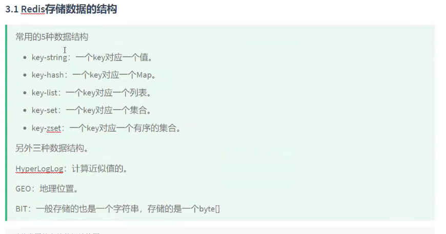

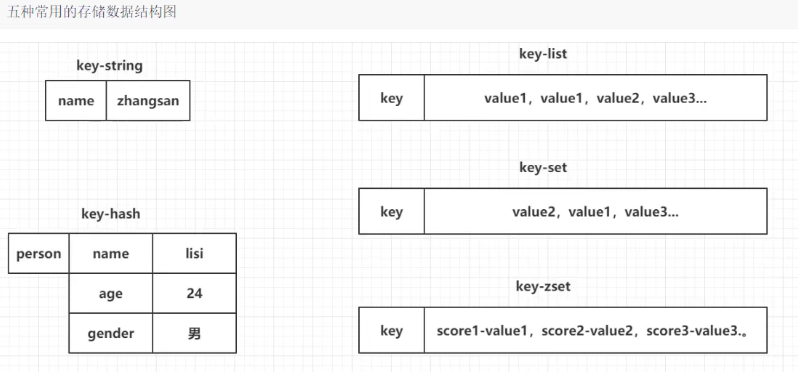

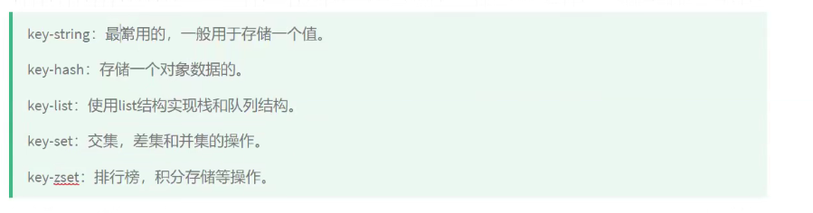


### 特点⭐

| 特点      | 说明                                                         |
| --------- | ------------------------------------------------------------ |
| KV 数据库 | 值包括多种数据结构：字符串、哈希、列表、集合、有序集合，在字符串基础上演变出 Bitmaps 和 HyperLogLog。 |
| 功能丰富  | 键过期（缓存）；发布订阅（消息系统）；支持 Lua 脚本（创造 Redis 命令）；简单事务；流水线（减少网络开销）。 |
| 简单      | 单线程模型，服务端处理模型和客户端开发简单；不依赖底层操作系统的类库，自己实现了事件处理的相关功能。 |
| 持久化    | Redis 提供了两种持久化方式 RDB 和 AOF 将内存数据保存到硬盘。 |
| 高性能    | 将所有数据放在内存；Redis 使用非阻塞 IO 模型 epoll；单线程避免了线程切换和竞争消耗。 |

---

### 内部编码

可以使用 `type` 命令查看键的数据结构，包括：string、hash、list、set、zset，这些是 Redis 对外的数据结构。实际上每种数据结构都有底层的内部编码，Redis 根据场景选择合适的内部编码，可以使用 `object encoding`。

| 数据类型 | 内部编码                                                     |
| -------- | ------------------------------------------------------------ |
| string   | int：8B 整形。                                               |
|          | embstr：value <= 39B                                         |
|          | raw：value > 39B                                             |
| hash     | ziplist：field <= 512 且 value <= 64B                        |
|          | hashtable：field > 512 或 value > 64B，此时 ziplist 的读写效率下降，而 hashtable 的读写时间复杂度都为 O(1)。 |
| list     | ziplist：key <= 512 且 value <= 64B                          |
|          | linkedlist：key > 512 或 value > 64B                         |
|          | Redis 3.2 提供了 quicklist，是以一个 ziplist 作为节点的 linkedlist，结合了两者的优势。 |
| set      | intset：key <= 512 且 element 是整数                         |
|          | hashtable：key > 512 或 element 不是整数                     |
| zset     | ziplist：key <= 128 且 member <= 64B                         |
|          | skiplist：key > 128 或 member > 64B                          |

**ziplist 的特点**

- 内部是数据紧凑排列的一块连续内存数组，可以大幅降低内存占用。
- 可以模拟双向链表，以 O(1) 时间复杂度出队和入队。
- 新增删除需要内存重新分配或释放，涉及复杂的指针移动，最坏时间复杂度 O(n^2^)。
- 适合存储小对象和长度有限的数据。

---

### string ⭐

字符串类型是 Redis 最基础的数据结构，键是字符串，值可以是字符串（简单的字符串、复杂的字符串如 JSON、XML）、数字（整形、浮点数）、二进制（图片、音频、视频），但最大不能超过 512 MB。

#### 命令

| 命令  | 含义                                                         |
| ----- | ------------------------------------------------------------ |
| set   | 设置指定 key 的值。                                          |
| setex | 为键设置秒级过期时间。                                       |
| setnx | 键必须不存在才能设置成功，由于 Redis 的单线程命令处理机制，多个客户端同时执行只有一个能设置成功，可用作分布式锁的一种实现。如果返回 0 说明锁正被占用，返回 1 则成功获取锁。 |
| get   | 获取指定 key 的值。                                          |
| mset  | 批量设置值。                                                 |
| mget  | 批量获取值，批量操作可以提高效率，假如没有 mget，执行 n 次 get 命令需要 n 次网络时间 + n 次命令时间，使用 mget 只需要 1 次网络时间 + n 次命令时间。 |
| incr  | 将存储在 key 的数字值加 1。值不是整数返回错误；值是整数，返回自增后的结果；值不存在，按照值为 0 自增，返回 1。 |
| decr  | 将存储在 key 的数字值减 1。                                  |

#### 应用场景

**缓存**

Redis 作为缓存层，MySQL 作为存储层，首先从 Redis 获取数据，如果失败就从 MySQL 获取并将结果写回 Redis 并添加过期时间。

**计数**

Redis 可以实现快速计数功能，例如视频每播放一次就用 incr 把播放数加 1。

**共享 Session**

一个分布式 Web 服务将用户的 Session 信息保存在各自服务器，但会造成一个问题，出于负载均衡的考虑，分布式服务会将用户的访问负载到不同服务器上，用户刷新一次可能会发现需要重新登陆。为解决该问题，可以使用 Redis 将用户的 Session 进行集中管理，每次用户更新或查询登录信息都直接从 Redis 获取。

**限速**

例如为了短信接口不被频繁访问，限制用户每分钟获取验证码的次数，或者网站限制一个 IP 地址不能在一秒内访问超过 n 次。可以使用键过期策略和自增计数实现。

---

### hash ⭐

哈希类型指键值本身又是一个键值对结构，哈希类型中的映射关系叫 field-value， value 是指 field 对应的值而不是键对应的值。

#### 命令

| 命令    | 含义                                                 |
| ------- | ---------------------------------------------------- |
| hset    | 为指定 key 的指定 field 设置值。                     |
| hget    | 获取指定 key 的指定 field 的值。                     |
| hdel    | 删除 key 的一个或多个 filed，返回成功删除的个数。    |
| hlen    | 计算 key 的 field 个数。                             |
| hmset   | 批量设置值。                                         |
| hmget   | 批量获取值。                                         |
| hexists | 判断 key 的 field 是否存在，存在返回 1，否则返回 0。 |
| hkeys   | 获取 key 的所有 field。                              |
| hvals   | 获取 key 的所有 value。                              |
| hgetall | 获取 key 的所有 field 和 value。                     |

#### 应用场景

缓存用户信息，每个用户属性使用一对 field-value，但只用一个键保存。

优点：简单直观，如果合理使用可以减少内存空间使用。

缺点：要控制哈希在 ziplist 和 hashtable 两种内部编码的转换，hashtable 会消耗更多内存。

---

### list ⭐

list -链表存储多个有序字符串，每个字符串称为元素，一个列表最多可以存储 2^32^-1 个元素。可以对列表两端插入和弹出，还可以获取指定范围的元素列表、获取指定索引的元素等。列表是一种比较灵活的数据结构，可以充当栈和队列，在实际开发中有很多应用场景。

list 有两个特点：① 元素有序，可以通过索引获取某个元素或某个范围的元素。② 元素可以重复。

---

#### 命令

| 命令        | 含义                                 |
| ----------- | ------------------------------------ |
| rpush/lpush | 从右边/左边插入元素。                |
| lrange      | 从左到右获取列表指定范围的元素。     |
| lindex      | 从左到右根据索引获取列表的元素。     |
| llen        | 计算列表元素个数。                   |
| lpop/rpop   | 从列表左侧/右侧弹出元素。            |
| blpop/brpop | 从列表左侧/右侧阻塞式地弹出元素。    |
| lrem        | 从左到右删除列表中指定个数的元素。   |
| lset        | 从左到右设置列表中指定索引元素的值。 |

#### 应用场景

**消息队列**

Redis 的 lpush + brpop 即可实现阻塞队列，生产者客户端使用 lpush 从列表左侧插入元素，多个消费者客户端使用 brpop 命令阻塞式地抢列表尾部的元素，多个客户端保证了消费的负载均衡和高可用性。

**文章列表**

每个用户有属于自己的文章列表，现在需要分页展示文章列表，就可以考虑使用列表。因为列表不但有序，同时支持按照索引范围获取元素。每篇文章使用哈希结构存储。

lpush + lpop = 栈、lpush + rpop  = 队列、lpush + ltrim = 优先集合、lpush + brpop = 消息队列。

---

### set ⭐

集合类型也是用来保存多个字符串元素，和列表不同的是集合不允许有重复元素，并且集合中的元素是无序的，不能通过索引下标获取元素。一个集合最多可以存储 2^32^-1 个元素。Redis 除了支持集合内的增删改查，还支持多个集合取交集、并集、差集。

#### 命令

| 命令                | 含义                                           |
| ------------------- | ---------------------------------------------- |
| sadd                | 添加元素，返回结果为添加成功的元素个数。       |
| srem                | 删除元素，返回结果为删除加成功的元素个数。     |
| scard               | 计算元素个数。                                 |
| sismember           | 判断元素是否在集合中，存在返回 1，否则返回 0。 |
| srandmember         | 随机从集合中返回指定个数的元素。               |
| spop                | 随机从集合中弹出一个元素。                     |
| smembers            | 获取集合中的所有元素。                         |
| sinter/sunion/sdiff | 求多个集合的交集/并集/差集。                   |

#### 应用场景

set 比较典型的使用场景是标签，例如一个用户可能与娱乐、体育比较感兴趣，另一个用户可能对例时、新闻比较感兴趣，这些兴趣点就是标签。这些数据对于用户体验以及增强用户黏度比较重要。

sadd = 标签、spop/srandmember = 生成随机数，比如抽奖、sadd + sinter = 社交需求。

---

### zset ⭐

有序集合保留了集合不能有重复成员的特性，不同的是可以排序。但是它和列表使用索引下标作为排序依据不同的是，他给每个元素设置一个分数（score）作为排序的依据。有序集合提供了获取指定分数和元素查询范围、计算成员排名等功能。

#### 命令

| 命令                           | 含义                                                         |
| ------------------------------ | ------------------------------------------------------------ |
| zadd                           | 添加成员，返回添加成功的个数。Redis 3.2 为 zadd 命令添加了 nx、xx、ch、incr 四个选项：nx：member 必须不存在才可以设置成功，用于添加；xx：member 必须存在才能设置成功，用于更新；ch：返回此次操作后，有序集合成员和分数变化的个数；incr：对 score 做增加，相当于 zincrby。 |
| zcard                          | 计算元素个数。                                               |
| zscore                         | 计算某个成员的分数。                                         |
| zrank/zrevrank                 | 计算成员排名，从低到高/从高到低。                            |
| zrem                           | 删除成员，返回删除成功的个数。                               |
| zrange/zrevrange               | 返回指定排名范围的成员，从低到高/从高到低。                  |
| zrangebyscore/zrevrangebyscore | 返回指定分数范围的成员，从低到高/从高到低。                  |
| zcount                         | 返回指定分数范围成员的个数。                                 |
| zinter/zunion                  | 求多个有序集合的交集/并集。计算后，分值可以按和、最小值、最大值汇总，默认 sum。 |

#### 应用场景

有序集合的典型使用场景就是排行榜系统，例如用户上传了一个视频并获得了赞，可以使用 zadd 和 zincrby。如果需要将用户从榜单删除，可以使用 zrem。如果要展示获取赞数最多的十个用户，可以使用 zrange。

---

### 键和数据库管理 

#### 键重命名

`rename key newkey`，如果 rename 前键已经存在，那么它的值会被覆盖。为了防止强行覆盖，Redis 提供了 renamenx 命令，确保只有 newkey 不存在时才被覆盖。

由于重命名键期间会执行 del 命令删除旧的键，如果键对应值比较大会存在阻塞的可能。

---

#### 键过期

`expire key seconds`：键在 seconds 秒后过期，如果过期时间为负值，键会被立即删除。

对于字符串类型键，执行 set 命令会去掉过期时间，set 命令对应的函数 setKey 最后执行了 removeExpire 函数去掉了过期时间。setex 命令作为 set + expire 的组合，不单是原子执行并且减少了一次网络通信的时间。

键过期策略：

- 惰性删除

  客户端访问某个 key 时，Redis 检查该 key 是否过期，若过期则删除。存在不访问的 key 占用内存的问题。

- 定期扫描

  默认每秒执行 10 次过期扫描，从过期字典中随机选择 20 个 key 并删除其中过期的 key，如果过期 key 超过 25% 则循环该过程。

---

#### 键迁移

`move` 命令用于在 Redis 内部进行数据迁移，`move key db` 把指定的键从源数据库移动到目标数据库中。

---

`dump` 加 `restore` 可以实现在不同的 Redis 实例之间进行数据迁移，分为两步：

- `dump key` ，在源 Redis 上，`dump` 命令会将键值序列化，格式采用 RDB 格式。

- `restore key ttl value`，在目标 Redis 上，`restore` 命令将序列化的值进行复原，ttl 代表过期时间， ttl=0 表示没有过期时间。

整个迁移并非原子性的，而需要通过两个客户端完成。

---

`migrate`，实际上 migrate 命令就是将 dump、restore、del 三个命令进行组合，从而简化操作流程。migrate 具有原子性，支持多个键的迁移，有效提高了迁移效率。实现过程和 dump + restore 类似，有三点不同：

- 整个过程是原子执行，不需要在多个 Redis 实例开启客户端。

- 数据传输直接在源 Redis 和目标 Redis 完成。

- 目标 Redis 完成 restore 后会发送 OK 给源 Redis，源 Redis 接收后根据 migrate 对应选项来决定是否在源 Redis 上删除对应键。

---

#### 切换数据库

`select dbIndex`，Redis 中默认配置有 16 个数据库，例如 select 0 将切换到第一个数据库，数据库之间的数据是隔离的。

---

#### 清除数据库

`flushdb` 只清除当前数据库，`flushall` 会清除所有数据库。

如果当前数据库键值数量比较多，flushdb/flushall 存在阻塞 Redis 的可能性。

---

### 持久化 ⭐

#### RDB 持久化

RDB 持久化是把当前进程数据生成快照保存到硬盘的过程，

优点：RDB 是一个紧凑压缩的二进制文件，Redis 加载 RDB 恢复数据远远快于 AOF。

缺点：RDB 无法做到实时持久化，因为 bgsave 每次运行都要执行 fork 操作创建子进程，会阻塞父进程；RDB 文件使用特定二进制格式保存，存在老版本无法兼容新版本的问题。

触发 RDB 分为手动触发和自动触发。

| 触发类型 | 命令                                                         |
| -------- | ------------------------------------------------------------ |
| 手动触发 | `save`：阻塞服务器直到 RDB 过程完成，对于内存较大的实例会造成长时间阻塞，线上环境不建议使用。 |
|          | `bgsave`：执行 fork 操作创建子进程负责 RDB 持久化，阻塞只发生在 fork 阶段，一般时间很短，优化了 save。 |
| 自动触发 | `save m n`，表示 m 秒内数据存在 n 次修改时，自动触发 `bgsave`。 |
|          | 执行 `debug reload` 命令重新加载 Redis 时自动触发 `save`。   |
|          | 默认情况下执行 `shutdown` 命令时，如果没有开启 AOF 持久化则自动触发 `bgsave`。 |

**bgsave 流程**

- Redis 父进程判断当前是否存在 RDB/AOF 子进程，如果存在 bgsave 命令直接返回。

- 父进程执行 fork 操作创建子进程，fork 过程中父进程会阻塞。

- 父进程 fork 完成后，bgsave 命令返回并不再阻塞父进程。

- 子进程创建 RDB 文件，根据父进程内存生成临时快照文件，对原文件进行原子替换。

- 子进程发送信号给父进程表示完成，父进程更新统计信息。

---

#### AOF 持久化

AOF 持久化以独立日志的方式记录每次写命令，重启时再重新执行 AOF 文件中的命令恢复数据。AOF 解决了 RDB 不能实时持久化的问题，是 Redis 持久化的主流方式。开启 AOF 需要设置：`appendonly yes`，默认不开启。

**命令写入**

所有的写命令会追加到缓冲区中，写入的内容直接是文本协议格式，文本协议具有很好的兼容性，方便直接修改和处理。

---

**文件同步**

Redis 提供了多种 AOF 同步策略，AOF 缓冲区根据对应的策略向硬盘做同步操作。

| 策略     | 说明                                                         |
| -------- | ------------------------------------------------------------ |
| always   | 每次写入都要同步，性能低，不建议配置。                       |
| everysec | 同步操作每秒调用一次，是默认配置，兼顾性能和数据安全。       |
| no       | 不同步，同步由操作系统负责，由于操作系统同步周期不可控，虽然提升了性能，但安全性无法保证。 |

---

**文件重写**

随着 AOF 文件越来越大，需要定期重写，把 Redis 进程内的数据转化为写命令同步到新 AOF 文件，降低文件占用空间。

AOF 重写分为手动触发和自动触发，手动触发直接调用 `bgrewriteaof` 命令，自动触发根据 `auto-aof-rewrite-min-size` 和  `auto-aof-rewrite-percentage` 参数确定时机。

- 执行 AOF 重写请求，如果进程正在执行 AOF 重写，请求不执行并返回，如果进程正在执行 bgsave 操作则延迟重写。
- 父进程执行 fork 创建子进程，之后继续响应其他命令，所有修改命令依然写入 AOF 缓冲区并同步到硬盘。
- 子进程根据内存快照，按命令合并规则写入新的 AOF 文件。
- 新 AOF 文件写入完成后，子进程发送信号给父进程，父进程更新统计信息。
- 父进程把 AOF 重写缓冲区的数据写入到新的 AOF 文件并替换旧文件。

---

**重启加载**

当服务器重启时，可以加载 AOF 文件进行数据恢复。

- AOF 持久化开启且存在 AOF 文件时，优先加载 AOF 文件。

- AOF 关闭时且存在 RDB 文件时，加载 RDB 文件。

- 加载 AOF/RDB 文件成功后，Redis 启动成功。

- AOF/RDB 文件存在错误导致加载失败时，Redis 启动失败并打印错误信息。

----

###   redis数据删除

**时间上：**针对已过期数据--删除机制

1. 定时删除：创建一个定时器，当key设置有过期时间，且过期时间到达时，由定时器任务**立即执行**对键的删除操作
2. 定期删除：周期性轮询redis库中的时效性数据，采用随机抽取的策略，利用过期数据占比的方式控制删除频度
3. 惰性删除：数据到达过期时间，不做处理。等下次访问该数据时：

**当新数据进入redis是，如果内存不足时：**针对存活数据--淘汰机制

1. volatile-lru：在内存不足时，Redis会在设置了过期时间的key中淘汰掉一个最近最少使用的key
2. allkeys-lru：在内存不足时，Redis会在全部的key中淘汰掉一个最近最少使用的key
3. volatile-lfu：在内存不足时，Redis会在设置了过期时间的key中淘汰掉一个最近最少频次使用的key
4. allkeys-lfu：在内存不足时，Redis会在全部的key中淘汰掉一个最近最少频次使用的key
5. volatile-random：在内存不足时，Redis会在设置了过期时间的key中随机淘汰掉一个key
6. allkeys-random：在内存不足时，Redis会在全部的key中随机淘汰掉一个key
7. volatile-ttl：在内存不足时，Redis会在设置了过期时间的key中随机淘汰掉一个剩余生存时间最少的key
8. noeviction：（默认）：在内存不足时，直接报错


## Linux 常用命令 

### 文件管理

| 命令    | 含义                                                         |
| ------- | ------------------------------------------------------------ |
| cat     | 查看文件，一次性显示全部文件                                 |
| chgrp   | 变更文件或目录的所属群组                                     |
| chmod   | 更改文件权限，ugoa 分别表示拥有者、同组、其他人、所有人； rwx 分别表示可读、写、执行。 |
| chown   | 更改文件拥有者，一般只有系统管理者 root 才有此权限           |
| cmp     | 比较两个文件是否有差异                                       |
| file    | 辨识文件类型                                                 |
| find    | 在指定目录下查找文件，-type 指定文件类型、-name 指定文件名   |
| ln      | 为文件在其它位置建立同步链接，软链接类似于 Windows 的快捷方式；硬链接以文件副本的形式存在，不占用实际空间 |
| less    | 查看文件，和 more 类似，查看前不会加载整个文件               |
| more    | 查看文件，以页的形式查看文件，按空格显示下一页，b 显示上一页 |
| mv      | 为文件和目录改名或移动                                       |
| rm      | 删除文件或目录                                               |
| touch   | 修改文件或者目录的时间属性                                   |
| which   | 查找文件                                                     |
| whereis | 查找文件，只能查找二进制文件、源代码和 man 手册，一般文件的定位需要用 locate |
| cp      | 复制文件或目录                                               |
| read    | 从标准输入读取数值                                           |

---

### 文档编辑

| 命令  | 含义                                   |
| ----- | -------------------------------------- |
| ed    | 最简单的文本编辑程序，一次只能编辑一行 |
| egrep | 在文件内查找字符串                     |
| grep  | 查找文件中的字符串                     |
| look  | 查询单词                               |
| sort  | 对文本文件内容排序                     |

---

### 文件传输

| 命令 | 含义                         |
| ---- | ---------------------------- |
| ftp  | 文件传输                     |
| bye  | 中断 ftp                     |
| uuto | 将文件传送到远端的 UUCP 主机 |

---

### 磁盘管理

| 命令  | 含义                     |
| ----- | ------------------------ |
| cd    | 切换当前工作目录         |
| df    | 显示文件系统磁盘使用情况 |
| mkdir | 创建目录                 |
| tree  | 以树状图列出目录内容     |
| rmdir | 删除空目录               |
| ls    | 显示工作目录下的内容     |

---

### 网络通讯

| 命令      | 含义                                  |
| --------- | ------------------------------------- |
| telnet    | 远端登录                              |
| netconfig | 设置网络环境                          |
| nc        | 设置路由器                            |
| httpd     | Apache 的 HTTP 服务器程序             |
| ifconfig  | 显示或设置网络设备                    |
| netstat   | 显示网络状态                          |
| ping      | 使用 ICMP，若远端主机无问题会得到回应 |
| tty       | 显示终端机连接标准输入设备的文件名称  |
| write     | 传信息给其它使用者                    |

---

### 系统管理

| 命令     | 含义                                                         |
| -------- | ------------------------------------------------------------ |
| adduser  | 新增使用者账号                                               |
| date     | 显示或设定系统日期                                           |
| exit     | 退出目前的 shell 终端                                        |
| sleep    | 将目前动作延迟一段时间                                       |
| kill     | 删除执行中的程序或工作，1 重新加载进程、9 杀死进程、15 正常停止进程 |
| ps       | 显示当前进程的状态，-A 列出所有进程、-u 指定用户             |
| whois    | 查找并显示用户信息                                           |
| whoami   | 显示自身用户名称                                             |
| who      | 显示系统中在线的使用者                                       |
| shutdown | 关机，-r 重新启动、-c 取消关机、-n 立即关机                  |
| top      | 实时显示进程状态，-n 设置更新次数、-d 设置更新时间、-p 指定进程号 |

---

### 系统设置

| 命令   | 含义                     |
| ------ | ------------------------ |
| clear  | 清除屏幕                 |
| rpm    | 管理套件                 |
| passwd | 更改使用者密码           |
| time   | 测量指令消耗的时间和资源 |

---

### 备份压缩

| 命令        | 含义                                                         |
| ----------- | ------------------------------------------------------------ |
| zip/unzip   | 压缩文件/解压缩，兼容 Linux 与 Windows，可以压缩多个文件或目录 |
| gzip/gunzip | 压缩文件/解压缩 gzip 文件，压缩单个文件，压缩率相对低，CPU 开销低 |
| tar         | 将多个文件打包成一个并压缩                                   |
| xz/unxz     | 压缩/解压缩 xz 文件，压缩单个文件，压缩率高，时间相对长，解压快，CPU 开销高 |

---

## Maven

###  简介

项目管理工具：


-----

## 项目开发知识

###  用户登录-权限管理

####  SpringSecurity+JWT

版本 springboot2.0.3 release parent规定 5.0.6

**作用**

- 认证 （你是谁）
- 授权 （你能干什么）
- 攻击防护 （防止伪造身份）

**设计模式：**

责任链设计模式：**使多个对象都有机会处理请求，从而避免请求的发送者和接受者之间的耦合关系，将这个对象连成一条链，并沿着这条链传递该请求，直到有一个对象处理他为止**

**认证流程**

用户请求-》协议相关过滤、session相关过滤、跨域相关过滤、csrf攻击相关过滤，——》然后自定义登出过滤器，设置登录成功后动作，——》登录过滤器，验证码过滤、密码过滤，认证管理器，设置登录成功和失败的动作——》

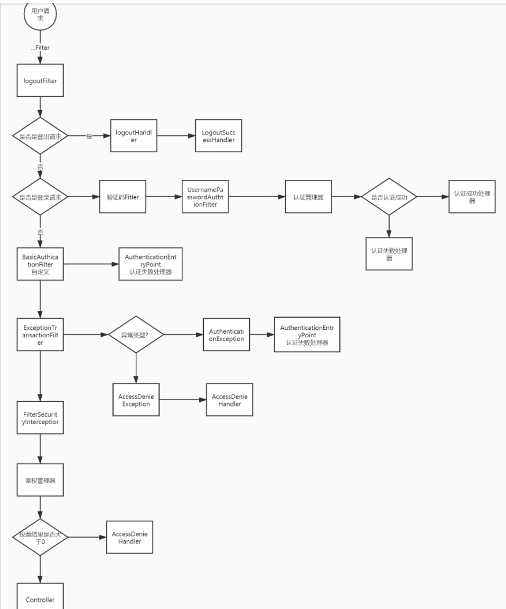

**自己改动**

- LogoutFilter  - 登出过滤器

- logoutSuccessHandler - 登出成功之后的操作类

- UsernamePasswordAuthenticationFilter  - from提交用户名密码登录认证过滤器

- AuthenticationFailureHandler  - 登录失败操作类

- AuthenticationSuccessHandler  - 登录成功操作类

- BasicAuthenticationFilter - Basic身份认证过滤器

- SecurityContextHolder - 安全上下文静态工具类

- AuthenticationEntryPoint - 认证失败入口

- ExceptionTranslationFilter - 异常处理过滤器

- AccessDeniedHandler - 权限不足操作类

- FilterSecurityInterceptor - 权限判断拦截器、出口

**JWT**

JSON Web Token它定义了一种紧凑的、自包含的方式，用于作为JSON对象在各方之间安全地传输信息。该信息可以被验证和信任，因为它是数字签名的

组成：由三部分组成，它们之间用圆点(.)连接第一部分我们称它为头部（header),第二部分我们称其为载荷（payload, 类似于飞机上承载的物品)，第三部分是签证（signature).

- 头部：令牌类型，签名算法
- 负载：请求体和其他的一些数据
- 签名：主要是把头部的base64UrlEncode与负载的base64UrlEncode拼接起来，再进行HMACSHA256加密，加密结果再进行base64url加密，最终得到的结果作为签名部分。

设置过期时间7day

设置加密算法hs512

**验证码生成**

谷歌的验证码生成器包

```
  // 存储到redis中

  redisUtil.hset(Const.captcha_KEY, key, code, 120);
```

重写redisTemplate。opsforHash（）.put（key。item . value)

expire(key,time)

创建hash表

------

####  Redis验证码缓存

Springboot集成redis大家都会用，主要就是使用RedisTemplate类来进行各种操作。可能很多人并没有注意，在Springboot2以后，底层访问redis已经不再是jedis了，而是lettuce。

定义redisService接口

通过注入RedisTemplate bean 


```shell
<lettuce.version>5.0.4.RELEASE</lettuce.version>
```

------

####  加密算法

- 加密算法分类
  - 对称加密：文件加密和解密使用的是相同的秘钥---DES、AES
  - 非对称加密：有两个秘钥，公开秘钥和私有秘钥，加密和解密过程用不同的秘钥---RSA、DSA
  - 单向加密：用来计算一段数据的特征码，加密后的数据长度固定128位，---MD5(128位)、SHA1(160位)
    - 雪崩效应：只要被加密内容有一点点的不同，加密所得结果就会有很大的变化
- 对称加密算法和非对称加密算法的区别
  - 对称加密中加密和解密使用的秘钥是同一个；非对称加密中采用两个密钥，一般使用公钥进行加密，私钥进行解密
  - 对称加密解密的速度比较快，非对称加密和解密花费的时间长、速度相对较慢
  - 对称加密的安全性相对较低，非对称加密的安全性较高。
- 

------

###  接口开发

####  RESTful风格接口

REST是英文representational state transfer 表现层状态转化;

Rest是web服务的一种架构风格;使用HTTP,URI,XML,JSON,HTML等广泛流行的标准和协议;轻量级,跨平台,跨语言的架构设计;它是一种设计风格,不是一种标准,是一种思想

**RESTful API 是一种基于 REST 构建的 API，它是一种被设计的更好使用的 API。**简单来说RESTful API 可以让你**看到 URL+Http Method 就知道这个 URL 是干什么的**，让你看**到了 HTTP 状态码（status code）就知道请求结果如何**。

Rest架构的主要原则

```undefined
1.网络上的所有事物都被抽象为资源
2.每个资源都有一个唯一的资源标识符
3.同一个资源具有多种表现形式(xml,json等)
4.对资源的各种操作不会改变资源标识符
5.所有的操作都是无状态的
```

------

####  Swagger

Swagger 是一个规范和完整的框架，**用于生成、描述、调用和可视化 RESTful 风格的 Web 服务**。
总体目标是使客户端和文件系统作为服务器以同样的速度来更新。文件的方法，参数和模型紧密集成到服务器端的代码，允许API来始终保持同步。Swagger 让部署管理和使用功能强大的API从未如此简单。

```java
@Api的作用是描述当前模块的作用
@ApiOperation的作用是描述当前接口的具体作用,参数还包含请求方式等
@ApiParam的作用是描述当前接口所需的参数含义,是否必选等
    
    
@Api：放在类的控制模块
@ApiOperation：放在接口方法上
@ApiImplicitParams：方法上一组参数说明
@ApiImplicitParam：一个参数的说明
@ApiResponses：一组响应说明
@ApiResponse：用在@ApiResponses中，一般用于表达一个错误的响应信息
@ApiModel：请求体和返回体说明
@ApiModelProperty：请求体属性说明
```


------

###  通讯模块开发

####  HslCommunication

一个连接各种plc的工具包，支持java、Python、c#,支持多家厂商plc三菱、西门子、欧姆龙等、支持多种modbus（modbus TCP）、三菱Q系列


------

####  Demo3D

三维仿真平台 ，导入实物模型，通过编写模型脚本，仿真实物的动作，通过通讯连接plc。

------

####  握手机制


------

### 搜索实现

####  solr 

版本 springboot2.0.3 release parent规定 6.6.3

Apache开源的搜索引擎   不但可以当做搜索引擎也可以当成nosql类型数据库

**使用范围**

- 搜索数据量很大的时候，模糊查找时，电商平台的搜索

**默认端口**

http:localhost:8983/solr


**引入springboot**

配置solr服务器地址

配置solr中与数据库的对应

分别创建solr对应的持久层、mysql对应的持久层

对**mysql数据库和solr同时进行增删改**时要考虑事务，用@Transactional注解（只对public方法有用，遇到异常停止，回滚成原来状态）

**SolrJ简介**

SolrJ是操作Solr的Java客户端，它提供了增加、修改、删除、查询Solr索引的Java接口。通过solrJ提供的API接口来操作solr服务，SolrJ底层是通过使用httpClient中的方法来完成Solr的操作。要注入SolrClient

**SpringDataSolr**

持久层继承SolrCrudRepository


------

####  pdf上传

>InputStream 和OutputStream,两个是为**字节流**设计的,主要用来处理字节或二进制对象,
>Reader和 Writer.两个是为**字符流**（一个字符占两个字节）设计的,主要用来处理字符或字符串.
>
>字符流处理的单元为2个字节的Unicode字符，操作字符、字符数组或字符串，
>字节流处理单元为1个字节，操作字节和字节数组。
>
>如果是音频文件、图片、歌曲，就用字节流好点，
>如果是关系到中文（文本）的，用字符流好点
>
>MultipartFile 这个类一般是用来接受前台传过来的文件
>
>spring.servlet.mutipart.max-file-size=10M

**多文件存储**

>FastDFS是一个开源的轻量级[分布式文件系统](https://baike.baidu.com/item/分布式文件系统/1250388)，它对文件进行管理，功能包括：文件存储、文件同步、文件访问（文件上传、文件下载）等，解决了大容量存储和[负载均衡](https://baike.baidu.com/item/负载均衡/932451)的问题。特别适合以文件为载体的在线服务，如相册网站、视频网站等等。
>
>FastDFS为互联网量身定制，充分考虑了冗余备份、负载均衡、线性扩容等机制，并注重高可用、高性能等指标，使用FastDFS很容易搭建一套高性能的文件服务器集群提供文件上传、下载等服务。

------

####  IK分词器

solr 原生的分词器不支持中文， 采用ik分词器 


------

###  区块链网络搭建

####  FISCO-BCOS


------

###  SpringBoot 使用

版本 2.0.3 release

####  后端架构模式

entity-repository-service-controller


------

**mybatis-plus**

版本3.2.0

通过继承BaseMapper实现一下规定好的crud


------

## 面试准备

###  自我介绍

面试官你好！很荣幸能得到这个面试机会，接下来我简单介绍一下自己。

我叫阮国磊，今年25岁，湖北咸宁人，是广东工业大学机械工程专业一名在读硕士研究生；目前在（省部共建精密电子制造技术与装备实验室）广东省计算机集成制造重点实验室从事智能制造、工业软件开发相关知识的学习与工作。

硕士期间获得过硕士研究生国家奖学金、校级一等、二等奖学金、（明纬电子）企业奖学金各一次；发表sciⅠ论文2篇；申请授权专利2项，受理专利9项。硕士期间参与了一些项目，包括手机装配线生产管控系统、区块链协同制造供应链金融平台、板式定制家具轻量化智能生产线，主要负责这些项目后端部分功能的开发。研二寒假期间在香港城市大学成都研究院实习，参与基于区块链技术的专利交易机制设计与应用课题研究，负责专利交易平台后端部分功能开发。具有一定的项目开发经历，了解java开发相关知识，于是我投了java开发岗。我平常喜欢打羽毛球、跑步，工作责任感强，抗压能力强、做事积极主动，希望贵公司能够给我一个学习和锻炼的平台。

我的自我介绍结束，谢谢！

-----

###  项目

####  工业4.0示范线-手机装配线生产管控系统

工业4.0示范线-手机装配线生产管控系统这个项目，是基于国家重点研发项目，由我们实验室和深圳天珑无线科技有限公司合作的一个工业4.0教学示范线。针对3C 产品组装整线自动化综合水平低，高频换产等行业共性难题，搭建一条手机自动装配示范研究线。项目节选了手机装配流程中的贴胶、TP压合、贴标、锁螺丝、贴辅料5五个工艺段，通过MES、数字孪生系统和单元控制系统三个部分协同控制实现手机装配过程的多视图同步，透明化监控。mes系统主要负责订单指令下发，生产数据管理、点位握手，对整个系统进行控制相当于整个系统的控制中心；数字孪生系统主要通过Demo3d搭建虚拟的三维产线实现和真实产线的虚实联动，单元管控系统主要是由一个总PLC和多个子PLC和实物设备构成，主要通过PLC网络来控制实际产线的运行。

我前期参与项目需求分析，负责拆分手机装配过程机器动作，确定通讯点位；中期负责开发系统通讯网络的开发，通过第三方jar包HSLcommunication提供的接口去总控PLC读取实物设备上传感器信号和Demo3d中虚拟PLC信号，在mes中实现虚拟点位和实物点位的握手判断，并下发指令，实现设备和模型的虚实联动，对设备的生产数据采集。后期负责项目部署落到调试。

目前这个项目已经在实验室落地，已经投入教学使用。

------

**问题**

**时间**：2019.10-2019.12

**开发人员**：5个，（一人三维模型处理与动作脚本编写，一人前端开发，两人后端mes开发，一个师兄监督）

**技术栈**：Springboot2.0.3  ,vue.js2.6  ,swagger2.6  ,Mybatis-plus ,MySql ,SpringSecurity JWT 

**其他细节**：点位个数 113 ，通讯协议modbus，三菱Q系列，贴胶、TP压合、贴标、锁螺丝、贴辅料5五个工艺段

**遇到问题**：整个项目生产过程最大的问题就是握手点位个数确定，太少了虚实同步容易延时，太多增加通讯系统压力和开发工作。刚开始参考之间的项目设计了70多个点位，后期项目部署调试环节，由于握手点位较少，很难调模型动作速度与实物同步。后来重新设计握手点位，增加到了113个点位，后面再部署调试的时候就容易调试了。

**收获**：这是研究生期间做的第一个项目，真正的吧学到的java语言用到项目上，不但增加了对java语言的掌握，也很有成就感。

-----

>1、mes(制造执行系统)，系统包括生产执行模块（包括计划排产管理）、设备管理模块、质量管理模块、物料管理模块、生产数据管理模块、统计分析模块、用户管理模块；通过mes来实现手机装配过程生产过程信息管理，数据统计，生产控制等功能，同时也控制着实物设备与虚拟产线的虚实联动；
>
>2、数字孪生系统是通过Demo3D三维仿真平台上搭建一条与实物设备一样的虚拟生产线，通过与MES的控制来实现实际产线到虚拟产线的虚实联动；达到对产线监控的效果。
>
>3、单元控制系统，这个部分由多个PLC构成的控制网络和手机装配线的实物产线两个部分组成，其中控制网络来实现对产线数据采集和动作控制的功能，而实物产线通过完成手机装配过程中的贴胶、TP压合、贴标、锁螺丝、贴辅料5个工艺，实现手机装配自动化。
>
>

-----

####  区块链协同制造供应链金融平台

这个项目是拿来参加第六届互联网+比赛的一个项目，主要是针对中小型企业面对产能需求波动大和融资需求难的两个问题，提出一种基于区块链技术的协同制造供应链金融平台；让整个供应链企业用户可以发布产品需求、发布产能、寻求合作、建立交易合同并且上传到区块链中，同时也支持合同票据拆分，合同状态查询等功能。通过引入区块链技术，提高了合同的可信度，为融资提供担保证明，降低企业融资难度，赋能中小型企业。

参与项目需求讨论，负责基于SpringSecurity+JWT实现用户注册、登录、权限管理后端模块开发，实现不同用户登录页面不同。负责供应链网络、应收账数据、合同统计等可视化需求的restful风格后端接口开发，为前端可视化提供数据。通过SwaggerUI生成restful风格接口文档。

最后这个项目基本实现需求，参加院里的选拔，但是没有选上。

----

**时间**：2020.6-2020.8

**开发人员：**6个（一个前端，一个两个后端，两个负责搭建区块链，一个负责写文档）

**技术栈：**springboot vue  Mybatis-plus MySql Redis SpringBootSecurity Jwt Fisco-Bcos swagger

**其他细节：**

>为什么用SpringSecurity 不用shiro？
>SpringSecurity 虽然比较难上手，但是功能比shiro强大（安全维护方面），而且是Spring生态，前景更好

**遇到的困难：**

**收获：**


------

####  板式定制家具轻量化智能生产线-分拣系统

板式定制家具轻量化生产线这个项目，是实验室和索菲亚家居股份有限公司合作的横向课题中的一个子项目。（背景目的）主要是解决现在板式家具行业对定制化家具需求越来越大，而现有的生产线自动化程度不够生产成本高，无法满足大规模个性化生产需求的问题。（具体分工）在这个项目中，我们实验室负责算法、软件系统设计开发；索菲亚公司负责硬件部分设计开发；通过算法提高板材利用率，通过引入数字孪生技术，实现“实物-模型-监控”多视图同步，达到产线的透明化监控，智能化运维效果，实现产线智能化升级。

参与整个产线中分拣系统这一部分开发，分拣系统主要是将前面切割处理好的板材进行分类放置，实现分拣过程多视图同步，透明化监控。我主要负责编写demo3D三维模型动作脚本，通过hslcommunication搭建通讯网络，确定握手点位实现实物-模型-监控之间的多视图同步，并对分拣中的数据数据统计分析生成restful数据接口，并生成swaggerUI接口文档。

项目现在已经开发完成，并在企业中应用。

-----

**时间**：2020.9-2021.1

**开发人员：**2人(我负责分拣系统后端开发，另一个人负责前端)，整个板材线总共四个模块，每个模块2个人，加上一个老师，一个博士，一起10人

**技术栈：**springboot vue  Mybatis-plus MySql Redis SpringBootSecurity Jwt  swagger HSLcommunication

**其他细节：**（日分拣量，仓储平均利用率，今日入仓数量、今日出仓数量，历史分拣数据，种类），1500多件，417种

**遇到困难：**负责一个独立的子系统，从三维模型动作脚本编写，握手点位设计，通讯网络的搭建、到后端开发。完成了一个项目的完整功能实现。

**收获：**

>（项目简介）项目软件部分流程，先对收到的个性化订单进行拆单（方圆拆单软件）得到产品的boom表单，MES根据boom表中的板材尺寸数量要求进行排程，并进行工单投放生产执行，单元控制系统将加工指令分别传个硬件设备和仿真设备，使得实物产线与仿真产线同步生产，达到“实物-模型-监控”多视图同步，实现板材生产过程透明化监控。
>
>其中单元控制系统由数控**开料优化模块**、**回转封边控制模块**、**钻孔拉槽控制模块**和**缓存分拣控制模块**四个模块构成

-----

###  实习

####  香港城市大学成都研究院

导师和城大那边有个合作课题，让我们去那边实习。参与基于区块链技术的专利交易机制设计与应用课题研究，负责专利交易机制平台后端部分功能开发。平台主要是利用区块链技术对专利权利人信息，和专利交易信息的一个上链存储和实现专利的交易平台。我主要参与项目需求分析、数据库设计；负责基于SpringBoot后端开发，专利管理模块，搭建Solr搜索引擎和配置IK分词器，实现专利的搜索。

负责部分已经完成，申请软件著作权。

**时间**：2021.1-2021.3

**开发人员**：6（区块链两人，后端三人，前端一人）

**技术栈**：springboot vue  Mybatis-plus MySql Redis SpringBootSecurity Jwt Fisco-Bcos swagger

**其他细节**：

>为什么用Solr不用Elasticsearch？
>
>Solr有一个更大、更成熟的用户、开发和贡献者社区。
>（2）支持添加多种格式的索引，如：HTML、PDF、微软 Office 系列软件格式以及 JSON、XML、CSV 等纯文本格式。
>（3）Solr比较成熟、稳定。
>（4）不考虑建索引的同时进行搜索，速度更快。

**遇到困难**：直接都是直接数据库搜索，现在要搭建搜索引擎，实现全文搜索，实现新的困难。

**收获：**

----

###  hr面试准备

1. 自我介绍；

   面试官你好！很荣幸能得到这个面试机会，接下来我简单介绍一下自己。

   我叫阮国磊，今年25岁，湖北咸宁人，是广东工业大学机械工程专业一名在读硕士研究生；目前在广东省计算机集成制造重点实验室从事智能制造、工业软件开发相关知识的学习与工作。

   硕士期间获得过硕士研究生国家奖学金、校级一等、二等奖学金、（明纬电子）企业奖学金各一次；发表sciⅠ区论文2篇；申请授权专利2项，受理专利9项。硕士期间参与一些项目，包括手机装配线生产管控系统、区块链协同制造供应链金融平台、板式定制家具轻量化智能生产线，主要负责这些项目后端部分功能的开发。研二寒假期间在香港城市大学成都研究院实习，参与基于区块链技术的专利交易机制设计与应用课题研究，负责专利交易平台后端部分功能开发。具有一定的项目开发经历，了解java开发相关知识，于是我投了java开发岗。我平常喜欢打羽毛球、跑步，工作责任感强，抗压能力强、做事积极主动，希望贵公司能够给我一个学习和锻炼的平台。

   我的自我介绍结束，谢谢！

2. 项目介绍；

3. 做项目过程；

4. 职业规划；

   软件开发相关的工作，

   -----

   想从事企业数字化转型、数字化制造、智能制造这方面的工作。首先我自己硕士期间就是从事这方面的研究，再者这个方向发展前期很好，是未来的趋势；最后从社会国家的角度考虑，数字化制造、智能制造是国家国家的需要，可以提升国家工业实力，实现自己的社会价值。

5. 自己的优缺点；

   优点：就是和周围的同学朋友都能相处的很好，做事不拖沓，安排的工作认真完成，自己定期做规划，抗压能力强，生活习惯较好，东西从哪拿放哪去；

   缺点：有时候给自己制定的计划不能完成，想的比较多做的比较少。

6. 论文、专利发表情况；

7. 获奖情况；

   本科期间获得过，优秀班干部、校级一等奖学金、校级优秀毕业生；硕士期间获得过硕士研究生国家奖学金、学业一等、二等奖学金、明纬电子企业奖学金；

8. 为什么不考虑读博；

   首先因为读博搞科研过程很枯燥，已经经历了两年的这种生活不想继续下去了，第二个是因为读博大概率会在自己实验室读，毕竟还是没有985名头，出去竞争力也不是那么大；第三个是因为，还是想去出挣钱提升生活质量。

9. 一面复盘；

   一面的时候面试官提问方式是由浅入深，关联转跳的方式来提问，问到有一些深入的问题时，有些我了解得不是清楚。比如说为什么synchronized可以保持原子性，当时没有答出来，但是面试结束后，自己找了一些资料，了解了为什么。主要是通过字节码中的monitorenter和monitorexit指令对同步代码上锁而保证原子性。

10. 机械为什么，转计算机；你觉得你的优势和劣势在哪；

    第一个是因为我硕士期间方向就是计算机集成制造和工业软件开发；第二个是看好企业数字化转型的方向；

    优势是我有制造业的背景，我也懂计算机相关知识；劣势就是计算机相关基础会薄弱一点，但是现在计算机相关学习资料很多，我相信只有花时间，这个劣势是可以弥补的，所以也不能算作是劣势。

11. 你怎么了解到用友的；

    第一次接触到用友是，之前研一的时候帮老师整理基金申请材料的时候，里面就会有国内外研究机构，看到里面就有提到用友、金蝶等（erp、云服务提供商、智能制造解决方案）当时觉得这些公司和我们实验室方向符合或许以后毕业可以去试试，就去网上查了一下，所以很久之前就了解到用友了。最近一次是在看一家公司招聘岗位的时候，上面写的就是基于用友云平台二次开发，具体公司不记得了。所以总体的来说我跟用友还是比较有缘的，希望能够加入用友大家庭。

12. 遇到的一些问题；

13. 有收到过其他公司的offer或者投过其他公司的简历嘛？

    投过一些公司，比如华为、honor、三一重工、tcl；但是只有用友给了面试，其他的都还没有给笔试。

14. 平时的学习方式；

    先会去搜索一些博客，csdn、菜鸟教程、书栈网等，也会去查一些官方文档，再有不理解的地方就去去b站上搜一下视频。

15. 是独生子女嘛；

16. 对加班怎么看；

    现在年轻，适当的加班也是可以的，加班过程中可以学到更多的东西，加快自己的成长速度。其实现在在学校也是每天早上九点之前到实验室，晚上十点半回宿舍，每天工作时间也是挺长的，只不过相对自由一些。所以在工作适当的加班是可以接受的。

17. 周末有什么活动；

    约朋友一起出去吃个饭，看个电影，晚上有时间一起打个羽毛球；有时候也会自己去跑步。但是读研一般都周末也会加一下班。

18. 介绍一下家庭情况；

19. 反问：

    1. 我了解到用友在做很多行业的数字化赋能，比如说金融、人力、采购、制造，我想问问有没有着重发展的方向呢？
    2. 在数字化制造、智能制造这块有什么样的布局或者打算？
    3. 我了解到用友有一些产品，如YonSuite、YonBIP、NC Cloud这些产品，我看了一下简介发现他们有很多地方是重叠的，能介绍一下他们的差异嘛？
    4. 公司培养体系？
    5. 公司福利？加班？工作要出差嘛？
    6. 用友北京、南昌、三亚三大产业园，他们业务、环境上的区别？

-----

###  研究方向


------

###  面试遇到或者牛客

####  1.创建对象有哪些方法？

1. 使用new关键字，调用了构造方法；

2. 使用class.newInstance方法，调用了构造方法；

3. 使用constructor类的newInstance方法，调用了构造函数；

4. 使用clone方法，没有调用构造函数；

5. 使用反序列化，没有调用构造函数。

   >```java
   > private static void SerializeCustomer() throws FileNotFoundException,
   >26             IOException {
   >27         Customer customer = new Customer("gacl",25);
   >28         // ObjectOutputStream 对象输出流
   >29         ObjectOutputStream oo = new ObjectOutputStream(new FileOutputStream(
   >30                 new File("E:/Customer.txt")));
   >31         oo.writeObject(customer);
   >32         System.out.println("Customer对象序列化成功！");
   >33         oo.close();
   >34     }
   >35 
   >44  private static Customer DeserializeCustomer() throws Exception, IOException {
   >45         ObjectInputStream ois = new ObjectInputStream(new FileInputStream(
   >46                 new File("E:/Customer.txt")));
   >47         Customer customer = (Customer) ois.readObject();
   >48         System.out.println("Customer对象反序列化成功！");
   >49         return customer;
   >50     }
   >```
   >
   >

####  2.线程池的参数，和创建的过程

① corePoolSize：常驻核心线程数，设置过大会浪费资源，过小会导致线程的频繁创建与销毁。

② maximumPoolSize：线程池能够容纳同时执行的线程最大数，必须大于 0。

③ keepAliveTime：线程空闲时间，线程空闲时间达到该值后会被销毁，直到线程数等于 corePoolSize 为止，避免浪费内存资源。

④ unit：keepAliveTime 的时间单位。

⑤ workQueue：工作队列，当线程请求数大于等于 corePoolSize 时线程会进入队列。

⑥ threadFactory：线程工厂，用来生产一组相同任务的线程。可以给线程命名，有利于分析错误。

⑦ handler：拒绝策略，默认使用 AbortPolicy 丢弃任务并抛出异常，CallerRunsPolicy 重新尝试提交任务，DiscardOldestPolicy 抛弃队列里等待最久的任务并把当前任务加入队列，DiscardPolicy 丢弃任务但不抛出异常。

####  3.redis为什么这么快？

1. 完全基于内存；

2. 数据结构简单；

3. 采用单线程，避免了多线程中不必要的上下文切换和竞争条件；

4. 使用多路I/O复用模型，非阻塞IO；

   >多路I/O复用模型是利用 select、poll、epoll 可以同时监察多个流的 I/O 事件的能力，在空闲的时候，会把当前线程阻塞掉，当有一个或多个流有 I/O 事件时，就从阻塞态中唤醒，于是程序就会轮询一遍所有的流（epoll 是只轮询那些真正发出了事件的流），并且只依次顺序的处理就绪的流，这种做法就避免了大量的无用操作。

#### 4.time-wait的作用，超时报错是什么原因？

>在生产过程中，如果服务器使用短连接，那么完成一次请求后会主动断开连接，就会造成大量time_wait状态。因此我们常常在系统中会采用长连接，减少建立连接的消耗，同时也减少TIME_WAIT的产生，但实际上即使使用长连接配置不当时，当TIME_WAIT的生产速度远大于其消耗速度时，系统仍然会累计大量的TIME_WAIT状态的连接。TIME_WAIT状态连接过多就会造成一些问题。如果客户端的TIME_WAIT连接过多，同时它还在不断产生，将会导致客户端端口耗尽，新的端口分配不出来，出现错误。如果服务器端的TIME_WAIT连接过多，可能会导致客户端的请求连接失败，这在接下来举例说明。


####   5.springboot 控制事务的方式？

spring[事务](https://snailclimb.gitee.io/javaguide/#/docs/system-design/framework/spring/Spring%E4%BA%8B%E5%8A%A1%E6%80%BB%E7%BB%93)

>spring事务管理可以分为：
>
>编程式：使用编写代码的方式，进行事务的控制；
>
>声明式：通过切面编程(AOP)的方式，注入到要操作的逻辑的前后，将业务逻辑与事务处理逻辑解耦；
>
>对比：使用声明式事务可以保证业务代码逻辑不会受到事务逻辑的污染, 所以在实际的工程中使用声明式事务比较多。
>
>对于声明式事务的实现，在Java工程中一般有有两种方式：
>(1)使用配置文件(XML)进行事务规则相关规则的声明
>(2)使用@Transactional注解进行控制


####  6.spring常见的注解？

springboot[常用注解](https://snailclimb.gitee.io/javaguide/#/./docs/system-design/framework/spring/SpringBoot+Spring%E5%B8%B8%E7%94%A8%E6%B3%A8%E8%A7%A3%E6%80%BB%E7%BB%93)

####  7.什么是设计模式？模板模式的作用？

设计模式是一套被反复使用的、多数人知晓、经过分类编目的优秀代码设计经验的总结：

特定环境下特定问题的处理方法，具有以下优点：

1. 重用设计和代码
2. 提高扩展性 
3. 提高灵活性 
4.  提高开发效率 

**模板模式**

在模板模式（Template Pattern）中，一个抽象类公开定义了执行它的方法的方式/模板。它的子类可以按需要重写方法实现，但调用将以抽象类中定义的方式进行。

####  8.什么是sql注入，怎么防止sql注入？

就是攻击者把SQL命令插入到Web表单的输入域或页面请求的查询字符串，欺骗服务器执行恶意的SQL命令。

防止sql注入：

1. 代码层防止sql注入攻击的最佳方案就是sql预编译
2. 规定数据的类型，规定数据的长度；
3. 严格设置数据库权限；
4. 过滤参数中的一些数据库的关键词；

####  9.为什么${}可以防止sql注入

sql 预编译指的是数据库驱动在发送 sql 语句和参数给 DBMS 之前对 sql 语句进行编译，这样 DBMS 执行 sql 时，就不需要重新编译。

‘#{ }’：解析为一个 JDBC 预编译语句（prepared statement）的参数标记符，一个‘ #{ }’ 被解析为一个参数占位符 ? 。

‘${ }’ 仅仅为一个纯粹的 string 替换，在动态 SQL 解析阶段将会进行变量替换。在预编译之前已经被变量替换了

####   10.mysql中的锁？

[锁的分类](https://blog.csdn.net/cy973071263/article/details/105188519)

**按粒度分：**

1. 行级锁：

   行级锁是mysql中锁定粒度最细的一种锁。表示只针对当前操作的行进行加锁。行级锁能大大减少数据库操作的冲突，其加锁粒度最小，但加锁的开销也最大。**行级锁分为共享锁和排他锁**，开销答，加锁慢。

   >InnoDB有三种行锁的算法：
   >
   >1，Record Lock（记录锁）：单个行记录上的锁。这个也是我们日常认为的行锁。
   >
   >2，Gap Lock（间隙锁）：间隙锁，锁定一个范围，但不包括记录本身（只不过它的锁粒度比记录锁的锁整行更大一些，他是锁住了某个范围内的多个行，包括根本不存在的数据）。GAP锁的目的，是为了防止同一事务的两次当前读，出现幻读的情况。该锁只会在隔离级别是RR或者以上的级别内存在。间隙锁的目的是为了让其他事务无法在间隙中新增数据。
   >
   >3，Next-Key Lock（临键锁）：它是记录锁和间隙锁的结合，锁定一个范围，并且锁定记录本身。对于行的查询，都是采用该方法，主要目的是解决幻读的问题。next-key锁是InnoDB默认的锁

2. 表级锁：

   表级锁是mysql中锁定粒度最大的一种锁，表示对当前操作的整张表加锁，它实现简单，资源消耗较少，被大部分mysql引擎支持。最常使用的MyISAM与InnoDB都支持表级锁定。表级锁定分为**表共享读锁（共享锁）与表独占写锁（排他锁）**,开销小，加锁快，不会出现死锁。发生锁冲突的概率最高，并发度也最低。

3. 页级锁：

   页级锁是 MySQL 中锁定粒度介于行级锁和表级锁中间的一种锁。表级锁速度快，但冲突多，行级冲突少，但速度慢。因此，采取了折中的页级锁，**一次锁定相邻的一组记录**。BDB 支持页级锁。开销和加锁时间界于表锁和行锁之间；会出现死锁；锁定粒度界于表锁和行锁之间，并发度一般。

4. 间隙级锁：

**按共享策略分类：**

1. 共享锁：
2. 排他锁：
3. 意向共享锁:
4. 意向排他锁：

>共享锁和排他锁在MySQL中具体的实现就是读锁和写锁：
>
>读锁（共享锁）：Shared Locks（S锁），针对同一份数据，多个读操作可以同时进行而不会互相影响
>写锁（排它锁）：Exclusive Locks（X锁），当前写操作没有完成前，它会阻断其他写锁和读锁
>IS锁：意向共享锁、Intention Shared Lock。当事务准备在某条记录上加S锁时，需要先在表级别加一个IS锁。
>IX锁：意向排他锁、Intention Exclusive Lock。当事务准备在某条记录上加X锁时，需要先在表级别加一个IX锁。

**按加锁策略上分：**

1. 悲观锁：

   悲观锁认为对于同一个数据的并发操作，一定是会发生修改的（或者增删改多，查少），哪怕没有修改，也会认为修改。因此对于同一个数据的并发操作，悲观锁采取加锁的形式。悲观的认为，不加锁的并发操作一定会出问题。

2. 乐观锁：

   乐观锁则认为对于同一个数据的并发操作，是不会发生修改的（或者增删改少，查多）。在更新数据的时候，会采用不断尝试更新的方式来修改数据。也就是先不管资源有没有被别的线程占用，直接取申请操作，如果没有产生冲突，那就操作成功，如果产生冲突，有其他线程已经在使用了，那么就不断地轮询。乐观的认为，不加锁的并发操作是没有事情的。就是通过记录一个数据历史记录的多个版本，如果修改完之后发现有冲突再将版本返回到没修改的样子，乐观锁就是不加锁。好处就是减少上下文切换，坏处是浪费CPU时间。

####  11.什么是倒排索引

[倒排索引](https://www.cnblogs.com/ottll/p/9470732.html)

要弄清楚什么是倒排索引就要先弄清楚什么是正向索引；

在搜索引擎当中每个文件都会有一个对应的文档id，文件内容被表示为一系列关键词的集合；

正向索引是文档id————>关键词1，关键词2....:如果查找某个关键词，就需要扫描所有的关键词，然后按照关键词出现的频率对文档打分排序；

倒排索引是关键词————>文档id1，文档id2....: 如果查找某个关键词，直接查找就可以得到，关键词在文档中出现频率的文档排序；

####  12.判断链表是否有环


####  13.八皇后问题


####  14.什么是满二叉树，什么完全二叉树


####   15. synchronized锁升级过程

synchronized锁根据资源的竞争激烈程度，进行锁的升级；无锁-》偏向锁-》轻量锁-》重量锁。


[连接](https://www.jianshu.com/p/d61f294ac1a6)

####   16.SpringBoot启动过程

启动流程主要分为三个部分：

第一部分进行SpringApplication的初始化模块，配置一些基本的**环境变量、资源、构造器、监听器**；

第二部分实现了应用具体的启动方案，包括启动流程的**监听模块、加载配置环境模块、及ioc容器的创建上下文环境模块**；

第三部分是**自动化配置模块**，该模块作为springboot自动配置核心。

[连接](https://www.cnblogs.com/theRhyme/p/11057233.html)

[精简版](https://www.cnblogs.com/theRhyme/p/how-does-springboot-start.html)

[参考](https://www.cnblogs.com/trgl/p/7353782.html)

[新参考](https://blog.csdn.net/dl962454/article/details/107198682)


####  17. 多线程指定执行顺序

[参考](https://www.cnblogs.com/panda001/p/12363532.html)

1. 线程开始之后，对线程执行，join方法

2. 用ExecutorService.submint()方法

   ```JAVA
   //join 方法控制 
   public static void main(String[] args) throws Exception {
           thread1.start();
           thread1.join();
   
           thread2.start();
           thread2.join();
   
           thread3.start();
           thread3.join();
   
           thread4.start();
           thread4.join();
   
           thread5.start();
           thread5.join();
       }
   
   //线程池ExecutorService方法
   static ExecutorService executorService = Executors.newSingleThreadScheduledExecutor();
   
       public static void main(String[] args) throws Exception {
           executorService.submit(thread1);
           executorService.submit(thread2);
           executorService.submit(thread3);
           executorService.submit(thread4);
           executorService.submit(thread5);
           executorService.shutdown();
       }
   ```

   

####  18.redis 重写aof：


####   19.SpringBoot自动配置

Spring Boot 通过`@EnableAutoConfiguration`开启自动装配，通过 SpringFactoriesLoader 最终加载`META-INF/spring.factories`中的自动配置类实现自动装配，自动配置类其实就是通过`@Conditional`按需加载的配置类，想要其生效必须引入`spring-boot-starter-xxx`包实现起步依赖

####   20.空指针异常处理

[参考](https://www.cnblogs.com/cenyu/p/6289209.html)

- 可能出现空指针异常的情况：
  - 调用了null对象的方法
  - 访问或修改一个null对象的属性字段
  - 用null对象进行synchronized同步锁
  - 被抛出异常对象是null并且是一个Throwable的子类
- null指针异常的解决办法
  - **从已知非空的对象中调用equals方法；**
  - **使用optional类**
  - **使用String.valueof替代toString**
  - 多使用三元运算符来判断，规避指针
  - 如果返回集合，要返回空集合而不是空对象
  - 对外部传进来的参数进行判断
  - **借助第三方注解@NotNull和@Nullable进行检查**

####   21 optional类

Optional 类(java.util.Optional) 是一个容器类，代表一个值存在或不存在，原来用 null 表示一个值不存在，现在 Optional 可以更好的表达这个概念。并且可以避免空指针异常。

Optional.empty() : 创建一个空的 Optional 实例
Optional.of(T t) : 创建一个 Optional 实例，如果为null会报错
Optional.ofNullable(T t):若 t 不为 null,创建 Optional 实例,否则创建空实例
isPresent() : 判断是否包含值
T get(): 如果调用对象包含值，返回该值，否则抛异常
orElse(T t) : 如果调用对象包含值，返回该值，否则返回t
orElseGet(Supplier s) :如果调用对象包含值，返回该值，否则返回 s 获取的值
map(Function f): 如果有值对其处理，并返回处理后的Optional，否则返回 Optional.empty()
flatMap(Function mapper):与 map 类似，要求返回值必须是Optional

####   22 抽象类和接口的使用场景

**抽象类：**

既想约束子类具有共同的行为（但不再乎其如何实现），又想拥有缺省的方法，又能拥有实例变量如：模板方法设计模式，模板方法使得子类可以在不改变算法结构的情况下，重新定义算法中某些步骤的具体实现。

**接口：**

① 约束多个实现类具有统一的行为，但是不在乎每个实现类如何具体实现

② 作为能够实现特定功能的标识存在，也可以是什么接口方法都没有的纯粹标识。

③ 实现类需要具备很多不同的功能，但各个功能之间可能没有任何联系。

④ 使用接口的引用调用具体实现类中实现的方法（多态）


####   23 什么是微服务

**微服务架构是一项在云中部署应用和服务的新技术。微服务架构是一种架构模式，它将一个复杂的大型应用程序划分成多个微服务，这些小型服务都在各自独立的进程中运行，服务之间相互协调、互相配合，为用户提供最终价值。**每个服务运行在其独立的进程中，服务和服务之间采用轻量级的通信机制相互沟通(通常是基于HTTP的Restful API)。每个服务都围绕着具体的业务进行构建，并且能够被独立的部署到生产环境、类生产环境等。

微服务架构的优点：

1、开发简单：代码少且易于理解，一个服务只关注一个业务功能。

2、易于局部修改：服务独立测试、部署、升级、发布，对某个微服务进行修改，只需要重新部署这个服务即可。

3、容错性高：每个服务都可以独立进行部署，一个服务的内存泄露并不会让整个系统瘫痪。

微服务架构的缺点：

1、复杂性：微服务架构用的是分布式系统，分布式系统比单体应用架构复杂，且难以管理。

2、故障诊断难：分布式部署跟踪比单体架构复杂，当一个用户请求的业务涉及多个微服务时，如何保障数据的一致性就成为一个棘手的问题。

3、成本高：更多的服务意味着更多的运维投入，而且当服务数量增加，管理复杂性增加。 

####   24什么是springcloud

我所理解的 `Spring Cloud` 就是微服务系统架构的一站式解决方案，在平时我们构建微服务的过程中需要做如 **服务发现注册** 、**配置中心** 、**消息总线** 、**负载均衡** 、**断路器** 、**数据监控** 等操作，而 Spring Cloud 为我们提供了一套简易的编程模型，使我们能在 Spring Boot 的基础上轻松地实现微服务项目的构建。

####  25 什么是雪花算法

雪花算法生成的最终结果其实就是一个long类型的Java长整型数字，算法所有的内容都是针对这个数字进行运算的，Java基础类型相信都很熟悉，有32位的整型int类型，和64位的长整型long类型

####  26 MySQL是怎么解决幻读问题

1. 多版本并发控制mvcc
2. next-key锁：
   1. next-key原理：将当前数据行与上一条数据和下一条数据之间的间隙锁定，保证此范围内读取数据是-致的.
   2. next-key包含：记录锁：加在索引上的锁.间隙锁：加在索引之间的锁.

####   27 SpringBoot中的starter是什么

Spring Boot 中的starter 只不过是把我们某一模块,比如web 开发时所需要的所有JAR 包打包好给我们而已。不过它的厉害之处在于,能自动把配置文件搞好,不用我们手动配置。所以说,Spring Boot 是简化配置。

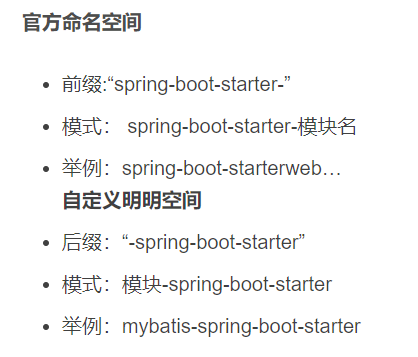

####  28 BeanFactory和FactoryBean的区别

BeanFactory是个Factory，也就是IOC容器或对象工厂，FactoryBean是个Bean。在Spring中，所有的Bean都是由BeanFactory(也就是IOC容器)来进行管理的。但对FactoryBean而言，这个Bean不是简单的Bean，而是一个能生产或者修饰对象生成的工厂Bean,它的实现与设计模式中的工厂模式和修饰器模式类似。

---

####  29 Spring-三级缓存和循环依赖

[参考](https://segmentfault.com/a/1190000023712597)

我们在之前介绍Bean的生命周期时说过，spring 中 bean的实例化过程，并非只是调用构造方法。除去spring框架本身提供的一些钩子或扩展方法，简单分成下面三个核心方法：

Spring在创建Bean的过程中分为三步

1. 实例化，对应方法：AbstractAutowireCapableBeanFactory中的createBeanInstance方法，简单理解就是new了一个对象。
2. 属性注入，对应方法：AbstractAutowireCapableBeanFactory的populateBean方法，为实例化中new出来的对象填充属性和注入依赖。
3. 初始化，对应方法：AbstractAutowireCapableBeanFactory的initializeBean，执行aware接口中的方法，初始化方法，完成AOP代理。

从单例Bean的初始化来看，主要可能发生循环依赖的环节就在第二步`populate`。值得注意的是，`基于构造方法注入`的方式，其实是将第一步和第二步同时进行，因此马上就抛出错误。而spring通过`基于属性注入`的方式，是否有其他特殊的处理呢，我们这时候就要提到spring的三级缓存：

- private final Map<String, Object> singletonObjects = new ConcurrentHashMap<>(256);
- private final Map<String, Object> earlySingletonObjects = new HashMap<>(16);
- private final Map<String, ObjectFactory<?>> singletonFactories = new HashMap<>(16);

| 缓存                  | 说明                                                         |
| --------------------- | ------------------------------------------------------------ |
| singletonObjects      | 第一级缓存，存放可用的完全初始化，成品的Bean。               |
| earlySingletonObjects | 第二级缓存，存放半成品的Bean，半成品的Bean是已创建对象，但是未注入属性和初始化。用以解决循环依赖。 |
| singletonFactories    | 第三级缓存，存的是Bean工厂对象，用来生成半成品的Bean并放入到二级缓存中。用以解决循环依赖。如果Bean存在AOP的话，返回的是AOP的代理对象。 |

####  30 java五种io模型

阻塞io（BIO）：

非阻塞io：

io多路复用（NIO）：

信号驱动IO：

异步IO（AIO）：

-----

####   31 为什么jdk动态代理，目标对象必须实现接口

因为jdk动态代理通过Proxy 的 `newProxyInstance` 方法获得代理对象， 由于java的单继承，动态生成的代理类已经继承了Proxy类的，就不能再继承其他的类，所以只能靠实现被代理类的接口的形式，故JDK的动态代理必须有接口。

####   32 mysql如何保证原子性，一致性，持久性，隔离性

  **1.mysql原子性的保证是利用了undo log。undo log名为回滚日志**，是实现原子性的关键，当事务回滚时能够撤销所有已经成功执行的sql语句，他需要记录你要回滚的相应日志信息。undo log记录了这些回滚需要的信息，当事务执行失败或调用了rollback，导致事务需要回滚，便可以利用undo log中的信息将数据回滚到修改之前的样子。

  **2.mysql持久性的保证是利用了redo log**。Mysql是先把磁盘上的数据加载到内存中，在内存中对数据进行修改，再刷回磁盘上。如果此时突然宕机，内存中的数据就会丢失。redo log包括两部分：一是内存中的日志缓冲(redo log buffer)，该部分日志是易失性的；二是磁盘上的重做日志文件(redo log file)，该部分日志是持久的。innodb通过***force log at commit\***机制实现事务的持久性，即在事务提交的时候，必须先将该事务的所有事务日志写入到磁盘上的redo log file和undo log file中进行持久化。

  **3.mysql一致性的保证是从2个方面来保证的。从数据库层面来看，A(原子性)、I(隔离性)、D(持久性)是手段，是为了保证一致性**，数据库提供的手段。数据库必须要实现AID三大特性，才有可能实现一致性。

4. 隔离性：根据不同的隔离级别来决定，

   - 读未提交：

     事务修改数据加排他锁，改完释放排它锁，加共享锁，直到提交事务释放。
     事务读取数据读永远读最高版本数据。

   - 读已提交：

     事务修改数据加排它锁，直到事务提交释放。
     事务读取数据永远读最高版本数据。

   - 可重复读：

     事务修改数据加排它锁，直到事务提交释放。
     事务读取数据版本号小于等于事务版本号的数据。

   - 串行化：

     不使用mvcc。
     事务修改数据加排他锁，读取数据加共享锁，直到提交释放。（低并发，极易死锁）

----

####  33 java有哪些网络框架


-----

####   34 modbus解析需要注意哪些


----

####  35 手写死锁


----

####   36 SSL


----


##  面经

###  汇总


| 公司         | 笔试                                                         | 一面                                                         | 二面                                                    | 三面                           | 状态                 |
| ------------ | ------------------------------------------------------------ | ------------------------------------------------------------ | ------------------------------------------------------- | ------------------------------ | -------------------- |
| 用友         | 无                                                           | 8.27全是八股文                                               | 9.1hr面，聊得还行最后叫我转部门                         | 无                             | 池子                 |
| 蓝月亮       | 无                                                           | 9.10线下群面                                                 |                                                         |                                | 流程终止             |
| 汇川         | 无                                                           | 9.13问了八股和项目，还有一些场景题                           | 9.17hr面，一些基础的问题，没有技术                      | 9.17主管面，技术夹杂着生活问题 | 9.21意向             |
| 北森         | 无                                                           | 9.15计算机网络，数据库，java比较少                           | 9.23突然说取消，9.25迟到50没来；重新约9.28，9.28主管面  |                                |                      |
| 荣耀         | 8.28三道算法                                                 | 9.16问的比较杂，数据结构，算法，计算机网络，数据库，多线程，集合总体不难 |                                                         |                                | 人才库               |
| 字节跳动     | 9.29四道算法，挺难的                                         |                                                              |                                                         |                                | 流程终止             |
| 招银网络科技 | 9.6选择加算法                                                | 9.17问的比较简单，但是比较少八股文，手撕代码最大子序列和     | 9.22体验很差，重项目，重算法，第二天上午通知约了hr面    | 9.26hr面常规问题，很随意       | 9.26晚上通知材料审核 |
| cvte         | 9.6选择加算法不能上一题，选择题挺难的很多查不到              | 笔试未通过，不建议去，                                       |                                                         |                                | 流程终止             |
| 小米         | 9.8选择加算法，简单                                          |                                                              |                                                         |                                |                      |
| tcl          | 9.8 选择题，同一套题                                         |                                                              |                                                         |                                |                      |
| 达实智能     | 9.9简单                                                      |                                                              |                                                         |                                |                      |
| 4399         | 9.9选择题算法题主观题                                        | 笔试未通过                                                   |                                                         |                                | 人才库               |
| 海康威视     | 9.10选择，算法，数据库，问答                                 |                                                              |                                                         |                                |                      |
| 兴业数金     | 9.10选择加算法比较简单                                       | 9.16约线下面试，直接推了，后面重新约我9.29面试。             |                                                         |                                |                      |
| 去哪儿       | 9.14选择加算法，中等难度                                     |                                                              |                                                         |                                |                      |
| 富途         | 9.16选择加算法，中等难度                                     | 9.29                                                         |                                                         |                                |                      |
| 网易互娱     | 9.17四道算法，巨难                                           |                                                              |                                                         |                                |                      |
| 玄武科技     | 9.17选择加算法，主观题，同一套题库                           | 9.26hr面+技术面，简单                                        |                                                         |                                |                      |
| 美的         | 9.20选择加算法，比较简单，从题库里选的，算法题重复度高       | 9.24线下群面，看运气，10人一组，4个面试官,9.26号下午通知二面 | 9.27线下技术面，20min基本上是围绕项目，感觉都没有问什么 |                                | 9.29下午已offer      |
| 步步高       | 9.20 选择题，加算法，算法比较难，其他没有算法，就我碰到了算法 |                                                              |                                                         |                                |                      |
| 华为         | 9.22三道算法100通过                                          | 9.30一面                                                     |                                                         |                                |                      |
| 大华         | 9.22选择加算法，比较简单                                     | 9.27下午一面，电话面试，八股                                 | 9.28二面                                                |                                |                      |
| 信也科技     | 9.24选择加问答，很简单基本上可以找到原题                     |                                                              |                                                         |                                |                      |
| 腾讯云智研   | 9.27笔试                                                     | 9.29面试                                                     |                                                         |                                |                      |
| -----        | ----------------                                             | -------------------                                          | --------------------                                    | ------------                   | ----                 |
| 大疆         | 选择加算法                                                   | 笔试未通过                                                   |                                                         |                                | 人才库               |
| 转转         | 笔试没做                                                     | 笔试未通过                                                   |                                                         |                                | 人才库               |
| 东方财富     | 无                                                           | 9.22感觉表象一般                                             |                                                         |                                | 人才库               |
|              |                                                              |                                                              |                                                         |                                |                      |


----

###  1 用友

####  用友一面 8.27

1. 自我介绍

2. 你做过的项目当中用过哪些集合？

3. ArraList和LinkedList有什么区别？

4. 为什么arraylist查找快？

5. 为什么linkedList插入快？

6. ArrayList新增数据和linkedList底层实现

7. ArrayList新增数据和linkedList新增数据实现过程？

8. 这些集合是安全的嘛？

9. juc下的线程安全集合有哪些？

   ConcurrentHashMap、、、、、、

10. vector、hashtable 区别？为什么线程安全？

11. hashmap特点？底层结构？

12. synchronized和volatile的区别？为什么Synchronized可以保证原子性、而volatile不可以？

13. 了解monitor嘛？

14. 你了解哪些设计模式？

15. 说一下动态模式？cglib底层实现了解嘛？

16. 单例模式有哪些？饿汉式有什么问题？双检锁/双重校验锁怎么实现的？

17. 能写一个双检锁/双重校验锁的单例模式嘛？

18. 写一个冒泡排序吧

19. 反问环节？

ps：项目一个字没有问、全是八股文。面试官由浅入深的问，动不动就底层，

####  用友二面9.1

1. 从研究生期间获得成就和未来职业规划两方面简单介绍一下；
2. 为什么是这个职业规划？
3. 实习做了什么，有什么收获，为什么，举个例子；
4. 自己的优缺点；
5. 最好的优点是哪个，举个列子；
6. 家里人情况；
7. 家里人对你工作的看法；
8. 有过面试嘛
9. 为什么没有面试，你觉得问题在哪里；
10. 愿意来北京嘛
11. 挂科了嘛
12. 期望薪资

面完hr画风一转，说我的职业意向很明显，但是他们部门不是做这个的，会给我推到其他部门去。之前感觉面试挺好，听到这感觉凉了半截。


-----

###  2 蓝月亮

####   一面9.10

1. 群面
2. 面试

已结束招聘


------

###  3 汇川

####  汇川一面9.13 （30多分钟）线上

1. 自我介绍；
2. arrayList和linkedlist区别？
3. 了解二分查找嘛？
4. 二叉树了解嘛？
5. 二叉的遍历方式？
6. 线程安全的集合？
7. synchronized关键字和volatile关键字区别？
8. synchronized关键字可以修饰哪些；
9. synchronized修饰对象静态类的区别；
10. 了解得设计模式有哪些？
11. 讲讲单例模式？
12. 项目中用到了哪些设计模式；
13. 项目中redis用来实现什么功能，采用的那种数据结构；
14. 项目中hash的一级key和二级key怎么设置的；
15. 可以用其他的数据结构嘛；
16. 然后就是项目，简历的每个项目都问了一遍，从我的描述上问，基本是怎么实现的，具体有哪些功能。
17. 反问：
    1. 公司的技术栈；
    2. 进入公司之后具体负责什么业务；

####   汇川二9.17（20多min）线下

1. 自我介绍；
2. 项目都是导师课题里面的嘛？
3. 为什么时间都这么短？
4. 你在这里面负责什么？
5. 硕士研究方向；为什么和项目不一样?
6. 实习做了什么，项目有几个人，分工，哪个角色最重要，为什么？是在这个项目中你觉得还是，所有的开发流程都是这样？
7. 是不是独生子女，有没有女朋友？
8. 爸妈是做什么的，对你的工作有什么看法；
9. 为什么要读研，本科是在哪里
10. 为什么不考长沙那边的学校；
11. 意向工作地点，如何看待生活压力大；
12. hr介绍了一下汇川的企业文化；

####   汇川三面9.17（30左右）线下 面完二面等了半个小时

1. 自我介绍；
2. 什么是计算机集成制造；
3. 导师方向？
4. 研究方向；为什么选这个，不选其他方向？
5. 毕业课题？
6. 接下来就是扣项目技术细节;
7. 职业规划，意向工作类型；
8. 对汇川了解嘛；
9. 平时兴趣爱好；
10. 周末一般做什么；
11. 有没有遇到压力特别大的时候，怎么解决的；
12. 平时和室友聊些什么
13. 学校里的学习工作时间；
14. 反问环节：
    1. 具体分到什么业务；
    2. 多久出结果；

####  9.21早上邮件通知通过面试，邀请参加沟通会


-----

###   4 北森

####  北森一面9.15（46min）

1. 自我介绍；
2. 有没有实习，做的项目都是哪种；
3. 选一个介绍一下；
4. 用到了哪些技术栈；
5. 有用到缓存中间件嘛；
6. redis缓存穿透，缓存雪崩；
7. 缓存穿透和缓存雪崩解决办法；
8. 有了解NoSQL嘛；
9. 二叉树、平衡二叉树；
10. 遍历二叉树的方法有哪些；
11. 链表和数组的区别；
12. 如何判断一个链表是否有环；
13. 数据库锁有哪些；
14. left join和inner join 区别；
15. 数据库索引；
16. 有哪些类型，有什么区别；
17. http是什么，有哪些类型；
18. osi七层网络模型；
19. tcp和upd区别；
20. tcp属于哪一层；
21. ip属于哪一层；
22. tcp三次握手和四次挥手；
23. time-wait 为什么？
24. 如果time-wait超时异常，可能的原因；
25. redis缓存穿透和缓存雪崩；
26. 有哪些解决办法；
27. gc算法；
28. 了解哪些设计模式；
29. 讲讲单例模式；
30. 对转语言有什么看法；
31. 不能来实习嘛？
32. 反问：
    1. 培养模式和晋升体系；
    2. 技术栈；

####   北森二面-主管面9.28（25min）

1. 自我介绍；
2. 两个授权专利都是什么方向的；
3. 其他的受理专利是什么；
4. 介绍一下项目；
5. 遇到了哪些问题，怎么解决的，每个项目基本上都问了；
6. 登录这块密码怎么加密的；
7. 其实md5已经不算安全的加密方式了，有了解其他加密嘛，比如说加盐；
8. jwt的结构；
9. 实习最大的收获；
10. 了解哪些数据库；
11. 数据库索引失效有哪些情况；
12. 这一年以来最有成就感的一件事情；
13. 你项目中，或者介绍中，都是深度学习，区块链这方面的，那你以后的职业规划呢；
14. 说说你对北森的了解；
    1. 中间反问，为什么北森自己的面试用的是别人家的产品
15. 有时间来实习嘛；
16. 工作地点的选择，北京还是成都；
17. 反问环节：
    1. 具体业务；
    2. 具体技术栈；
    3. 结果时间；

-----

###  5 荣耀

####  荣耀一面9.16


------

###   6 招银网络科技

####  招银网络科技一面9.17 （24min）

1. 自我介绍。
2. 什么是设计模式？
3. 你了解的设计模式有哪些？
4. 项目中用到了哪些设计模式？
5. 挑一个项目讲一下？
6. 这个项目用了什么样的架构？
7. jvm垃圾回收算法了解嘛，将一下分代收集算法？为什么用这种垃圾回收算法？
8. 了解数据库索引嘛？
9. 讲一下solr（项目当中用到了）？
10. 手撕代码：[连续子数组的最大和](https://www.nowcoder.com/practice/459bd355da1549fa8a49e350bf3df484?tpId=117)
11. 反问：用了哪些技术栈，做什么业务？
12. 总结：提问12分钟左右，总共24分钟；感觉凉了但是下午14点收到了二面通知。

####  招银网络科技二面9.22（30多min）

1. 自我介绍；
2. 说说你对招银网络科技的了解；
3. 说说你对区块链的了解；
4. 你在项目中如何使用的区块链；
5. 如果不能区块链可以实现这个功能嘛；
6. solr 倒排索引；
7. 为什么要加solr，加了具体的性能提升；
8. mybatis和mybatis-plus的区别；
9. 了解哪些数据结构；
10. 如何判断一个链表是否有环；怎么实现快慢指针；为什么快慢指针可以实现这个功能，用数学式子表示；
11. 了解哪些算法；
12. 八皇后问题怎么解决；
13. 两个专利是哪些；
14. springboot启动过程；
15. springboot启动用到了哪些java技术；
16. 项目开发的流程？
17. 自己在开发过程中遇到问题怎么解决的，举个例子;
18. 代码怎么合并到一起，有没有遇到一些问题，怎么解决的；
19. 项目中怎么评估队友的表现；
20. 如果觉得队友的实现方式不对，不好，怎么解决；
21. 如果他坚持他的想法怎么解决；
22. 反问环节；
    1. 具体做什么业务
    2. 用到的技术栈

体验极差：面试官摄像头怼墙，声音贼小，声音调最大有时候也听不清，全程贴着键盘听。第二天上午竟然通知hr面，离谱；

####   招银网络科技hr面9.26（20多min）

1. 自我介绍
2. 本科有没有拿过奖学金
3. 本科成绩排名，班级多少人
4. 硕士期间成绩，人数
5. 专硕还是学硕，有什么专利论文成果嘛
6. 机械专业，平时有上计算机专业的课嘛
7. 自己平常怎么积累计算机技术
8. 实习期间很短，做了什么
9. 软著是关于什么的；
10. 你觉得印象最深的一个项目是哪个
11. 职业规划
12. 遇到了什么困难
13. 你独自负责嘛，具体分工
14. 你是独生子女嘛
15. 父母都在哪工作
16. 有没有对象
17. 对工作地点有没有什么要求
18. 核对岗位和工作意向地点
19. 反问：
    1. 招银具体的业务线，会被分到哪里
    2. 培养制度，晋升体系
    3. 多久有结果。

####  hr面当晚通知提交资料


---

###  7  东方财富

####   东方财富-java开发-一面-9.22（20多min）

1. 自我介绍；
2. 满二叉树和完全二叉树的区别；
3. tcp三次握手；
4. tcp和udp的区别；
5. 腾讯会议采用的是什么传输协议；
6. 实习做了啥？
7. 怎么实现验证登录；
8. 密码是明文嘛；
9. 如何防止别人拿着一套密码来登录系统；
10. 超大数组，内存很小，如何找到重复的元素；
11. 反问：
    1. 技术栈；
    2. 会分到什么业务部门；

####  一天后人才库


-----

###  8 玄武科技

####  玄武科技hr面9.26（20+min）


比较简单


####  玄武科技技术一面（20+min）

比较简单

约了9.29号面试，时间冲突，婉拒。

----

###  9 大华

####   大华一面技术-电话面-9.27（20min）

1. 自我介绍；
2. 动态代理有哪几种；
3. jdk代理为什么要目标对象实现接口；
4. 数据库事务特性；
5. 怎么实现原子性，一致性，隔离性，持久性；
6. 数据库索引；
7. 为什么用B+树；
8. 五种IO模型；
9. springboot中，BeanFactory和FactoryBean有什么区别；
10. springboot循环引用；
11. 线程池参数有哪些；
12. redis有哪些数据类型；
13. redis持久化机制；
14. 了解Netty框架嘛；
15. jvm数据运行时区有哪些组成；
16. 栈帧有哪些，具体作用；
17. 反问环节：
    1. 具体业务
    2. 技术栈
    3. 什么时候出结果


####  大华二面技术面-视频面9.28（20min）

1. 自我介绍；
2. 常用的集合；
3. 项目种类是，和公司合作还是实验室的；
4. 项目的亮点；
5. 项目中遇到的问题；
6. 通讯用到的什么协议；
7. modbus协议解析过程中的注意事项；
8. 了解哪些计算机网络框架模型：
9. 数据库索引的种类，具体区别；
10. 怎么保证线程安全；
11. 如何对从变量角度保证变量安全；
12. 多线程的创建方法；
13. 线程池的种类；
14. 访问线程时，无响应，怎么排查故障；
15. 如何不重复的打印数组里的所有元素；
16. 你的方向都是有区块链的东西，你说说你的未来的发展规划；
17. 反问环节：
    1. 具体业务
    2. 技术栈
    3. 什么时候出结果

---

###  10 美的

####   美的一面-线下群面9.24（45min）

（8-10人一组，讨论一个问题，5分钟阅读材料，每人1分钟观点陈述，20分钟讨论，选一个代表5分钟报告）

群面技巧：**最后面试官会说，把试题和草稿纸放在桌子上，你可以帮忙整理一下，或许面试官会因为这个给你加分**

####  美的二面-线下技术面9.27 （20min）

主要是针对简历上的一些东西进行询问，项目分工，项目类型，项目遇到的难点，怎么解决的。还有一些hr面的问题，优缺点，平时怎么学习，课余时间安排。

####  9.29下午15.26收到offer


----

###   11 富途

####   富途技术面-客户端开发-java9.29（30多min）

面试官先自我介绍了自己的身份，姓名，一面内容，很礼貌；

1. 自我介绍；

2. 自我介绍的时候打断我，问我是不是对着稿子念（答：准备了很久，自我介绍已经很熟练了。）

3. 我们这边很少用java的；

4. 如果来了可能要转c++/Kotlin/OC/Swift;

5. 是否了解客户端开发；

6. 成绩排名；

7. 上过哪些和计算机相关的课程；

8. 分水的逻辑题；

9. 四个人打手电筒过桥的逻辑题；

10. 算法题：求二叉树最近公共父节点；

11. 为什么会有死锁；写一个例子；

12. 了解SSL嘛，SSL的解析还是什么的，没搞清楚；

    我直接说，可能我能力不够，直接说抱歉，希望结束面试。面试官也很好没有说啥，说我本身是机械的，计算机基础薄弱很正常，如果要从事这个行业还是要系统的学习一下计算机基础。

总体体验：虽然很难，但是面试官整个过程都很有礼貌，不会因为不会就表现出情绪，虽然大部分不会但是，感觉还是很好。富途这个公司还是很棒的，都是自己太菜了。**希望以后有机会可以去。**


----

###  12 兴业数金

####  兴业数金-java开发工程师：9.29（15min）

约的15.40迟到了好几分钟。腾讯会议当时开着，后面去看网页了，突然弹出一个选输入音频的对话框，才发现面试官已经上线了，一个女的技术面试官。

1. 自我介绍；
2. 了解兴业数金嘛；
3. 用过哪些框架；
4. redis的数据类型；
5. mysql事务开发中有用到过吗；
6. springboot常用的注解；
7. 设计模式有了解过嘛；
8. 动态代理模式讲一下；
9. 项目开发过程中springboot+vue.js前后端数据怎么交互；
10. 了解哪些排序算法；
11. 讲讲快速排序；
12. 反问环节：
    1. 具体业务和技术栈；
    2. 什么时候出结果

整个时间非常短，满满的kpi既视感。

----

###   13 腾讯云智研

####  腾讯云智研-一面技术-9.29（38min）


####  