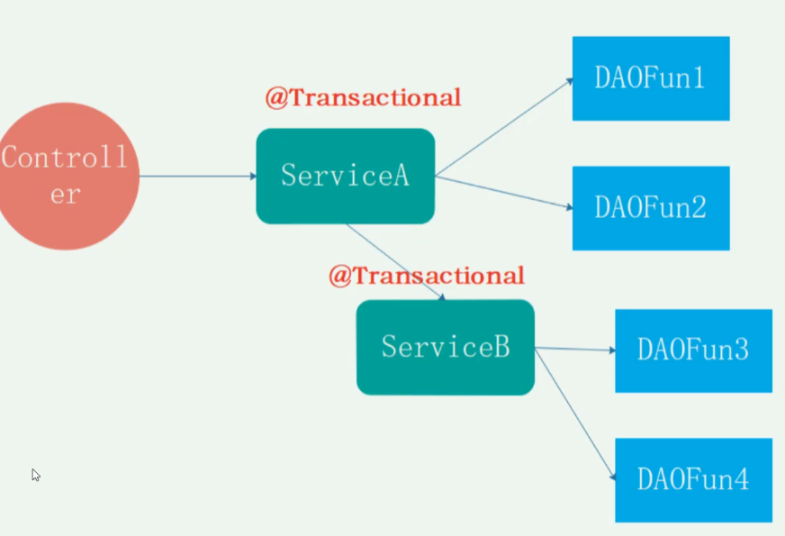
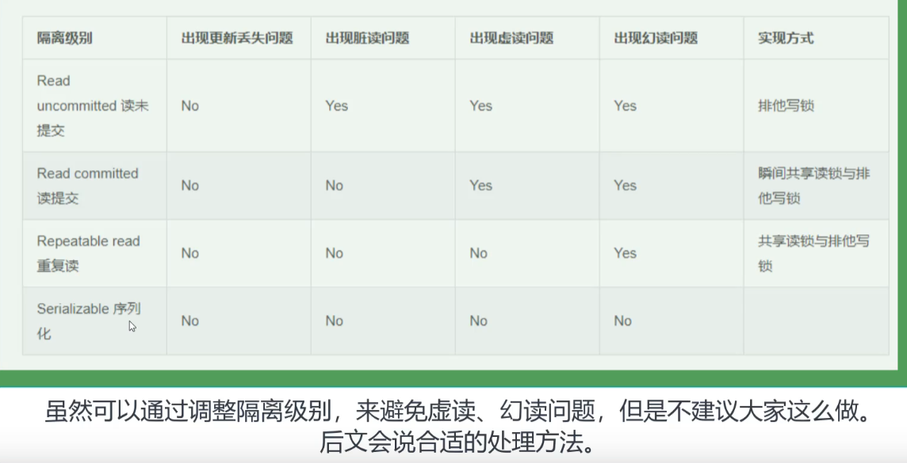

#  java 后端知识

[toc]

##  1 java 基础知识

###  1.java语言特点

1. 简单易学（语法简单、没有c++中的指针、增加了垃圾回收机制）；
2. 面向对象（继承、封装、多态）；

>1.什么是面向对象（oop），什么是面向过程、有什么区别？
>
>面向过程是具体化的、流程化的，就是一个动作的具体实现，将一个动作拆分成递进的若干个动作；
>
>面向对象是模型化的，就是把面向过程也就是方法的具体实现抽象成一个类，并封装；
>
>优点：性能比面向对象好，因为类调用时需要实例化，开销比较大，比较消耗资源。
>缺点：不易维护、不易复用、不易扩展。
>
>优点：易维护、易复用、易扩展，由于面向对象有封装、继承、多态性的特性，可以设计出低耦合的系统，使系统 更加灵活、更加易于维护 .
>缺点：性能比面向过程差
>
>2.继承？
>
>一个对象获得另外一个对象的属性和方法，提高代码复用性；继承是多态的前提。
>
>3.封装？
>
>封装是指把一个对象的状态信息（也就是属性）隐藏在对象内部，不允许外部对象直接访问对象的内部信息。但是可以提供一些可以被外界访问的方法来操作属性。
>
>4.多态？
>
>多态，顾名思义，表示一个对象具有多种的状态。具体表现为父类的引用指向子类的实例。多态的三个必要条件：**继承、重写、父类引用指向子类**。

3. 平台无关性（通过jvm实现平台无关性）；
4. 支持多线程；
5. 可靠性；
6. 支持网络编程并且方便；
7. 编译与解释并存；

>java源程序首先要经过一次编译形成字节码文件.class，此字节码文件不面向特定机器，而是面向JVM虚拟机的，具体面向机器的过程交由JVM来完成，不同的操作系统有着不同版本的JVM，这些JVM并不相同，但是他们都能够识别相同的.class字节码文件，将字节码文件翻译成特定机器的二进制码来执行。所以java 的跨平台性就是java源程序编译成的.class文件，在任何操作系统上通过该系统对应的JVM都能够顺利执行，java跨平台不等于JVM跨平台，JVM是非跨平台的！
>从java源程序到执行的过程可以看见，这个过程即有了编译步骤也有解释步骤。但是本质上来讲，编译的最终结果也只是.class文件，不是机器码，最终还是需要JVM来统一解释，所以更多的应该将java视为解释性语言。
>由于解释性语言性能比较低，后来java引入了JIT编译，某些被频繁执行的方法或者代码块，会被JVM认定为“热点代码”。在运行时JVM会把这些热点代码编译成与本地平台相关的机器码，并且进行各种层次的优化，以提高执行效率。

###  2.介绍一下jvm、jdk、jre

1. Java 虚拟机（JVM）是运行 Java 字节码的虚拟机。JVM 有针对不同系统的特定实现（Windows，Linux，macOS），目的是使用相同的字节码，它们都会给出相同的结果。字节码和不同系统的 JVM 实现是 Java 语言“一次编译，随处可以运行”的关键所在。
2. JDK 是 Java Development Kit 缩写，它是功能齐全的 Java SDK。它拥有 JRE 所拥有的一切，还有编译器（javac）和工具（如 javadoc 和 jdb）。它能够创建和编译程序。
3. JRE 是 Java 运行时环境。它是运行已编译 Java 程序所需的所有内容的集合，包括 Java 虚拟机（JVM），Java 类库，java 命令和其他的一些基础构件。但是，它不能用于创建新程序。

### 3.java和c++的区别

1. java不提供指针直接访问内存，程序内存更加安全；
2. java类是单继承，C++支持多继承；虽然java的类不能单继承，但是接口可以多继承；
3. java有自动内存管理垃圾回收机制(GC),C++需要手动释放内存；
4. java可以通过jvm实现一次编译多次运行的跨平台特性，C++依赖特定的平台；
5. java只支持方法重载，C++同时支持方法的重载和操作符的重载

### 4.基本数据类型

byte、short、int、long、float、double、char、boolean八大基本数据类型；

6中数字类型、1中字符类型、1种布尔类型；

| 名称    | 字节 | 位数 | 默认值 | 范围 | 包装类型  | 包装类型默认值 |
| ------- | ---- | ---- | ------ | ---- | --------- | -------------- |
| byte    | 1    | 8    | 0      |      | Byte      | null           |
| short   | 2    | 16   | 0      |      | Short     | null           |
| int     | 4    | 32   | 0      |      | Integer   | null           |
| long    | 8    | 64   | 0L     |      | Long      | null           |
| float   | 4    | 32   | 0.0f   |      | Float     | null           |
| double  | 8    | 64   | 0.0d   |      | Double    | null           |
| char    | 2    | 16   | u0000  |      | Character | null           |
| boolean |      | 1    | false  |      | Boolean   | null           |


### 5.装箱、拆箱

装箱和拆箱是指的java语言中8大基本数据类型和对应的包装类型之间的转换，`装箱`是指的基本数据类型值变成包装类型的实例，通过包装类的valueof方法实现（Integer.valueof）;`拆箱`指的是包装类实例变成基本数据类型的值，通过i.intValue实现。

>1.除了（Double、Float）之外的数值类型装箱的时候为了`提升性能和节约内存`自动装箱过程会判断，如果数值在[-128,127]之间，就返回指向IntegerCache.cache中已经存在的对象引用，否则则重新创建一个对象；
>
>2.boolean类型自动装箱时 所有的True都是赋个一个静态值为true的Boolean对象，所有的False都是赋给一个静态值为false的Boolean对象；
>
>3.Integer i = new Integer(xxx)和Integer i =xxx;这两种方式的区别；
>
>​	第一种方式不会触发自动装箱的过程；而第二种方式会触发；在执行效率和资源占用上的区别。第二种方式的执行效率和资源占用在一般性情况下要优于第一种情况（注意这并不是绝对的）。
>
>4.当“==”运算符的两边都是包装类型的引用，则是比较指向的是否为同一个对象，如果其中有一个一边是数值或者运算式（a+b），则会进行自动拆箱；
>
>
>
>


### 6.字符类型和字符串类型常量的区别

1.形式上：字符常量式单引号引起的一个字符，字符串常量是双引号引起的若干个字符；

2.含义上：字符常量相当于一个整形值，可以参加表达式计算，字符串常量代表一个内存地址

3.内存占用：字符常量占两个字节，字符串常量占若干个字节。


### 7.String和StringBuffer、StringBuilder的区别是

1.可变性：String不可变、StringBuffer和StringBuilder是可变的；

2.线程安全性：String是线程安全的，StringBuffer对所有的公开方法都加了synchronized修饰，是线程安全的；StringBuilder是非线程安全的；

3.性能：StringBuilder>StringBuffer>String


### 8.Switch使用

1.switch可以作用与char、byte、short、int以及他们的包装类型，jdk1.5之后可以作用与枚举类型，在jdk1.7之后可以作用于String类型

>不能作用于double、float、boolean及他们的包装类型；
>
>switch的转换和具体系统实现有关，如果分支比较少，可能会转换为跳转指令（条件跳转指令和无条件跳转指令）。但如果分支比较多，使用条件跳转会进行很多次的比较运算，效率比较低，可能会使用一种更为高效的方式，叫跳转表。跳转表是一个映射表，存储了可能的值以及要跳转到的地址，形如：
>
>| 值1  | 代码块1的地址 |
>| ---- | ------------- |
>| 值2  | 代码块2的地址 |
>| ...  |               |
>| 值n  | 代码块n的地址 |
>
>跳转表为什么会更为高效呢？因为，其中的值必须为整数，且按大小顺序排序。按大小排序的整数可以使用高效的二分查找，即先与中间的值比，如果小于中间的值则在开始和中间值之前找，否则在中间值和末尾值之间找，每找一次缩小一倍查找范围，其算法复杂度为O(log2n)。
>
>如果值是连续的，则跳转表还会进行特殊优化，优化为一个数组，连找都不用找了，值就是数组的下标索引，直接根据数组下标索引就可以找到跳转的地址。
>
>即使值不是连续的，但数字比较密集，差的不多，编译器也可能会优化为一个数组型的跳转表，没有的值指向default分支。
>
> 
>
>程序源代码中的case值排列不要求是排序的，编译器会自动排序。switch判断的类型可以是byte, short, int, char, 枚举和String（java7及之后支持）。其中byte/short/int/char本来就是整数，而枚举类型也有对应的整数序号ordinal，String用于switch时也会通过hashCode方法转换为整数，为什么不可以使用long呢？因为跳转表值的存储空间一般为32位，容纳不下long。
>
>需要说明下String的hashCode值可能冲突，而解决冲突的方式就是跳转之后再通过equals方法判定字符串内容是否相等。
>
>


### 9.访问修饰符

java语言中有四种权限访问控制符，这四种访问权限的控制符能够控制类中成员的可见性。其中类有两种，public、default，而方法和变量有4种，public、default、protected、private。

- public：对所有类可见。所有类型，类、接口、变量、方法；
- default：在同一包内可见。所有类型，类、接口、变量、方法；
- protected：对同一包内的类和所有子类可见。使用对象，变量、方法；
- private：在同一类中可见。使用对象，变量、方法。不能修饰外部类。


###  10.关键字

| 访问控制             | private  | protected  | public   |              |            |           |        |
| -------------------- | -------- | ---------- | -------- | ------------ | ---------- | --------- | ------ |
| 类，方法和变量修饰符 | abstract | class      | extends  | final        | implements | interface | native |
|                      | new      | static     | strictfp | synchronized | transient  | volatile  |        |
| 程序控制             | break    | continue   | return   | do           | while      | if        | else   |
|                      | for      | instanceof | switch   | case         | default    |           |        |
| 错误处理             | try      | catch      | throw    | throws       | finally    |           |        |
| 包相关               | import   | package    |          |              |            |           |        |
| 基本类型             | boolean  | byte       | char     | double       | float      | int       | long   |
|                      | short    | null       | true     | false        |            |           |        |
| 变量引用             | super    | this       | void     |              |            |           |        |
| 保留字               | goto     | const      |          |              |            |           |        |

####  1.static

static 关键字就是为了`在没有创建对象实例的时候也可以对变量或者方法的调用优化程序性能`

- static变量：可以直接通过类名来访问它；
- static方法：静态方法不依赖于任何对象就可以进行访问，在静态方法中不能访问非静态成员变量和非静态方法，因为非静态成员变量和方法都是必须依赖具体实例化对象才可以被调用，但是在非静态方法中可以访问静态变量和方法；
- static代码块：静态代码块主要用途是拿来优化程序性能，只会在类加载时被加载一次，很多时候将一些只需要执行一次的初始化操作放在static代码块中，如果程序中有多个代码块，在类初次被加载的时候，会按照static块的顺序来执行每个static块；
- 初始化顺序：静态变量和静态代码块优先于成员变量和普通代码块，静态变量和静态代码块的执行顺序取决于它们在代码中的先后位置。如果存在继承关系，`父类中的静态变量和静态代码块---》子类中的静态变量和静态代码块----》父类中的实例变量和普通代码块----》父类构造函数----》子类的实例变量和普通代码块----》子类的构造函数`；

#### 2.final关键字

final关键字主要用于修饰类，变量，方法

1. 类：被final修饰的类不能被继承；
2. 方法：被final修饰的方法不能被重写；
3. 变量：被final修饰的变量是基本类型，变量的数值不能改变；被修饰的变量是引用类型，变量不能在引用其他对象，但是变量引用的对象本身是可以改变的；

final、finally、finalize的区别；

- final主要用于修饰类、变量、方法；
- finally一般作用于try-catch代码块中，在处理异常时候，将一定要执行的代码方法放在finally代码块中；
- finalize是一个属于object类的方法，该方法一般由垃圾回收器来调用。

#### 3.this关键字

1. this关键字可以用来引用当前类的实例变量，
2. this关键字可用于调用当前类实例方法方法；
3. this关键字可以用来调用当前类的构造函数；this要放在构造函数的第一行，不然编译会报错，this(),表示调用构造方法
4. ..

>所谓的类方法是指的==类中用static修饰的方法==，非static方法为实例方法

####  4.super关键字

1. super可以用来直接引用父类的实例变量；
2. super可以用来直接调用父类的构造函数；必须放在方法的第一行
3. super可以用来直接调用父类的方法；super（）表示调用构造方法

#### 5.break、continue、return的区别

- break结束当前的循环体；
- continue结束本次循环，进入下一次循环；
- return 结束当前方法；

####  6.Atomic、volatile、synchronized、ThreadLocal关键字的区别


####  7.native关键字

当java中的方法用native来修饰的时候，就表示这个方法是一个本地方法。换言之，就是不是使用java语言实现的方法。例如hashCode


###  11.构造方法

构造方法是类的一种特殊方法，用来初始化类的一个新的对象，在创建对象（new 关键字）之后自动调用。java中的每个类都有一个默认的构造方法，并且可以有一个以上的构造方法。

Java 构造方法有以下特点：

- 方法名必须与类名相同

- 可以有 0 个、1 个或多个参数

- 没有任何返回值，包括 void

- 默认返回类型就是对象类型本身

- 不能重写，可以重载

- 可以通过new调用

- >1.使用new创建对象会自动调用构造方法
  >
  >  Person person=new Person();
  >
  >2.使用Class类的newInstance方调用构造方法
  >
  >  Person person=(Person) Class.forName("com.Person").newInstance();
  >
  >3.用反射中的constructor类 的newInstance 调用构造方法
  >
  >Constructor constructor=Person.class.getConstructor ();
  >
  >Person person=constructor.newInstance();
  >
  >2.3均属于反射机制
  >
  >上面三中创建对象的时候回自动调用构造方法，
  >
  >但不是所有的创建对象的时候会调用，比如clone方法（对象的复制），
  >
  >序列化的时候也会创建对象，这是有jvm创建的，所以也不会调用
  >
  >还可以通过this，或super调用构造方法


###  12.重载和重写

方法的重写(Overriding)和重载(Overloading)是java多态性的不同表现，重写是父类与子类之间多态性的一种表现，重载可以理解成多态的具体表现形式。

- 方法重载是一个类中定义了多个方法名相同,而他们的参数的数量不同或数量相同而类型和次序不同,则称为方法的重载(Overloading)。
- 方法重写是在子类存在方法与父类的方法的名字相同,而且参数的个数与类型一样,返回值也一样的方法,就称为重写(Overriding)。
- 方法重载是一个类的多态性表现,而方法重写是子类与父类的一种多态性表现。

>1.重载：
>
>重载(overloading) 是在一个类里面，方法名字相同，而参数不同。返回类型可以相同也可以不同。每个重载的方法（或者构造函数）都必须有一个独一无二的参数类型列表。最常用的地方就是构造器的重载。
>
>**重载规则:**
>
>- 被重载的方法必须改变参数列表(参数个数或类型不一样)；
>- 被重载的方法可以改变返回类型；
>- 被重载的方法可以改变访问修饰符；
>- 被重载的方法可以声明新的或更广的检查异常；
>- 方法能够在同一个类中或者在一个子类中被重载。
>- 无法以返回值类型作为重载函数的区分标准。
>
>2.重写：
>
>重写是子类对父类的允许访问的方法的实现过程进行重新编写, 返回值和形参都不能改变。
>
>**重写规则:**
>
>- 参数列表与被重写方法的参数列表必须完全相同。
>- 返回类型与被重写方法的返回类型可以不相同，但是必须是父类返回值的派生类（java5 及更早版本返回类型要一样，java7 及更高版本可以不同）。
>- 访问权限不能比父类中被重写的方法的访问权限更低。例如：如果父类的一个方法被声明为 public，那么在子类中重写该方法就不能声明为 protected。
>- 父类的成员方法只能被它的子类重写。
>- 声明为 final 的方法不能被重写。
>- 声明为 static 的方法不能被重写，但是能够被再次声明。
>- 子类和父类在同一个包中，那么子类可以重写父类所有方法，除了声明为 private 和 final 的方法。
>- 子类和父类不在同一个包中，那么子类只能够重写父类的声明为 public 和 protected 的非 final 方法。
>- 重写的方法能够抛出任何非强制异常，无论被重写的方法是否抛出异常。但是，重写的方法不能抛出新的强制性异常，或者比被重写方法声明的更广泛的强制性异常，反之则可以。
>- 构造方法不能被重写。
>- 如果不能继承一个类，则不能重写该类的方法。

| 区别点   | 重载方法 | 重写方法                                       |
| :------- | :------- | :--------------------------------------------- |
| 参数列表 | 必须修改 | 一定不能修改                                   |
| 返回类型 | 可以修改 | 一定不能修改，可以小于父类得返回类型           |
| 异常     | 可以修改 | 可以减少或删除，一定不能抛出新的或者更广的异常 |
| 访问     | 可以修改 | 一定不能做更严格的限制（可以降低限制）         |

###  13.==和equals的区别

对于基本数据类型来说，==比较的是值；对于引用类型数据来说， ==比较的对象的内存地址；

equal方法不能作用于判断基本数据类型，equals方法存在于object类中，object方法是所有类的直接或间接父类

- **类没有覆盖 `equals()`方法** ：通过`equals()`比较该类的两个对象时，等价于通过“==”比较这两个对象，使用的默认是 `Object`类`equals()`方法。
- **类覆盖了 `equals()`方法** ：一般我们都覆盖 `equals()`方法来比较两个对象中的属性是否相等；若它们的属性相等，则返回 true(即，认为这两个对象相等)。

###  14.hashCode()与equals()

hashCode 的作用是获取哈希码，也称散列码；实际上是返回一个int整数。这个哈希码的作用是确定该对象在哈希表中的索引位置。`hashCode()`定义在 JDK 的 `Object` 类中，这就意味着 Java 中的任何类都包含有 `hashCode()` 函数。另外需要注意的是： `Object` 的 hashcode 方法是本地方法，也就是用 c 语言或 c++ 实现的，该方法通常用来将对象的 内存地址 转换为整数之后返回。

**3)为什么重写 `equals` 时必须重写 `hashCode` 方法？**

如果两个对象相等，则 hashcode 一定也是相同的。两个对象相等,对两个对象分别调用 equals 方法都返回 true。但是，两个对象有相同的 hashcode 值，它们也不一定是相等的 。**因此，equals 方法被覆盖过，则 `hashCode` 方法也必须被覆盖。**


###  15.浅拷贝、深拷贝的区别

给新变量复制的时候

- 浅拷贝：对基本数据类型进行值传递，对引用数据类型复制一个引用指向原始引用的对象，就是复制的引用和原始引用指向同一个对象；
- 深拷贝：对基本数据类型进行值传递，对引用数据类型创建一个新的对象，并复制其内容，两个引用指向两个对象，但是内容相同；

通过重写clone类或者序列化来实现。


###  16.序列化

-  序列化：将对象转化为字节序列
- 反序列化：将字节序列转化为对象
- 序列化的意义：将java对象转化成为字节序列，方便通过网络传输或者存储在磁盘上，在需要的时候可以通过反序列化恢复；
- 实现方式：1.实现Serializable接口，2.实现Externalizable接口；
- 序列化注意事项：
  - 对象的类名、实例变量会被序列化，方法、类变量、transient实列变量都不会被序列化；
  - 可以同通过transient修饰，使得变量不被序列化；
  - 序列化对象的引用类型成员变量，也必须是可以序列化的，否则会报错；
  - 反序列化时必须有序列化对象的class文件；


###  17.泛型

- 泛型意味着编写的代码可以被不同类型的对象所重用，本质上是参数化类型，也就是说操作的数据类型被指定为一个参数；
- 通配符：传入一个类型的指定范围；
  - <?>无限制通配符，表示可以持有任何类型；
  - <? extends E>上界通配符，表示这个泛型中的参数必须是E或者E的子类：用于灵活的读取
  - <? super E> 下界通配符，表示这个泛型的参数必须是E或者E的父类，用于灵活的写入或者比较
- 当编译器对带有泛型的java代码进行编译时，它会去执行类型检查和类型推断，然后生成普通的不带泛型的字节码，这个普通的字节码可以被一般的java虚拟机接收并执行，这就叫做类型的擦除；
  - Java 编辑器会将泛型代码中的类型完全擦除，使其变成原始类型。当然，这时的代码类型和我们想要的还有距离，接着 Java 编译器会在这些代码中加入类型转换，将原始类型转换成想要的类型。这些操作都是编译器后台进行，可以保证类型安全。总之泛型就是一个语法糖，它运行时没有存储任何类型信息。
- 优点：
  - 类型安全，编译时期就可以检查出类型是否正确；
  - 消除强制类型转换；
  - 潜在的性能收益。

###  18.反射

- 反射：就是获取任意一个类的所有属性和方法，你还可以调用这些属性和方法；
- 反射机制的优缺点：
  - 优点：可以让代码更加灵活、为各种框架提供开箱即用的功能提供了便利；
  - 缺点：让我们在运行时有了分析操作类的能力，这同时也增加了安全问题。
- 反射的应用场景：java的注解的实现就用到了反射，动态代理也依赖反射实现，springboot、mybatis等各种框架中有用到。@component、@value注解用到；

###  19.代理模式

1. 代理模式：为一个目标对象提供一个代理，通过控制这个代理来访问目标对象；

2. 代理模式优点：

   1. 可以在目标对象实现的基础上，增加额外的操作功能；
   2. 屏蔽对目标对象的直接访问，使得目标对象更加安全；
   3. 降低系统耦合度；

3. 代理模式缺点：

   1. 创建了多余的开销
   2. 系统更加复杂

4. 代理模式的分类：

   1. 静态代理：静态定义代理类；
   2. 动态代理
      - jdk自带的动态代理；
      - CGLIB代理；
      - javaassist字节码操作库实现

5. 应用场景：

   1. 安全代理
   2. 远程代理
   3. 延迟加载
   4. 常见的框架中基本上都用到了代理模式

6. 静态代理模式：

   1. 定义一个目标对象的接口：
   2. 通过实现目标对象接口来创建目标对象，通过实现目标对象接口生成代理对象；
   3. 实例化代理对象时，将目标对象传给代理对象；
   4. 优点：在不修改目标对象的功能前提下，能通过代理对象目标功能扩展；
   5. 缺点：因为代理对象需要与目标对象实现一样的接口,所以会有很多代理类。一旦接口增加方法,目标对象与代理对象都要维护

7. 动态代理jdk实现：

   1. 定义一个目标对象的接口
   2. 实现目标对象接口来创建目标对象，代理对象则通过jdk中的API，动态的在内存中构建；
   3. java.lang.reflect.Proxy
      • 作用：动态生成代理类和对象
      java.lang.reflect.InvocationHandler(处理器接口)
      • 可以通过invoke方法实现对真实角色的代理访问。
      • 每次通过Proxy生成代理类对象对象时都要指定对应的处理器对象
   4. 优点：抽象角色中(接口)声明的所以方法都被转移到调用处理器一个集中的方法中处理，这样，我们可以更加灵活和统一的处理众多的方法。
   5. 缺点：静态代理和 JDK 代理模式都要求目标对象是实现一个接口,但是有时候目标对象只是一个单独的对象,并没有实现任何的接口,这个时候可使用目标对象子类来实现代理-这就是 Cglib 代理

8. 动态代理cglib实现：

   1. Cglib 代理也叫作子类代理,它是在内存中构建一个子类对象从而实现对目标对象功能扩展。

9. [参考](https://blog.csdn.net/qq_42937522/article/details/105067563)

   []: 

###  20.异常

1. 程序运行出错就是异常
2. 异常分类：异常主要分为error和exception类
   1. error：error类以及他的子类的实例，代表了jvm本身的错误。错误不能被程序员通过代理处理；
   2. exception：exception类以及他的子类，代表程序运行时发送的各种不期望发生的事件，可以被java异常处理机制使用，时异常处理的核心；


3. 异常捕获：

   1. 除了errror类及其子类，RuntimeException类及其子类，其他的异常都需要强制捕获或者用throws声明；

   2. 用try...catch捕获异常；

      ```java
      public static void main(String[] args) {
          try {
              process1();
              process2();
              process3();
          } catch (UnsupportedEncodingException e) {
              System.out.println("Bad encoding");
          } catch (IOException e) {
              System.out.println("IO error");
          } finally {
              System.out.println("END");
          }
      }
      ```

      注意`finally`有几个特点：

      1. `finally`语句不是必须的，可写可不写；
      2. `finally`总是最后执行。不管有没有异常发生都会执行，

      当处理需要关闭的资源时，优先考虑用try-with-resources，而不是try-finally。这样得到的代码将更简洁，清晰，产生的异常也更有价值，这些也是try-finally无法做到的

###  21.jvm内存管理


- 类加载系统：

  - >- BootStrapClassLoader：C++编写，这个类加载器负责将\lib目录下的类库加载到虚拟机内存中，用来加载Java的核心库，此类加载器并不继承于java.lang.ClassLoader，不能被Java程序直接调用，代码是使用C++编写的，它虚拟机自身的一部分
    >- ExtClassLoader：Java编写，加载扩展库。 这个类加载器负责加载\lib\ext目录下的类库，用来加载Java的扩展库，开发者可以直接使用这个类加载器。
    >- AppClassLoader：Java编写，加载程序所在目录的Class，这个类加载器负责加载用户类路径(CLASSPATH)下的类库，一般我们编写的Java类都是由这个类加载器加载，这个类加载器是CLassLoader中的getSystemClassLoader()方法的返回值，所以也称为系统类加载器。一般情况下这就是系统默认的类加载器。
    >- 自定义ClassLoader：Java编写，定制化加载

- 垃圾回收

- 

  >**Minor GC触发机制：**
  >
  >当年轻代满时就会触发Minor GC，这里的年轻代满指的是 Eden 代满， Survivor 满不会引发 GC
  >
  >**Full GC触发机制：**
  >
  >当年老代满时会引发Full GC，Full GC将会同时回收年轻代、年老代，
  >
  >**jvm调优的目的就是：减少GC，主要是减少full GC，**
  >
  >**如何判断，一个对象是否是垃圾，有两种算法。一种是引用计数法，一种是可达性分析法：**
  >
  >**引用记数法**: 是早期垃圾回收器中使用的算法，每一个对象维护一个该对象被引用的记数，每引用一次，记数加1，每减少引用1次，引用减1，当引用为0时，表示该对象不再被引用，可以作为垃圾被清除。但是引用记数法有一个最致命的问题，就是无法解决循环引用的问题。
  >
  >**可达性分析法**: 是通过从GCRoots出发，找出内存中的引用链，那么链中的对象表示可达，即不能作为被垃圾回收的。引用链之外的对象即可作为垃圾回收。Java中使用的是可达性分析法。
  >
  >**GCRoots：**
  >
  >虚拟机栈（栈帧中的本地变量表）中引用的对象
  >
  >方法区中类静态属性引用的对象
  >
  >方法区中常量引用的对象
  >
  >本地方法栈中JNI（即一般说的native方法）中引用的对象
  >
  >**堆内存中对象的分配基本策略**
  >
  >目前主流的垃圾收集器都会采用分代回收算法
  >
  >- 大多数情况下，对象在新生代中eden区分配，当eden/伊甸区没有足够的空间时，jvm发起一次minorGC
  >- 大对象，需要连续内存空间的对象(字符串、数组)，放入老年代
  >- 长期存活对象将进入老年代
  >
  >**强引用、软引用、弱引用**
  >
  >- 强引用
  >- 软引用
  >- 弱引用
  >
  >**垃圾回收算法**
  >
  >- 标记-清除
  >
  >- 复制算法
  >
  >- 标记-整理算法
  >
  >- 分代搜集算法
  >
  >  

  

  

###  22.java值传递和引用传递

- 基本数据类型，数值传递，通过内部方法传入，不改变外部的值；
- 引用类型数据，传递引用的内存地址，通过内部方法传入时，String类型，和基本数据类型的包装类型，和基本数据类型一样，不改变外部对象的值，其他的引用类型改变外部对象的值
- [参考](https://www.nowcoder.com/profile/333070086/myFollowings/detail/24226013)


### 23.DBMS

>原子性：事务是一组不可分割的操作单元，这组单元要么同时成功要么同时失败（由DBMS的事务管理子系统来实现）；
>一致性：事务前后的数据完整性要保持一致（由DBMS的完整性子系统执行测试任务）；
>隔离性:  多个用户的事务之间不要相互影响，要相互隔离（由DBMS的并发控制子系统实现）；
>持久性:  一个事务一旦提交，那么它对数据库产生的影响就是永久的不可逆的，如果后面再回滚或者出异常，都不会影响已提交的事务（由DBMS的恢复管理子系统实现的）

###  24.抽象类和接口的区别

- 接口
  - 接口中除了public、static、final变量，不能有其他变量，而抽象类不一定；
  - 接口中只能有抽象方法，抽象类中可以有抽象方法和非抽象方法，抽象类中抽象方法可以用public或者protected修饰，接口中方法只能用public修饰；
  - 一个类一个实现多个接口，但只能继承一个抽象类，接口本身可以通过extends关键字扩展多个接口；
  - 接口比抽象类还抽象；

###  25.容器、集合


| 函数名称        | 描述                                                         | 类型 |
| --------------- | ------------------------------------------------------------ | ---- |
| Collections     | 继承了iterable接口，collection接口提供了多种对集合的排序和遍历的方法； |      |
| LinkedList      | 该类实现了List接口，允许有null（空）元素。主要用于创建链表数据结构，非同步方法，插入效率高； |      |
| ArrayList       | 该类也是实现了List的接口，实现了可变大小的数组，随机访问和遍历元素时，提供更好的性能。非线程同步。ArrayList 增长当前长度的50%，插入删除效率低。 |      |
| Vector          | 可实现自动增长的对象数组，同步的线程安全，默认扩容两倍，也可在构造方法中设置，性能比ArrayList低。 |      |
| Stack           | 底层是vector，先进后出。                                     |      |
| Queue           | 列队，实现了一个先进先出（FIFO：First In First Out）的有序表，`List`可以在任意位置添加和删除元素，而`Queue`只有两个操作：<br />把元素添加到队列末尾； 从队列头部取出元素<br />Queue<String> queue = new LinkedList<>(); |      |
| Deque           | 接口`Deque`来实现一个双端队列，它的功能是：<br />既可以添加到队尾，也可以添加到队首； 既可以从队首获取，又可以从队尾获取,<br />Deque<String> d2 = new LinkedList<>(); |      |
| ArrayDeque      | `ArrayDeque`是`Deque`接口的一个实现，使用了可变数组，所以没有容量上的限制。是线程不安全的，效率高于`LinkedList`。不能有null |      |
| priorityQueue   | `PriorityQueue`实现了一个优先队列：从队首获取元素时，总是获取优先级最高的元素;<br />Queue<String> q = new PriorityQueue<>(); |      |
| HashSet         | 该类实现了Set接口，不允许出现重复元素，不保证集合中元素的顺序，允许包含值为null的元素，但最多只能一个 |      |
| LinkedHashSet   | 具有可预知迭代顺序的 `Set` 接口的哈希表和链接列表实现。      |      |
| TreeSet         | 该类实现了Set接口，对数据进行顺序存储；                      |      |
| HashMap         | HashMap 是一个散列表，它存储的内容是键值对(key-value)映射。该类实现了Map接口，根据键的HashCode值存储数据，具有很快的访问速度，最多允许一条记录的键为null，不支持线程同步。默认为16，每次扩2倍<br />可以用Collections.synchronizedMap(new HashMap<Long, User>()); |      |
| HashTable       | 和HashMap类似，但是线程安全的，支持多线程操作；键值都允许有null，默认11，每次变为原来的2n+1 |      |
| TreeMap         | 不允许出现重复的key，可以插入null键，可以插入null值，可以对元素进行排序，无序集合-插入和遍历的顺序不一致 |      |
| WeakHashMap     | 和hashmap相似，WeakHashMap的键是弱键，，当某个键不再正常使用是，会重weakHashMap中移除 |      |
| IdentityHashMap | 比如对于要保存的key，k1和k2，当且仅当k1== k2的时候，IdentityHashMap才会相等，而对于HashMap来说，相等的条件则是：对比两个key的hashCode等 |      |
| LinkedHashMap   | HashMap和双向链表合二为一即是LinkedHashMap，通过额外维护一个双向链表保证了迭代顺序，可以是插入顺序也可以是访问顺序； |      |


#### 1.list、set、Map三者区别

- list ：存储的元素是有序的，可重复的；
- Set：存储的元素是无序的，不可重复的；
- Map：使用键值对（key-value）存储，key是无序的不可重复的，value是无序的可重复的；

#### 2.HashMap：

jdk1.8之前底层是数组+链表结构；1.8之后，数组+链表/红黑树二叉树；当链表长度大于阈值时，将链表转化为红黑树，减少搜索时间；


每次put时，先通过hashcode计算hash，如果hash值对应的数组中已经有值，用containKey比较两个值是不是同一个，先比较内存地址，再通过equals比较是不是一个对象；

#### 3.ArrayList和LinkedList的区别

- ArrayList的底层是数组，LinkedList的底层是双向链表
- ArrayList支持随机快速访问读取，LinkedList不支持
- ArrayList插入元素时，可以快速找到插入位置，但是插入过程需要重移动数组，LinkedList比较慢的找到插入位置，但是可以很快的插入元素
- ArrayList占用空间主要体现在，会预留一段空间，LinkedList则体现在每个元素消耗的空间比ArrayList多；

#### 4.hashmap和hashSet的区别

1. hashset底层基于hashmap实现；
2. hashMap存储键值对
3. hashSet仅存储对象

#### 5.hashSet如何实现检查重复

- 当你把对象加入HashSet时，HashSet会先计算对象的hashcode值来判断对象加入的位置，同时也会与其他加入的对象的hashcode值作比较，如果没有相符的hashcode，HashSet会假设对象没有重复出现。但是如果发现有相同hashcode值的对象，这时会调用equals（）方法来检查hashcode相等的对象是否真的相同。如果两者相同，HashSet就不会让加入操作成功。

#### 6.hashtable和HashMap的区别

1. hashTable是同步的，线程安全的效率高，hashMap是非同步的，线程不安全的，效率比hashTable低
2. hashTable键和值都不能有null，hashMap中，键可以有一个null，值中可以有多个null
3. hashTable的初始容量是11，当容量不够的时候，每次变成原来两倍加一；hashMap的初始值容量为16，每次扩容变成原有的两倍；
4. HashTable继承自Dirctionary，HashMap继承自AbstractMap

#### 7.concurrentHashMap和hashtable的区别

1. 从底层结构上，concurrentHashMap，采用分段数组+链表/红黑二叉树，hashTable采用数组+链表
2. 线程安全实现上，1.7，对每一个分段数组进行上上锁，1.8而是直接用Node数组+链表+红黑树的数据结构来实现，并发控制使用synchronized和CAS来操作；hashTable是直接对整个数组上锁，效率低；


###  26.Comparable和Comparator

**Comparable 简介**
Comparable 是排序接口。
若一个类实现了Comparable接口，就意味着“该类支持排序”。此外，“实现Comparable接口的类的对象”可以用作“有序映射(如TreeMap)”中的键或“有序集合(TreeSet)”中的元素，而不需要指定比较器。
接口中通过x.compareTo(y)来比较x和y的大小。若返回负数，意味着x比y小；返回零，意味着x等于y；返回正数，意味着x大于y。

**Comparator 简介**
Comparator 是比较器接口。我们若需要控制某个类的次序，而该类本身不支持排序(即没有实现Comparable接口)；那么，我们可以建立一个“该类的比较器”来进行排序。这个“比较器”只需要实现Comparator接口即可。也就是说，我们可以通过“实现Comparator类来新建一个比较器”，然后通过该比较器对类进行排序。

int compare(T o1, T o2)和上面的x.compareTo(y)类似，定义排序规则后返回正数，零和负数分别代表大于，等于和小于。

**两者的联系**
Comparable相当于“内部比较器”，而Comparator相当于“外部比较器”。

[参考](https://blog.csdn.net/u010859650/article/details/85009595)

###  27.多线程

####  1.进程和线程的区别

- 进程就是程序的执行过程，是系统运行程序的基本单位
- 线程和进程相似，是进程的更小执行单位，一个进程在执行过程中可以产生多个线程，进程内部线程共享堆和方法区，每个线程有自己的**程序计数器**、**虚拟机栈**、**本地方法栈**

####  2.并发和并行的区别

- 并发：同一时间段，多个任务都在执行，单位时间内不一定同时执行
- 并行：单位时间内，多个任务同时执行

#### 3.线程的优缺点：

1. **优点**
   - 线程比进程轻量，线程之间的切换和调度成本远小于进程
   - 多线程提高系统的并发能力
   - 提高多核cpu利用率
2. **缺点**
   - 内存泄漏
   - 上下文切换
   - 死锁

####  4.线程生命周期和状态

| 状态         | 说明                                                         |
| ------------ | ------------------------------------------------------------ |
| New          | 初始状态，线程被构建，但是还没有调用start()方法；            |
| Runnable     | 运行状态，Java线程将操作系统中的就绪和运行两种状态笼统地称作“运行中”<br />running: 运行中<br />ready：就绪状态 |
| Blocked      | 阻塞状态，表示线程阻塞于锁                                   |
| Waiting      | 等待状态，表示线程进入等待状态，进入该状态表示当前线程需要等待其他线程做出一些特定动作（通知或中断） |
| Time_Waiting | 超时等待状态，该状态不同于WAITING，它是可以在指定的时间自行返回的 |
| Terminated   | 终止状态，表示当前线程已经执行完毕                           |


线程创建之后就处于new(新建状态)，调用start()方法后开始运行，线程开始处于ready（可运行）状态，可运行状态获得cpu时间片之后就处于running(运行状态）。

当线程执行wait（）方法之后，线程进入WAITING（等待）状态。进入等待状态的线程需要依靠其他线程的通知才能够返回到运行状态。

而TIME-WAITING（超时等待）状态相当于在等待状态的基础上增加了超时限制，比如通过sleep（long millis）方法或wait（long millis）方法可以将Java线程置于TIMED WAITING状态。当超时时间到达后Java线程将会返回到RUNNABLE状态。

当线程调用同步方法时，在没有获取到锁的情况下，程将会进入到BLOCKED（阻塞）状态。

线程在执行Runnable的run）方法之后将会进入到TERMINATED（终止）状态。

#### 5.什么是上下文切换？

当前任务在执行完CPU时间片切换到另一个任务之前会先保存自己的状态，以便下次再切换回这个任务时，可以再加载这个任务的状态。**任务从保存到再加载的过程就是一次上下文切换。**

>上下文切换通常是计算密集型的。也就是说，它需要相当可观的处理器时间，在每秒几十上百次的切换中，每次切换都需要纳秒量级的时间。所以，上下文切换对系统来说意味着消耗大量的CPU时间，事实上，可能是操作系统中时间消耗最大的操作。
>Linux相比与其他操作系统（包括其他类Unix系统）有很多的优点，其中有一项就是，其上下文切换和模式切换的时间消耗非常少。

#### 6.什么是线程死锁，如何避免死锁？

- 死锁：多个线程同时被阻塞，它们中的一个或者全部都在等待某个资源被释放。由于线程被无限期地阻塞，因此程序不可能正常终止。
- 死锁必须具备的四个条件：
  - 互斥：该资源任何时刻只能由一个线程占用；
  - 请求与保持：一个线程因请求资源而阻塞时，对已获得资源保持不放；
  - 不剥夺：线程已获得的资源在未使用完之前不能被其他线程强行剥夺，只有自己使用完毕后才释放资源；
  - 循环等待：若干线程之间形成一种头尾相接的循环等待资源关系。
- 如何避免死锁：
  - 破坏死锁条件；

#### 7.sleep()和wait()方法的区别和共同点

- 都可以暂停线程执行
- sleep()方法没有释放锁，wait()方法释放了锁
- wait常用语线程交互通讯，sleep常用于暂停
- wait调用后线程不会自动苏醒，需要别的线程调用notify或者notifyAll；sleep方法执行完成后，线程会自动苏醒，wait（long）方法也可以

#### 8.为什么我们调用start()方法是会执行run方法，为什么不能直接用run方法

- 调用start方法方可启动线程并使线程进入就绪状态，直接执行run方法的话不会以多线程的方式执行。

- >new一个Thread，线程进入了新建状态。调用start（）方法，会启动一个线程并使线程进入了就绪状态，当分配到时间片后就可以开始运行了。start）会执行线程的相应准备工作，然后自动执行run0方法的内容，这是真正的多线程工作。但是，直接执行run）方法，会把run）方法当成一个main线程下的普通方法去执行，并不会在某个线程中执行它，所以这并不是多线程工作。

#### 9.说一下对synchronize关键字的了解

synchronized关键字解决的是多个线程之间访问资源的同步性，synchronized关键字可以保证被它修饰的方法或者代码块在任意时刻只能有一个线程执行。

>因为监视器锁（monitor）是依赖于底层的操作系统的Mutex Lock来实现的，Java的线程是映射到操作系统的原生线程之上的。如果要挂起或者唤醒一个线程，都需要操作系统帮忙完成，而操作系统实现线程之间的切换时需要从用户态转换到内核态，这个状态之间的转换需要相对比较长的时间，时间成本相对较高。
>庆幸的是在Java 6之后Java官方对从JVM层面对synchronized较大优化，所以现在的synchronized锁效率也优化得很不错了。JDK1.6对锁的实现引入了大量的优化，如自旋锁、适应性自旋锁、锁消除、锁粗化、偏向锁、轻量级锁等技术来减少锁操作的开销。
>所以，你会发现目前的话，不论是各种开源框架还是JDK源码都大量使用了synchronized关键字。

#### 10.怎么使用synchronize关键字

- 修饰实例方法：作用于当前对象实例加锁，进入同步代码前要获得**当前对象实例的锁**
- 修饰静态方法：也就是给当前类加锁，会作用于类的所有对象实例，进入同步代码前要获得当前class的锁。因为静态成员不属于任何一个实例对象，是类成员（static表明这是该类的一个静态资源，不管new了多少个对象，只有一份）。所以，如果一个线程A调用一个实例对象的非静态synchronized方法，而线程B需要调用这个实例对象所属类的静态synchronized方法，是允许的，不会发生互斥现象，**因为访问静态synchronized方法占用的锁是当前类的锁，而访问非静态synchronized方法占用的锁是当前实例对象锁。**
- 修饰代码块：指定加锁对象，对给定对象/类加锁。synchronized（hislbject）表示进入同步代码库前要获得给定对象的锁。synchronized（类，class）表示进入同步代码前要获得当前class的锁

#### 11.jmm(java内存模型)

- 

- 当前的Java内存模型下，线程可以把变量保存**本地内存**（比如机器的寄存器）中，而不是直接在主存中进行读写。这就可能造成**一个线程在主存中修改了一个变量的值，而另外一个线程还继续使用它在寄存器中的变量值的拷贝，造成数据的不一致。**要解决这个问题，就需要把变量声明为volatile，这就指示JVM，这个变量是共享且不稳定的，每次使用它都到主存中进行读取。这就是保证了变量的可见性

- 内存交互操作-8种指令

   　内存交互操作有8种，虚拟机实现必须保证每一个操作都是原子的，不可在分的（对于double和long类型的变量来说，load、store、read和write操作在某些平台上允许例外）

  - - lock   （锁定）：作用于主内存的变量，把一个变量标识为线程独占状态
    - unlock （解锁）：作用于主内存的变量，它把一个处于锁定状态的变量释放出来，释放后的变量才可以被其他线程锁定
    - read  （读取）：作用于主内存变量，它把一个变量的值从主内存传输到线程的工作内存中，以便随后的load动作使用
    - load   （载入）：作用于工作内存的变量，它把read操作从主存中变量放入工作内存中
    - use   （使用）：作用于工作内存中的变量，它把工作内存中的变量传输给执行引擎，每当虚拟机遇到一个需要使用到变量的值，就会使用到这个指令
    - assign （赋值）：作用于工作内存中的变量，它把一个从执行引擎中接受到的值放入工作内存的变量副本中
    - store  （存储）：作用于主内存中的变量，它把一个从工作内存中一个变量的值传送到主内存中，以便后续的write使用
    - write 　（写入）：作用于主内存中的变量，它把store操作从工作内存中得到的变量的值放入主内存的变量中


#### 12.synchronize和volatile关键字区别

synchronize和volatile关键字都是为了实现线程同步的，两者是互补的存在，不是对立存在

- volatile关键字是线程同步的**轻量级实现**，性能强于synchronized，volatile关键字只能用于**变量**，而synchronized关键字可以**修饰方法及代码块**

- volatile关键字能保证**数据可见性**，不能保证数据**原子性**，synchronized**两者都可以保证**

- volatile关键字主要用于解决**变量**在多个线程之间的**可见性**，而synchronized关键字解决的是多个线程之间的**访问资源的同步性**

- volatile关键字禁止指令重排

  

#### 13.什么是ThreadLocal

多线程访问同一个共享变量的时候容易出现并发问题，特别是多个线程对一个变量进行写入的时候，为了保证线程安全，一般使用者在访问共享变量的时候需要进行额外的同步措施才能保证线程安全性。ThreadLocal是除了加锁这种同步方式之外的一种保证一种规避多线程访问出现线程不安全的方法，当我们在创建一个变量后，如果每个线程对其进行访问的时候访问的都是线程自己的变量这样就不会存在线程不安全问题。ThreadLocal是JDK包提供的，**它提供线程本地变量，如果创建一乐ThreadLocal变量，那么访问这个变量的每个线程都会有这个变量的一个副本，在实际多线程操作的时候，操作的是自己本地内存中的变量，从而规避了线程安全问题**


#### 14.线程池：

1. 线程池的优点：
   - **降低资源消耗**。通过重复利用已创建的线程降低线程创建和销毁造成的消耗。
   - **提高响应速度**。当任务到达时，任务可以不需要的等到线程创建就能立即执行。
   - **提高线程的可管理性**。线程是稀缺资源，如果无限制的创建，不仅会消耗系统资源，还会降低系统的稳定性，使用线程池可以进行统一的分配，调优和控控。
2. Runnable和Callable接口区别
   - Runnable接口不会返回结果或抛出检查异常，但是Callable接口可以。
3. execute方法和submit方法的区别
   - **execute方法用于提交不需要返回值的任务，所以无法判断任务是否被线程池执行成功与否；**
   - **subnit方法用于提交需要返回值的任务**。线程池会返回一个Future类型的对象，通过这个Future对象可以判断任务是否执行成功，并且可以通过Future的get方法来获目返回值，get方法会阻塞当前线程直到任务完成，而使用get（long timeout，TimeUnit unit）方法则会阻塞当前线程一段时间后立即返回，这时候有可能任务没有执行完。
4. 如何创建线程池？
   - ThreadPoolExecutor

#### 15.Atomic原子类

在我们这里Atomic是**指一个操作是不可中断的。即使是在多个线程一起执行的时候，一个操作一旦开始，就不会被其他线程干扰**。所谓原子类说简单点就是具有原子/原子操作特征的类。

#### 16.线程实现的方式：

- 继承Thread类
- 实现runnable接口
- 实现callable接口
- ...


#### 17.用户线程和守护线程

- 守护线程：根据随用户线程停止而停止，main gc线程
- 用户线程：自己停止

#### 18.Synchronized和lock区别

​	1，Synchronized内置的Java关键字，Lock是一个Java类

​	2，Synchronized无法判断获取锁的状态，Lock可以判断是否获取到了锁

​	3，Synchronized会自动释放锁，lock必须要手动释放锁！如果不释放锁，**死锁**

​	4，Synchronized 线程1（获得铁，阻塞）、线程2（等待，傻傻的等）；Lock锁就不一定会等待下去；

​	5，Synchronized 可重入锁，不可以中断的，非公平；Lock，可重入锁，可以判断锁，非公平（可以自己设置）
​	6，Synchronized 适合锁少量的代码同步问题，Lock适合锁大量的同步代码！


#### 19.各种锁

1. 公平锁、非公平锁

   - 公平锁：不能插队、先来先来后到
   - 非公平锁：可以插队、默认都是非公平的

2. 可重入锁-递归锁：

   - 拿到外面的锁就也拿到了里面的锁；所有的执行完，才能释放锁

3. 自旋锁：

   - 是指当一个线程在获取锁的时候，如果锁已经被其它线程获取，那么该线程将循环等待，然后不断的判断锁是否能够被成功获取，直到获取到锁才会退出循环。

4. 死锁排查：

   - jps-l：定位进程号
   - jstack 进程号 ：查看堆栈信息，找到死锁

5. 什么是juc：java.util.concurrent,在并发编程种使用的工具类

6. CAS：

   - **CAS算法** 即compare and swap（比较与交换），是一种有名的无锁算法。无锁编程，即不使用锁的情况下实现多线程之间的变量同步，也就是在没有线程被阻塞的情况下实现变量的同步，所以也叫非阻塞同步（Non-blocking Synchronization）。CAS算法涉及到三个操作数

     - 需要读写的内存值 V
     - 进行比较的值 A
     - 拟写入的新值 B

     当且仅当 V 的值等于 A时，CAS通过原子方式用新值B来更新V的值，否则不会执行任何操作（比较和替换是一个原子操作）。一般情况下是一个自旋操作，即不断的重试

   

   

###  **28.IO**

#### 1.java NIO和IO的主要区别

- IO是面向流的，NIO是面向缓冲区的；
- IO是阻塞IO,NIO是非阻塞IO；
- IO没有选择器，NIO有选择器；

>**Java IO**面向流意味着每次从流中读一个或多个字节，直至读取所有字节，它们没有被缓存在任何地方。此外，它不能前后移动流中的数据。如果需要前后移动从流中读取的数据，需要先将它缓存到一个缓冲区。 
>
>**Java NIO**的缓冲导向方法略有不同。数据读取到一个它稍后处理的缓冲区，需要时可在缓冲区中前后移动。这就增加了处理过程中的灵活性。但是，还需要检查是否该缓冲区中包含所有您需要处理的数据。而且，需确保当更多的数据读入缓冲区时，不要覆盖缓冲区里尚未处理的数据。

####  2.阻塞与非阻塞IO

- 阻塞：当一个线程调用read() 或 write()时，该线程被阻塞，直到有一些数据被读取，或数据完全写入。该线程在此期间不能再干任何事情了。
- 非阻塞：一个线程从某通道发送请求读取数据，但是它仅能得到目前可用的数据，如果目前没有数据可用时，就什么都不会获取。而不是保持线程阻塞，所以直至数据变的可以读取之前，该线程可以继续做其他的事情。 非阻塞写也是如此。一个线程请求写入一些数据到某通道，但不需要等待它完全写入，这个线程同时可以去做别的事情。 线程通常将非阻塞IO的空闲时间用于在其它通道上执行IO操作，所以一个单独的线程现在可以管理多个输入和输出通道（channel）。

####  3.选择器：

- 用于检查一个或多个NIO Channel（通道）的状态是否处于可读、可写。如此可以实现单线程管理多个channels,也就是可以管理多个网络链接。

- Java NIO的选择器允许一个单独的线程来监视多个输入通道，你可以注册多个通道使用一个选择器，然后使用一个单独的线程来“选择”通道：这些通道里已经有可以处理的输入，或者选择已准备写入的通道。这种选择机制，使得一个单独的线程很容易来管理多个通道。

- >java.nio.channels.Selector 
  >
  >//创建Selector
  >
  >Selector selector = Selector.open();
  >
  >//注册Channel到Selector
  >
  >channel.configureBlocking(false); 
  >
  >SelectionKey key = channel.register(selector, Selectionkey.OP_READ);

####  4.流的相关知识

1. 什么是流？

   - 内存和存储设备之间传输数据的通道

2. 流的分类？

   - 根据方向分类
     - 输入流：将存储设备中的内容读取到内存中
     - 输出流：将内存中的内容写入到存储设备中
   - 根据单位分类
     - 字节流：以字节为单位读取输入、输出流，支持所有数据；
     - 字符流：以字符为单位读取输入、输出流，只能是文本数据；
   - 根据功能分类：
     - 节点流：实际传输数据的读写功能；
     - 过滤流：在节点流的基础之上增强功能；

3. 常见的输入输出流类：

   - InputStream：字节输入流

   - | int read()                         | 读取下一个字节，字节值范围是0-255。如果返回-1代表已到流的末尾。 |
     | ---------------------------------- | ------------------------------------------------------------ |
     | int read(byte[] b)                 | 以指定长度的字节数组读取流。返回读取到的实际字节数组个数，如果返回-1代表已到流的末尾。 |
     | int read(byte[] b,int off,int len) | 以指定的字节数组读取流，并可以通过off指定字节数组覆盖位置，len指定字节输入覆盖的长度。如果返回-1代表已到流的末尾。 |

   - OutputStream：字节输出流

   - | void write(int b)                    | 将指定的字节写入该输出流中                                   |
     | ------------------------------------ | ------------------------------------------------------------ |
     | void write(byte[] b)                 | 将指定的字节数组写入该输出流                                 |
     | void write(byte[] b,int off,int len) | 将指定的字节数组写入该输出流，off指定字节输入写入的起始位置，len指定写入的字节数组长度。 |

   - FileInputStream：文件读取流；

   - FileOutputStream：文件输出流；

   - BufferedInputStream/BufferedOutputStream：字节缓存流

     - 提高IO效率，减少访问磁盘的次数。
     - 数据存储在缓冲区中，flush将缓冲区的内容写入文件中，也可以直接close。

   - ObjectInputStream/ObjectOuputStream

     - 增强了缓冲区功能。
     - 增强了读写8种基本数据类型和字符串功能。
     - 增强了读写对象的功能：readObject() 从流种读取一个对象；writeObject(Object obj)向流中写入一个对象。

   - #### .常见字符编码

     编码方式与解码方式不一致时，会出现乱码。

     | 名称       | 范围                                                      | 字节数  |
     | ---------- | --------------------------------------------------------- | ------- |
     | ISO-8859-1 | 收录ASCII、西欧、希腊语、泰语、阿拉伯语、希伯来语         | 1       |
     | UTF-8      | 针对Unicode码表的的可变长度字符编码，包含所有国家常见字符 | 1、2、3 |
     | GB2312     | 简体中文                                                  | 1、2    |
     | GBK        | 简体中文、扩充                                            | 1、2    |
     | BIG5       | 台湾，繁体中文                                            | 2       |


###  29.常用设计模式

#### 1.工厂模式


####  2.代理模式


####  3.单例模式


##  2 SpringBoot

通过自动装配一些bean使得配置变得简单

####  常见的持久层

- springJDBC
- mybatis
- springbootJPA


####  分层开发

Controller层：参数接受、响应结果返回

Service层：业务处理，事务控制

Repository层：数据持久化，数据查询相关




javabean赋值转化


####  atomikos实现分布式事务

1. 单数据源实现事务管理

   使用@Transactional

2. 多个数据源实现分布式事务-夸库

   对于数据库层面的分布式事务而言，JTA（Java Transaction API，XA的JAVA实现方案）是一个不错的解决方案，通常JTA需要应用服务器的支持，但在查阅SpringBoot的文档时发现，它推荐了Atomikos和 Bitronix两种无需服务器支持的分布式事务组件，在这两个组件中，Atomikos更受大家的好评，所以我选择使用Atomikos

   1. 通过atomikos组件实现
   2. 

3. 多源分布式事务-跨服务

   

###  1.注解

####  @configuration


## 3 MySQL


## 4 Redis

###  1.引言

- redis是基于内存存储数据和读取数据非关系型数据库，常用于数据缓存；
- Redis（Remote Dictionary Server）即远程字典服务，Redis是由C语言去编写，Redis是一款基于Key-Value的NoSQL，而且Redis是基于内存存储数据的，Redis还提供了多种持久化机制，性能可以达到110000/s读取数据，以及81000/s写入数据，Redis还提供了主从、哨兵以及集群的搭建方式，可以更方便的横向扩展以及垂直扩展

### 2.Redis常见的存储结构

- 常用的5种数据结构

- >- key-string： 一个key对应一个值。——————一般用于存储一个值
  >- key-hash：一个key对应一个Map。———————一般用于存储一个对象
  >- key-list：一个key对应一个列表。———————一般用于存储使用list结构实现栈和列队结构
  >- key-set：一个key对应一个无序集合，不可重复。————————用于交集、差集、并集的操作
  >- key-zset：一个key对应一个有序的集合。————————————排行榜、积分榜存储等操作

- 另外三种数据结构

- >另外三种数据结构：
  >
  >- HyperLogLog：计算近似值的。
  >- GEO：地理位置。
  >- BIT：一般存储的也是一个字符串，存储的是一个byte[]

###  3.常用命令

1. String常用命令

```shell
# 1. 添加值
set key value
 
# 2. 取值
get key
 
# 3. 批量操作
mset key value [key value...]
mget key [key...]

# 4. 自增命令（自增1）
incr key
 
# 5. 自减命令（自减1）
decr key
 
# 6. 自增或自减指定数量
incrby key increment
decrby key decrement

# 7. 设置值得同时，指定生存时间(每次向Redis添加数据时，尽量都设置上生存时间)
setex key second value
 
# 8. 设置值，如果当前key不存在的话（如果这个key存在，什么事都不做；如果这个key不存在，和set命令一样）
setnx key value
 
# 9. 在key对应的value后追加内容
append key value
 
# 10. 查看value字符串的长度
strlen key
```

2. Hash常用命令

```shell
# 1. 存储数据
hset key field value
 
# 2. 获取数据
hget key field
 
# 3. 批量操作
hmset key field value [field value ...]
hmget key field [field...]

# 4. 自增（指定自增的值）
hincrby key field increment

# 5. 设置值（如果key-field不存在，那么就正常添加，如果存在，什么事都不做）
hsetnx key field value
 
# 6. 检查field是否存在
hexists key field
 
# 7. 删除key对应的field，可以删除多个
hdel key field [field]

# 8. 获取当前hash结构中的全部field和value
hgetall key
 
# 9. 获取当前hash结构中的全部field
hkeys key
 
# 10. 获取当前hash结构中的全部value
hvals key
 
# 11. 获取当前hash结构中field的数量
hlen key
```

3. List常用命令

```shell
# 1. 存储数据（从左侧插入数据，从右侧插入数据）
lpush key value [value ...]
rpush key value [value ...]
 
# 2. 存储数据（如果key不存在，什么事都不做，如果key存在，但是不是list结构，什么都不做）
lpushx key value
rpushx key value
 
# 3. 修改数据（在存储数据时，指定好你的索引位置，覆盖之前索引位置的数据，index超出整个列表的长度，也会失败）
lset key index value

# 4. 弹栈方式获取数据（左侧弹出数据，右侧弹出数据）
lpop key
rpop key
 
# 5. 获取指定索引范围的数据（start从0开始，stop输入-1，代表最后一个，-2代表倒数第二个）
lrange key start stop
 
# 6. 获取指定索引位置的数据
lindex key index
 
# 7. 获取整个列表的长度
llen key

# 8. 删除列表中的数据（它是删除当前列表中的count个value值，count>0从左侧向右侧删除，count<0从右侧向左侧删除，count==0删除列表中的全部value）
lrem key count value
 
# 9. 保留列表中的数据（保留你指定个索引范围内的数据，超过整个索引范围被移除掉）
ltrim key start stop
 
# 10. 将一个列表中的最后一个数据，插入到另外一个列表的头部位置
rpoplpush list1 list2
```

4. Set常用命令

```shell
# 1. 存储数据
sadd key member [member...]
 
# 2. 获取数据（获取全部数据）
smembers key
 
# 3. 随机获取一个数据（获取的同时，移除数据，count默认为1,代表弹出数据的数量）
spop key [count]

# 4. 交集（取多个set集合交集）
sinter setl set 2 ...
 
# 5. 并集（获取全部集合中的数据）
sunion setl set 2 ...
 
# 6. 差集（获取多个集合中不一样的数据）
sdiff setl set2...
# 7. 删除数据
srem key member [member...]
 
# 8. 查看当前的set集合中是否包含这个值
sismember key member
```

5. zset常用命令

```shell
# 1. 添加数据（score必须是数值。member不允许重复的。）
zadd key score member [score member...]
 
# 2. 修改member的分数（如果member是存在于key中的，正常增加分数，如果memeber不存在，这个命令就相当于zadd)
zincrby key increment member

# 3. 查看指定的member的分数
zscore key member
 
# 4. 获取zset中数据的数量
zcard key
 
# 5. 根据score的范围查询member数量
zcount key min max
 
# 6. 删除zset中的成员
zrem key member [member...]I

# 7. 根据分数从小到大排序，获取指定范国内的数据（withscores如果添加这个参数，那么会返回member对应的分数）
zrange key start stop [withscores]
 
# 8. 根据分数从大到小排序，获取指定范围内的数据（withscores如果添加这个参数，那么会返回member对应的分数）
zrevrange key start stop [withscores]
 
# 9. 根据分数的返回去获取member(withscores代表同时返回score,添加1imit,就和MySQL中一样，如果不希望等于min或者max的值被查询出来可以采用‘（分数’相当于<但是不等于的方式，最大值和最小值使用+inf和-inf来标识）
zrangebyscore key min max [withscores] [limit offset count]
 
# 10. 根据分数的返回去获取member(withscores代表同时返回score,添加limit,就和MySQL中一样）
zrangebyscore key max min [withscores] [limit offset count]
```

6. key常用命令

```shell
# 1. 查看Redis中的全部的key(pattern:*,XXX*,*XXX)
keys pattern
 
# 2. 查看某一个key是否存在（1-key存在，0-key不存在）
exists key
 
# 3. 删除key
del key [key...]

# 4. 设置key的生存时间，单位为秒，单位为毫秒，设置还能活多久
expire key second
pexpire key milliseconds
 
# 5. 设置key的生存时间，单位为秒，单位为毫秒，设置能活到什么时间点
expireat key timestamp
pexpireat key milliseconds
 
# 6. 查看key的剩余生存时间，单位为秒，单位为毫秒（-2-当前key不存在，-1-当前key没有设置生存时间，具体剩余的生存时
间）
ttl key
pttl key
 
# 7. 移除key的生存时间（1 - 移除成功，0 - key不存在生存时间，key不存在）
persist key

# 8. 选择操作的库
select 0~15
 
# 9. 移动key到另外一个库中
move key db
```

7. 库常用命令

```shell
# 1. 清空当前所在的数据库
flushdb
 
# 2. 清空全部数据库
flushall
 
# 3. 查看当前数据库中有多少个key
dbsize
 
# 4. 查看最后一次操作的时间
lastsave
 
# 5. 实时监控Redis服务接收到的目录
monitor
```

###  4.java连接Redis


##  5 Mybatis

持久层框架,一般用Mybatis-plus或者mybatisGenenrator

####  Mybatis实现数据库操作的三种方式:

- 使用Mybatis Genenrator 或者Mybatis-plus,对于一些简单单表查询、删除等的操作直接实现了接口;

- 使用xml方式实现-动态sql、多表关联

  - 动态sql:根据传入的条件去动态的改变sql语句；

- 使用注解-简单两三行语句

  - @select
  - @Delete
  - @Insert
  - @Update

  


##  6 数据结构


##  7 算法


## 8 计算机网络


##  9.项目开发

###  1. 如何保持登录状态

1. Token和session如何保持

   - session+cookie 

     - cookie：存在浏览器端
     - session：存在服务器端

   - 

   - 

   - token+OAuth2.0

   - 

   - 加密算法

     - RSA
     - HS256
     - HMAC

   - 基于Token的身份认证与基于服务器的身份验证

     - 基于服务的身份验证-session：

     - >传统的做法是将已经认证过的用户信息存储在服务器上，比如Session。用户下次请求的时候带着Session ID，然后服务器以此检查用户是否认证过。
       >
       >这种基于服务器的身份认证方式存在一些问题：
       >
       >**Sessions :** 每次用户认证通过以后，服务器需要创建一条记录保存用户信息，通常是在内存中，随着认证通过的用户越来越多，服务器的在这里的开销就会越来越大。
       >
       >**Scalability :** 由于Session是在内存中的，这就带来一些扩展性的问题。
       >
       >**CORS :** 当我们想要扩展我们的应用，让我们的数据被多个移动设备使用时，我们必须考虑跨资源共享问题。当使用AJAX调用从另一个域名下获取资源时，我们可能会遇到禁止请求的问题。
       >
       >**CSRF :** 用户很容易受到CSRF攻击。

   - JWT和session的异同

     - 相同：都是存储用户信息
     - 差异：Session是在服务器端，JWT是在客户端
     - **而JWT方式将用户状态分散到了客户端中，可以明显减轻服务端的内存压力。**Session的状态是存储在服务器端，客户端只有session id；而Token的状态是存储在客户端。

   - session工作原理

     - 

   - 基于Token的身份认证是如何工作

     - 

     - 是无状态的，服务器不会存储任何信息

     - 主要流程

       >- 用户携带用户名和密码请求访问
       >- 服务器校验用户凭据
       >- 应用提供一个token给客户端
       >- 客户端存储token，并且在随后的每一次请求中都带着它
       >- 服务器校验token并返回数据
       >- 注意：
       >  - 每一次请求都需要token
       >  - Token应该放在请求header中
       >  - 我们还需要将服务器设置为接受来自所有域的请求，用`Access-Control-Allow-Origin: *`

   - Token优点：

     - **无状态和可扩展性：**Tokens存储在客户端。完全无状态，可扩展。我们的负载均衡器可以将用户传递到任意服务器，因为在任何地方都没有状态或会话信息。

       **安全：**Token不是Cookie。（The token, not a cookie.）每次请求的时候Token都会被发送。而且，由于没有Cookie被发送，还有助于防止CSRF攻击。即使在你的实现中将token存储到客户端的Cookie中，这个Cookie也只是一种存储机制，而非身份认证机制。没有基于会话的信息可以操作，因为我们没有会话!


